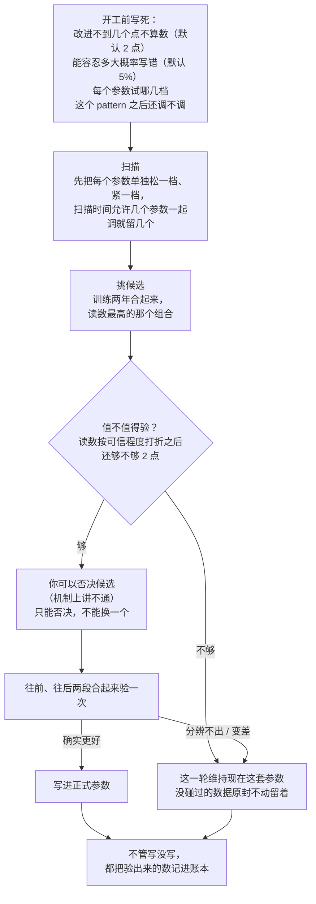

# 调参流程简化方案 · 白话版

> 来源：同目录 `final_report.md`（2026-09-19 终审定稿，经一名独立审核员三轮核对，记录在 `final_audit.md`）。
> 本文自包含：读这一份就能做决定，不必打开底稿。研究目录删除时本文一起删。
> **证据性质先说清**：所有数字来自按 bb_v1 的量级搭出来的模拟数据，没有在真实扫描结果上跑过。它们回答的是「在和 bb_v1 差不多的条件下会发生什么」，不是 bb_v1 本身的实测。

## 一句话版本

现在的调参流程，为了防「挑出来的参数只是运气好」，在训练数据里叠了十来套检查，却只让手里两段留着没碰过的数据中的一段决定写不写。简化后的流程只有三步：**在训练数据里挑一个候选 → 看它值不值得动用没碰过的数据 → 用两段没碰过的数据合起来验一次，过了才写进正式参数。** 它不会让你挑得更准，价值在于少把噪声写进正式参数；对 bb_v1 这种「效果比噪声小」的 pattern，期望上多赚的约等于 0。

## 本文反复用到的词

| 词 | 意思 | 出处 |
|---|---|---|
| 买点 | pattern 给出的入场位置；同一段买点只计一次 | `path2/CONTEXT.md:155` |
| 闸 | 加在某个事件上的过滤条件，可松可紧 | `path2/CONTEXT.md:91` |
| 首次穿越率 | 买入后先碰到上方目标线的比例，衡量「方向对不对」 | `path2/CONTEXT.md:148` |
| 随机日基线 | 同一天、同样波动水平的随机买入日的首次穿越率，一切好坏都相对它说 | `path2/CONTEXT.md:152` |
| 现在这套参数 | 调参时拿来对比的参照，候选的好坏都是「比它好几个点」 | tune-gates 的说法 |
| 留着没碰过的数据 | 训练期之外、从没参与过挑参数的数据。两段：**往前那段**（训练期之前，约 14.5 个月）、**往后那段**（最近几个月，约 3.5 个月） | tune-gates 的说法 |
| 读数 | 候选在训练数据上比现在这套参数好几个点。它是带运气的数，不是真实效果 | 本文 |

## 数据是怎么分的

```
 2022-09        2023-11      2024-01              2026-01        现在
    |---- 往前那段 ----|  隔开  |------ 训练期（两年）------|  隔开  |- 往后那段 -|
      从没碰过，约14.5个月          用来挑候选                     从没碰过，约3.5个月
      用一次就没了，不会变长                                       会随时间变长
```

关键事实：**往前那段用一次就没了，永远不会变长；往后那段要攒满大约一年，才有足够的分辨力。**

## 新流程



## 为什么这样改

**现在流程的问题出在哪。** 调参要回答两个问题：挑哪个、它到底有多好。

- 挑哪个，只需要在训练数据里排个序，这一步没什么可挑剔的。
- 它有多好，必须用一份**和挑选过程无关**的数据来回答。因为「挑」这个动作已经把训练数据里的运气用掉了：挑出来的那个，在挑它的那份数据上总会显得偏好。在同一份数据上再怎么校正，都是在同一份运气里估计自己有多幸运。

现在的流程手里本来就有两段这样的数据，却只让往后那段决定写不写（按现行规则，往前那段没验出来、往后那段没变差，照样会暂定写入）。然后在训练数据里叠了十来套机制，去逼近一个本来可以直接量出来的数。**补丁感就是从这里来的。**

**最早那版简化草案错在哪。** 草案想用「把训练数据切成块，轮流留一块出来打分」来代替那十来套机制。查下来这条路走不通：

- 按股票切，留出来的那块和训练用的块处在同一段行情里，行情带来的运气两边共享，打出来的分偏高 2～4.5 个点；
- 按整年切，诚实了，但训练期一共只有两年，等于只有一次观察；
- 它量出来的是「这套挑法平均表现如何」，不是「这次挑中的这个候选如何」。

围着它打补丁要打十条，这本身就说明方向不对。而留着没碰过的数据天然就是一份和挑选无关的数据，直接用它就行。

## 三步各自的道理

### 第一步：挑候选——直接取读数最高的

试过几种更复杂的挑法（要求每年都好、要求旁边的组合也好、按可信程度打折后再排序）。结论是它们之间**互有输赢，差别多在零点几个点以内**，区别只是「离开现在这套参数的倾向」有强有弱。分不出高下，就取最简单的。

这一条结论不硬。专门补跑过一轮模拟：真实的改进如果藏在买点很少的紧档组合里，直接取最高略好（多 0.1～0.2 点）；如果是一片宽平台、或者在更松的组合里，按可信程度打折后再排更好（多 0.2～0.7 点）。事先定的裁决标准正好压在线上，判不出来，所以写的是「暂时维持」。等实施时在真实扫描结果上看一眼——历史上真正兑现的改动，买点是变少还是变多——再回头定。

### 第二步：值不值得验——读数按可信程度打个折

没碰过的数据一打开就算用掉，不管最后写不写。所以打开之前先问一句：这个候选靠得住吗？

做法是把候选的读数按可信程度打折，打完折还有 2 点以上才去验。可信程度由两样东西决定：

- **样本多少**：扣掉同一只股票反复出现之后，真正独立的样本越多越可信。收紧一道闸，买点变少，折扣就变狠，读数必须高出很多才补得回来——这正是「别一味收紧」的制衡，和老框架 mining 里 n/(n+n0) 那个公式是同一个意思。
- **只看过两年**：同一时段里所有买点共享那段行情的运气，买点再多也摊不掉，只有年数多了才摊得掉。所以可信程度有上限。老框架的公式没有这一项；这一项不能省，省了之后买点多的组合可信程度接近满分，这道检查形同虚设。

这两样都从数据里估，不需要你定任何数。

**这道检查是一份保险，不是多赚。** 它省下没碰过的数据，代价是真有大改进时会漏掉一部分（细数见附表 B）。默认开着；只有你在开工时声明「这个 pattern 之后不再调了」才关——那时数据留着也没用，不如这一轮拿满。**必须在算出打折后的读数之前声明，不能看到过不了再改口**，否则这道检查就没有约束力了。

### 第三步：验了再写——两段合起来验一次

把往前、往后两段的结果按各自的精度合起来，要求「确实比现在这套参数好」才写，否则维持现状。这是整个方案里最值钱的一处改动，而且对现在的流程也直接适用：没有真实改进的候选被误写进去的概率从约 18% 降到约 5%，真有改进的被写进去的机会反而更高。

带三条小修正：

1. **把「不同时段效果本来就会差多少」算进误差。** 只有两段数据，合起来的时候如果当它们完全同质，会过于自信。差多少，从训练期两年里各个组合的表现估出来。
2. **候选新纳入了买点时，往前那段的结果先往不利方向挪一点。** 数据里只有活到今天的股票，往前那段缺的退市股最多，放松闸多纳入的那类买点恰恰最容易碰上后来退市的股票，不挪会偏乐观。
3. **往后那段不能明显变差**（差出 2 点就不写），用来挡住行情突变。

**报数**：验出来的数不管写没写都记进账本。只在「过了才写」的时候报，那个数平均会偏高好几个点；每轮都记，长期平均才是准的。单独一轮的数说明不了「这次挑得有多好」，这是数据决定的，不是方法的问题。

## 和现在的流程比，删了什么、留了什么

| 现在的机制 | 去向 |
|---|---|
| 「每年都要好」「旁边的组合也要好」 | 删。它们本质上只是「别轻易离开现在这套参数」的力度旋钮 |
| 换一批股票重抽、对半分验证、几种分数并列 | 删。训练数据里的数和未来真实效果的关联本来就弱，报数交给没碰过的数据 |
| 一轮比很多个改动时的加严门槛、「刚过线」 | 删。只拿没碰过的数据验唯一一个候选，不存在「比了很多个」 |
| 把每个参数单独松一档、紧一档 | 留，但只用来省扫描时间（决定哪几个参数一起调），不再报「哪个改动分辨得出」 |
| 「这两年效果明显不一样」「不同时段时好时坏」的提醒 | 删。时段稳不稳，由两段没碰过的数据和第三步的第 1、3 条修正承担 |
| 「可能只是换成了另一批股票」的提醒 | 删，**前提是**好坏一律按「比同一天、同样波动水平的随机日好多少」来算；你否决候选时仍能看到候选和现在这套参数的买点构成对比 |
| 往前那段一套规则、往后那段一套规则、四种结论、「暂定写入」 | 合成一次检验；「暂定写入」取消 |
| 「验出结论的把握不到一半先问你」 | 由第二步代替 |
| 「买点少三成就问你」 | 删。买点数通过可信程度进了第二步；定案时照常告诉你买点数变了多少 |
| 账本、看结果之前先写下来的验证清单、没碰过的数据只开一次、开工确认与定案两个停点、一致性验证 | 全部保留。它们防的是人这一环的泄漏和工程出错 |

需要人定的数从二十来个降到 4 个：改进不到几个点不算数、能容忍多大概率写错、每个参数试哪几档、样本至少要多少只股票。都有默认值，不用你逐个定。

## 它到底能不能让参数在未来更好用

**做不到的：**

- 「任何情况下都不比维持现状差」在道理上就做不到：如果现在这套参数本来就是最好的，任何会换参数的流程，平均下来都是亏的。
- 挑得比现在的流程更准——做不到，各种挑法互有输赢。
- 单独一轮说清「这次挑的有多好」——做不到。

**做得到的：**

- 没有真实改进的候选被写进去的概率压在一个事先定好的水平附近（前提是没碰过的那两段行情能代表未来）。
- 现在这套参数本来就最好时，每轮平均只亏 0.03～0.15 点；而「每轮必换」的做法要亏 1.2～1.9 点。
- 真实改进有 4～8 点时，能兑现其中的四分之一到三分之一；只有 1～2 点时，几乎兑现不了。

**两个必须知道的推论：**

1. **最值钱的那部分好处，每个 pattern 只有一次。** 第三步之所以有力，靠的是往前那段又长又准；它用一次就没了。
2. **之后大约一年才有一轮验得动的调参，而且只对离现在这套参数不远的候选成立。** 往后那段攒不满一年，要读数超过四五个点才验得过。所以调参应该低频、每轮只送一个候选；两轮之间要找改进，靠改结构（换 detector、改拓扑），不是反复调阈值。

## 对 bb_v1 眼下意味着什么（需要你心里有数）

- 09-08 暂定写进去的两处改动（提高突破幅度门槛、删掉峰龄闸）从来没在没碰过的数据上验过。按新流程，它们**合在一起**就是这一轮的候选，「现在这套参数」指的是改动之前的那套。
- 它们合起来的训练期读数约 3.1～3.2 点，要过第二步，可信程度得在六成以上。粗看**多半过不了，但要在真实扫描结果上算了才知道**。拆开送的话两处都几乎必然过不了，所以整体送。
- **过不了的后果是撤回这两处改动。** 撤回本身也是换参数，而且是换向训练期读数更差的一边。这样做的理由是堵住「先写进去再说」的后门，不是因为统计上更优。撤回之后它们能不能回来，取决于以后训练期并进新数据之后读数够不够——光等往后那段变长没有用，因为第二步只看训练期。
- **另一条路**：如果你的判断是「bb_v1 这一轮之后不再调」，就在开工时声明、关掉第二步，直接用两段没碰过的数据去验。真实改进要是有读数那么大，验过的把握约四成；只有 2.5 点的话约三成。不管验不验得过，往前那段就此用掉。
- 这个选择到实施那一步再定也来得及，但必须在算出打折后的读数之前定。

## 局限

- 全部数字来自模拟数据。有三件事模拟回答不了：真实的改进到底落在买点少的组合还是买点多的组合；离现在这套参数很远的组合，不同年份之间效果会差多大；第二步省下来的数据在以后的轮次里到底值多少。前两件，实施第一步在真实扫描结果上顺带就能看到。
- 「把每个参数单独松一档、紧一档来决定哪几个一起调」和第二步合在一起的效果没有完整模拟过：这样挑出来的参数会让可信程度估得偏高，第二步可能比模拟里松。已有缓解办法，幅度待验证。
- 第三步第 1 条修正在模拟里只拉回了一大半：名义 5% 的误写率，实际还有 10%～12%。推荐的更细的估法还没测过。

## 建议的下一步

1. **先只改第三步**（两段合起来验 + 三条修正 + 每轮都记账）。改动最小、好处最大，不依赖其余重构，对现在的流程直接适用。
2. 再重写挑候选和第二步，说明文档同步重写。

---

## 附表（需要核对数字时再看）

「行情影响」指不同年份之间参数效果的差异有多大：弱 = 没有，中 = 和 bb_v1 差不多，强 = 约两倍。点 = 首次穿越率的百分点。表里的「多拿 / 少拿」都指写进去之后未来一年，相对现在这套参数的真实效果。

**A. 相对现在的流程（行情影响：中）**

| 真实情况 | 第二步关着 | 第二步开着（默认） |
|---|---|---|
| 没有任何真实改进 | +0.05 | +0.04 |
| 现在这套参数本来就最好 | +0.09 | +0.13 |
| 越紧越好，小改进 / 大改进 | −0.01 / +0.49 | −0.09 / −0.07 |
| 一片宽平台，小 / 大 | −0.04 / +0.51 | −0.11 / +0.47 |
| 紧档角落里的单点，小 / 大 | 0.00 / +0.17 | −0.04 / −0.47 |
| 越松越好，小 / 大（这一行偏向新流程，模拟没做第三步第 2 条修正） | +0.05 / +0.81 | +0.01 / +0.57 |

行情影响强时：第二步关着与现在的流程基本持平；开着时大改进多数少拿 0.2～0.5 点。

**B. 第二步的代价与好处（行情影响：中）**

| | 关着 | 开着 |
|---|---|---|
| 现在这套参数本来就最好时，动用没碰过的数据的轮次 | 100% | 约 18% |
| 同上，平均每轮亏 | 0.10 点 | 0.03 点 |
| 真实改进 4～8 点时平均多拿 | 约 1.9 点 | 约 1.4 点 |
| 写进一个明显更差（差出 2 点以上）的参数的概率 | 0.5%～2.8% | 0.4%～1.3% |
| 现在的流程 | 100% 动用；0.7%～4.2% | — |

**C. 能兑现多少真实改进（行情影响：中，占理想值的比例）**

| 真实改进 | 第二步开着 | 关着 |
|---|---|---|
| 4～8 点 | 约 24% | 约 31% |
| 1～2 点 | 约 2% | 约 9% |

**D. 第三步的效果**

| | 现在的规则 | 两段合起来验 |
|---|---|---|
| 没有真实改进却被写进去（单个改动，理论推算） | 约 18% | 约 5% |
| 真实改进 2.5 点被写进去（同上） | 约 51% | 57%～69%；算进「不同时段本来就会差多少」之后约 48% |
| 模拟里真有 2 点以上改进的候选被写进去 | 27% | 35%～39% |

**E. 最早那版草案的打分偏高多少**：按「股票 × 年」切块，行情影响中 / 强时偏高 2.1 / 4.5 点；按整年切块偏差 −0.1～−0.3 点。
