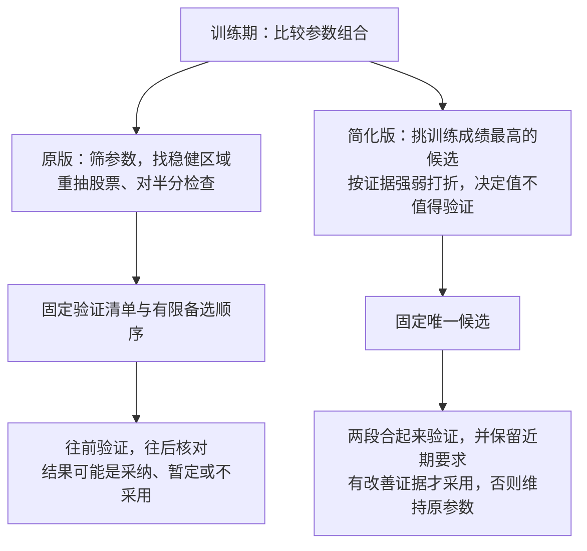

# tune-gates 原版与简化版比较 · 白话版

> 日期：2026-09-20。
> 来源：当前 tune-gates 实现、同目录简化方案报告、模拟结果与模拟脚本，以及相关原始研究。核对依据见文末。
> 证据性质：本次做的是文件与代码核对，没有运行新的策略实验。既有比较主要来自模拟，不能当成真实交易效果。
> 阅读边界：原版是当前已实现的流程；简化版是研究方案。本文把已核实的事实与改进建议分开，不表示任何建议已经实现。

## 一句话结论

**抛开复杂度，目前也没有充分证据证明简化版整套优于原版。建议以原版为改造起点，保留有用的检查信息，吸收简化版对样本可信程度和最终采用条件的改进，再公平比较候选该怎么挑。**

这不等于原版已经被证明更好。检查多不一定选得好，流程短也不一定更可靠。需要分别判断：前面能不能挑出好候选，后面能不能避免把不好的候选采用，以及整套方法能不能长期适应行情变化。

## 本文反复用到的词

| 词 | 意思 | 出处 |
|---|---|---|
| 买点 | 一次命中里真正用于计算后续表现的位置 | [path2/CONTEXT.md:159](/home/yu/PycharmProjects/Trade_Strategy/path2/CONTEXT.md:159) |
| 首次穿越率 | 买点之后先碰到上方目标线的比例；用于比较方向是否有优势 | [path2/CONTEXT.md:148](/home/yu/PycharmProjects/Trade_Strategy/path2/CONTEXT.md:148) |
| 随机日基线 | 随机买入的对照表现；这里匹配同一天、同样波动水平 | [path2/CONTEXT.md:152](/home/yu/PycharmProjects/Trade_Strategy/path2/CONTEXT.md:152) |
| 现在这套参数 | 本轮改动之前、拿来比较的原参数 | tune-gates 的人话译法 |
| 稳健区域 | 附近的取值小改也不太影响效果；不自动等于换行情也可靠 | tune-gates 的人话译法 |
| 留着没碰过的数据 | 没参与挑参数的数据；训练期之前叫“往前那段”，之后叫“往后那段” | tune-gates 的人话译法 |

## 一、两版到底在什么地方不同

两版都会先在训练期里比较很多组合，再把选定的改动送去验证。它们都不是“验证失败就修改，再用同一份验证数据试到成功”。

图中的简化版选最高分，描述的是普通新一轮调参；方案另规定，已经暂定写入但未验证的改动，要作为一个整体先接受验证，不重新挑最高分。

| 要解决的问题 | 原版 | 简化版 | 当前判断 |
|---|---|---|---|
| 参数小改会不会垮 | 主动检查附近取值 | 不再用附近表现决定选谁 | 原版提供了信息，但附近都好不等于证据独立 |
| 是否依赖某些股票 | 重抽、对半分提供检查 | 主要通过样本误差和成绩打折处理 | 两种方法针对的问题不完全相同，可以互补 |
| 样本太少怎么办 | 数量不足不评价，筛选和验证考虑误差 | 设置不同股票数要求，并按证据强弱打折 | 简化版方向值得借鉴，具体效果尚待验证 |
| 什么情况下采用 | 允许部分未确认改善的结果暂定写入 | 要有改善证据才采用 | 为了改善而改参数时，更赞成后者的原则 |
| 如何面对行情变化 | 看不同年份，并做近期核对 | 合并两段数据，考虑时段差异并做近期核对 | 两版都没有充分解决持续变化下的长期适应问题 |

## 二、现有比较有一个必须先纠正的边界

**报告里部分称为“现行流程”的对照，没有运行完整原版。**

从模拟脚本可以核实，那项对照实际做的是：

> 取训练期成绩最高的组合，再检查它在往后那段是否方向为正、且没有差出容忍范围。

它没有把原版“找稳健区域、重抽、扣掉挑选造成的虚高”完整接在前面，也没有复现原版完整的筛参数和有限备选采用过程。

模拟另有一个更接近原版训练阶段的版本：先找稳健区域，扣减后仍然为正才继续，再做近期检查。它与上述对照在结果表里是两行，不能当成同一种流程。这个近似版本更保守：错误采用较少，也会错过更多真实改善。

因此，已有结果可以帮助判断某些部件的取舍，**不能直接推出“删掉稳健区和重抽，整套简化方案更好”**。这里也不是说旧研究完全没比较过原版方法，而是后续部分整套优劣表述超出了实际对照的范围。[对照定义](/home/yu/PycharmProjects/Trade_Strategy/docs/research/2026-09-15_tune-gates-crossfit-simplification-review/repro/report6.py:26)、[两种对照分别列出的结果](/home/yu/PycharmProjects/Trade_Strategy/docs/research/2026-09-15_tune-gates-crossfit-simplification-review/simulator.md:149)。

## 三、为什么不能直接说原版更好

原版主动检查附近参数、股票名单和年份变化，这些信息有价值。但检查更多，不等于推荐一定更好。

**看最差年份、最差相邻组合，既能挡住偶然高分，也会误伤真实改善。** 某个候选本来有效，但某个年份或附近组合碰巧表现差，也会被压低。真正有效的参数范围如果比较窄，原版可能主动错过它。

**附近组合可能共享同一批好运样本。** 如果移动一档只换掉很少的买点，一片好成绩不一定提供了多少额外证据。原版能排除部分完全不改变筛选结果的档位，但没有全面解决高度重叠的问题。

**一些检查主要供人判断，并未直接改变推荐。** 当前对半分结果会展示，但不直接参与是否给出推荐的判断。不能把“做过这项检查”理解成“它已经保证了结果可靠”。

因此，值得保留的是这些检查揭示的信息；是否继续原样使用“取最差”的选择规则，需要比较它挡住了多少错误、又错过了多少真正的改善。

## 四、为什么也不能直接说简化版更好

### 最后的验证，不能替前面挑出更好的候选

训练期可能有两个候选：一个表面成绩更高，但样本很少；另一个表面成绩稍低，证据却扎实得多。

简化版先挑最高分，再判断值不值得验证。它可能选中前者，然后因证据不足而放弃整轮，后者没有机会送去验证。

**最后拒绝了一个不可靠的候选，不等于前面已经选得足够好。** 这是“避免误采用”和“找出值得采用的改动”的区别。

但反过来，把样本少的候选都大幅打折，也可能错过真实存在的小范围机会。已有模拟显示，直接取最高分与按可信程度打折后排名，在不同情形下各有输赢；尚没有一种始终更好。[候选选择的比较与限制](/home/yu/PycharmProjects/Trade_Strategy/docs/research/2026-09-15_tune-gates-crossfit-simplification-review/final_report.md:100)。

### 合并较早和近期数据，不自动等于更了解现在

合并可以增加信息，让判断更容易明确。但较早的数据更多时，也可能主要由过去的行情决定结果。

如果市场规律已经发生变化，**统计上更确定，可能只是更确定地描述了过去。** 把时段差异算进误差，可以承认不确定性，却不自动回答“过去的改善是否仍适用于现在”。

因此，值得借鉴的是让已有验证证据真正参与决定，而不是不加判断地把所有历史证据合在一起。原版把近期核对单独拿出来，也有它的用途。

### 节省验证数据有价值，但净收益尚未量清

简化版在验证前先打折，可以减少无把握时消耗新数据的次数；代价是拦住部分真实改善。

报告承认，省下的数据在未来几轮究竟值多少，还没有完整模拟。最终建议里的部分修正、先筛参数再打折的完整组合，也没有全部测完。因此，“更谨慎”不能直接等同于“长期更好”。[研究自身列出的局限](/home/yu/PycharmProjects/Trade_Strategy/docs/research/2026-09-15_tune-gates-crossfit-simplification-review/final_report.md:316)。

## 五、两版值得互相借鉴什么

### 原版借给简化版：保留能解释问题的检查

建议保留三类信息：

- 参数小改后，成绩是否明显变化，入选买点到底变了多少。
- 换一批股票后，推荐是否大幅改变。
- 改善主要来自哪些股票、年份和时间段。

这些信息能帮助理解“为什么好”。即使不全部设成必须通过的条件，也不应仅因它们不能证明未来有效而删除。

不过，看过这些信息之后再修改选择办法，它们就参与了挑选，不能再把同一份结果当成挑选之外的独立证明。

### 简化版借给原版：改善数量处理和最终采用原则

**第一，样本少、年份少，就降低对漂亮成绩的信任。** 原版已有数量限制和误差计算，但通过数量门槛之后，并不按每个候选的样本可信程度持续给排名打折。简化版对此提出了更直接的处理。

进一步值得比较的方向，是把可信程度用于挑候选时，而不只用于挑完以后否决。这样可能减少“选中不可靠的第一名，整轮放弃”的情况。这是改进建议，尚未证明优于现有做法。

**第二，把“证明改善”和“没发现明显变差”分清楚。** 如果改变参数是为了改善效果，就不应把后者直接当成前者。原版中允许暂定采用的分支，值得优先重新审视。

**第三，让所有候选使用一致的对照。** 简化版要求先扣除同一天、同样波动水平的随机买入表现，再比较候选与原参数。这有助于识别“只是换到了本来容易上涨的日子和股票”，但不能自动排除行业等其他构成差异。

**第四，不论采用与否，都记录结果，并预先安排采用后的复核。** 简化版已有这些约定，值得借鉴；同时需要检验长期运行时的实际效果，不能把写下规则视为效果已经得到验证。[数量处理与对照依据](/home/yu/PycharmProjects/Trade_Strategy/docs/research/2026-09-15_tune-gates-crossfit-simplification-review/final_report.md:192)、[后续复核约定](/home/yu/PycharmProjects/Trade_Strategy/docs/research/2026-09-15_tune-gates-crossfit-simplification-review/final_report.md:92)。

## 六、两版共同欠缺的功能与证据

### 1. 没有充分检查：到底有多少不同的证据

不同股票数只是起点，还需要知道是否主要依赖少数股票、同一小段行情，或者附近参数共同保留的同一批买点。

否则，原版可能找到共享好运的区域；简化版也可能高估漂亮成绩的可信程度。按股票重抽不能完整解决不同股票共享行情的问题。

既有模拟不是完全忽略样本重叠，它确实模拟了部分共享买点和年份影响。但这不能替代对真实筛选结果的检查，尤其是相邻档位几乎完全重叠的情况。

### 2. 缺少经过验证的长期数据使用和近期适应方案

两版主要解决一轮怎么挑、怎么采用。简化版已经规定了新数据默认如何分配、采用后如何复核，并非完全没有长期安排；欠缺的是这些安排在连续多轮中的完整效果验证。

实际需要回答：新数据来了，什么时候用于更新参数，什么时候留作验证；行情变化后，什么时候继续观察，什么时候重新研究；数据有限时，怎样避免训练越来越旧或者验证始终不够。

### 3. 检查发现问题之后，缺少明确且经过验证的后续处理

发现结果高度依赖少数股票后，目前主要是提醒、扣分或拒绝。两版都缺少一套经过充分比较的办法，把这类发现转成更好的候选选择。

这里需要的不是无限迭代直到通过，而是在训练阶段提前规定：发现哪类问题，怎样调整选择依据，何时停止。最后留出的验证数据，仍然不能反复拿回来指导修改。

### 4. 缺少公平的完整流程比较

两套流程应该面对相同的数据、可搜索范围、评价对照和验证机会，并且共同与“维持原参数”比较。

比较不应只看一次挑出来的成绩，还应同时看：找到真实改善的机会、错误采用的机会、消耗多少新数据，以及连续多轮遇到行情变化时的结果。

选择规则和最终采用规则也应分别比较，避免同时换掉多个部件以后，把改善全部归功于其中一个。用于反复设计流程的历史回放，只能算开发依据，不能再冒充最终独立证明。

## 七、建议先做什么

以下是改进顺序建议，不是已经实施的改动：

1. **先改清最终采用原则。** 为了改善而改参数，就明确要求相应改善证据；不要靠未确认改善的暂定写入绕过去。如何组合较早和近期证据，要同时考虑近期适用性。
2. **补足股票与时间上的集中问题。** 分清“样本多”与“证据来自不同股票、不同时间”，也分清“附近参数多”与“它们实际换了多少样本”。
3. **再比较候选排名方式。** 对直接取最高分、按可信程度打折、考虑附近取值等做公平比较，暂不预设谁必胜。
4. **最后验证连续多轮的运行方式。** 包括新数据分配、何时重调、采用后复核和撤回，以及多次尝试累计带来的错误机会。

在这些工作完成之前，原版的稳健区和重抽信息值得保留；但不承诺所有原版条件都必须保留。简化版值得吸收的是经过论证的部件，而不是仅凭流程更短就整体替换。

## 核对依据与适用边界

| 依据 | 本文用它支持什么 |
|---|---|
| [当前方案白话说明](/home/yu/PycharmProjects/Trade_Strategy/docs/research/2026-09-15_tune-gates-crossfit-simplification-review/tune-gates_当前方案_白话版.md) | 原版实际流程、数量保护、检查如何影响推荐 |
| [原版较差年份与相邻取值的评分](/home/yu/PycharmProjects/Trade_Strategy/.claude/skills/tune-gates/region_core.py:662) | 原版如何选择，以及它检查的范围 |
| [原版是否推荐的实际判断](/home/yu/PycharmProjects/Trade_Strategy/.claude/skills/tune-gates/region_core.py:1123) | 对半分结果不是自动取消推荐的条件 |
| [原版最终采用规则](/home/yu/PycharmProjects/Trade_Strategy/.claude/skills/tune-gates/validate.py:175) | 原版包含暂定采用的分支 |
| [模拟中最终核对的写法](/home/yu/PycharmProjects/Trade_Strategy/docs/research/2026-09-15_tune-gates-crossfit-simplification-review/repro/sim.py:449) | 部分“现行流程”对照只使用近期核对 |
| [模拟中不同选参流程的实现](/home/yu/PycharmProjects/Trade_Strategy/docs/research/2026-09-15_tune-gates-crossfit-simplification-review/repro/sim.py:461) | 取最高分与原版近似流程是不同对照 |
| [简化方案的实际流程](/home/yu/PycharmProjects/Trade_Strategy/docs/research/2026-09-15_tune-gates-crossfit-simplification-review/final_report.md:53) | 候选、打折、最终采用的分工 |
| [选择依据也会被过度迎合的研究](https://www.jmlr.org/papers/v11/cawley10a.html) | 最后的检查不能使前面的挑选质量变得无关紧要 |
| [存在相关性时如何验证的研究](https://arxiv.org/abs/1904.02438) | 把数据拆开不自动保证验证适合未来场景；这项通用结论不直接给出本项目的数值效果 |

本文没有给出两版真实效果的胜负数字，因为目前没有足够公平、完整的项目实测支持这种结论。
