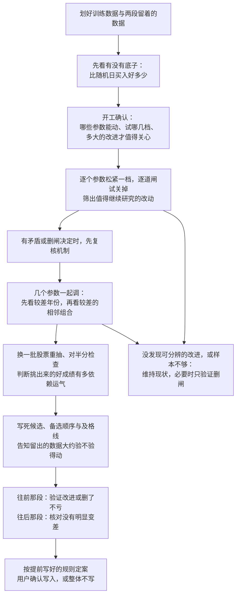

# tune-gates 当前调参方案 · 白话版

> 来源：2026-09-19 本地 tune-gates 的流程说明、参考说明与实际实现，核对时仓库版本为 `890b20ee`。关键机制以实际实现为准。
> 本文解释当前方案，不是同目录的简化方案，也不是一次新的策略效果测试。例子中的数字仅用于说明机制。
> 本文自包含；只读这一份即可理解流程、各项检查的作用与局限。

## 一句话版本

**先确认这个走势有值得调的基础，再筛出值得动的参数，寻找“不同年份和附近取值都不太差”的组合；随后检查它是否依赖少数股票或挑选时的好运，最后用留着没碰过的数据决定采纳、暂定还是撤回。**

它没有一种能彻底排除运气的检查。它把几个不同问题分开处理：有没有基础、动哪些参数、参数附近稳不稳、是不是挑出来才显得好、换一段时间还能不能成立。

## 本文反复用到的词

| 词 | 在本文里的意思 | 出处 |
|---|---|---|
| pattern | 一个走势形态的完整声明，是本轮要调的对象 | [path2/CONTEXT.md:96](/home/yu/PycharmProjects/Trade_Strategy/path2/CONTEXT.md:96) |
| 买点 | 一次命中里真正用来计算后续表现的位置；调参时同一段买点不重复计数 | [path2/CONTEXT.md:155](/home/yu/PycharmProjects/Trade_Strategy/path2/CONTEXT.md:155)，去重规则来自 tune-gates |
| 闸 | 决定某个候选能不能通过的一道判据；本文讨论它该不该保留、该放多紧 | [path2/CONTEXT.md:91](/home/yu/PycharmProjects/Trade_Strategy/path2/CONTEXT.md:91) |
| 首次穿越率 | 买点之后，先碰到上方目标线的比例；具体哪些情况进入分母，见下文 | [path2/CONTEXT.md:148](/home/yu/PycharmProjects/Trade_Strategy/path2/CONTEXT.md:148) |
| 随机日基线 | 用随机买入日作对照；本流程匹配同一天、同样波动水平 | [path2/CONTEXT.md:152](/home/yu/PycharmProjects/Trade_Strategy/path2/CONTEXT.md:152) |
| 现在这套参数 | 本轮拿来比较的原参数，候选要说明比它改善了多少 | tune-gates 的人话译法 |
| 稳健区域 | 附近的取值小改也不太影响效果；这是对已检查数据和档位的描述 | tune-gates 的人话译法 |
| 留着没碰过的数据 | 没参与挑参数的数据；训练期之前叫“往前那段”，之后叫“往后那段” | tune-gates 的人话译法 |

## 整个流程怎么走



图里展示的是完整路径，不是每一轮都必须换参数。找不到可信候选、样本不足、或者用户否决时，可以维持现状。

## 一、它首先明确：到底在优化什么

### 主要比较方向，不按少数暴涨的幅度排名

当前筛参数、找稳健区域和最后验证，主要围绕首次穿越率展开：买入以后，是先到上涨目标，还是先到下跌目标。

没有碰到任何一侧的情况不进入这个比例的分母；同一根 K 线两侧都碰到、无法确定先后的情况进入分母，但不计为先碰到上方。所有组合用同一把尺子比较。

这意味着，一次刚够到上涨目标和一次后来暴涨的买点，不会因为后者涨得特别多就得到更大权重。**当前核心排名本来就不是用平均涨幅，因此少数暴涨把平均值抬高，并不是这项评分的直接问题。**

项目还会看买点之后的上行幅度，其规范名称是[前瞻收益](/home/yu/PycharmProjects/Trade_Strategy/path2/CONTEXT.md:141)。它表示固定时间内的最大上行幅度，不能直接当成实际卖出的收益。当前找稳健区域也不是按这个幅度的中位数排名。

### 对照分两层

先问“有没有底子”：现在这套参数，以及闸全部放开的版本，分别与同一天、同样波动水平的随机日基线比较。目的是分清表现好是不是仅仅因为当时市场好、这批股票本来就容易涨。

再问“改动有没有改善”：候选主要与现在这套参数比较。**当前找稳健区域的核心分数，是候选与原参数的首次穿越率之差，不是每个候选都先减去自己对应的随机日基线后再排名。** 因此流程还要另外提醒：改善会不会只是换成了另一批股票。

“没有底子”也不是说走势绝对毫无规律，而是现有数据给出的改善上限，已经低于本轮关心的幅度。分不清时会说“还不能确定”，不把它当成已经证实有优势。

## 二、先筛参数，避免把所有东西一起乱调

开工时先约定每个参数试哪几档，以及多大的改进才值得关心。衡量好坏用的尺子，例如持有多久、涨跌多少才算数，不在这一轮里跟着调，否则不同组合的成绩就不再回答同一个问题。

闸还要区分三种情况：

- 已经单独验证确实有用的，可以继续调松紧。
- 正在使用、但还没单独验证清楚的，先只试保留或关掉，检查删了亏不亏。
- 想新加、却还没验证过的，不直接塞进调参；先验证它该不该存在。

随后把每个参数单独松一档、紧一档，把每道在役闸单独关掉。主要看其他设置维持现在这样时是否改善，也看其他闸全部放开时结论会不会变。

同一轮试很多个改动，很容易碰巧挑出一个好看的。因此，筛选时会把本轮比较的数量算进判断，不把每个“看起来提高了”的改动都送去一起调。计算误差时，也会把同一只股票反复出现的买点放在一起处理，避免把它们全部当成互不相关的证据。

它还会检查几个提醒：两个年份效果是否差很多、不同时间段是否时好时坏、一个参数的效果是否依赖另一道闸、是否换了一批股票。**这些提醒主要帮助解释，不是每条都自动否决候选。**

两个参数一起动才起作用的情况，也有补充检查。不过目前这项补充要求至少一方已经在单独筛选里过关，不能保证找到所有“单独都没用、一起才有用”的组合。

## 三、稳健区域究竟怎么找

### 先确定哪些组合有资格被评价

只把筛选中值得继续调的参数，以及与它们一起改时会互相影响的参数，放在一起试组合。闸和其他可调参数一起考虑，避免先找出一套好参数，再随意加闸把它改变。

每个组合在各年的样本都要够，才参与评价。所需样本数会参考本轮关心的改善幅度，以及同一只股票反复出现造成的相关程度。

样本不够的组合是“评估不了”，不是“表现差”。如果数据只够判断一次改一个参数，就退回单个改动；如果任何改动都分辨不清，就维持现值。

### 样本数量怎么起作用：与旧框架 n0 的区别

**当前方案不是完全不考虑样本数量，但没有像旧框架那样，在排名分数里直接按数量打折；也没有明确要求每个候选至少覆盖多少只不同股票。**

先分清三个东西：买点数量、不同股票数量，以及旧框架的 n0。同一只股票可以贡献多段买点，因此有 30 段买点，不代表有 30 只股票。

旧框架先排除样本不足最低数量的方案，再把剩下方案的成绩往基线拉回：样本越少，拉回越多。它使用的关系是：

```text
保留的优势比例 = 样本数 ÷（样本数 + n0）
```

**n0 是控制打折力度的设置，不是筛出来的数量，也不是最低数量限制。** 最低样本数由另一个设置控制。并且旧代码在这里数的是样本记录，没有按股票去重，所以它也没有直接保证覆盖足够多的不同股票。[旧框架的数量限制与打折方式](/home/yu/PycharmProjects/Trade_Strategy/BreakoutStrategy/mining/threshold_optimizer.py:60)。

tune-gates 主要通过“能不能参与评价”和“差别是否可信”来考虑数量：

| 环节 | 数量如何起作用 |
|---|---|
| 筛参数 | 不只看首次穿越率提高多少，还考虑误差；同一只股票反复出现的买点放在一起计算误差 |
| 找稳健区域 | 各年的样本数量必须达到计算出的要求，另外默认每年至少有 30 段买点；不够就不参与评价 |
| 重抽、对半分 | 在重新抽取或拆分后的数据上继续应用样本数量要求，再检查换股票以后是否仍然成立 |
| 最后验证 | 改善幅度要结合误差判断，不能仅凭比例更高就通过 |

这些限制在重抽之前就已经存在，不是等到重抽时才防止样本太少。[数量限制的实现](/home/yu/PycharmProjects/Trade_Strategy/.claude/skills/tune-gates/region_core.py:905)、[按股票计算误差的实现](/home/yu/PycharmProjects/Trade_Strategy/.claude/skills/tune-gates/inference.py:22)。

不过，当前仍有三处边界：

1. **限制买点数量，不等于限制不同股票数量。** 当前没有“这个候选至少来自 30 只或 100 只不同股票”这样的明确要求，很多买点仍可能集中在少数股票上。
2. **通过数量门槛之后，不再按数量持续打折。** 找稳健区域主要按较差年份、较差相邻组合的首次穿越率改善排序；两个组合都过了门槛，数量更多本身不会直接给它加分。
3. **最低样本要求使用前面基础检查测出的相关程度。** 它不是为每个候选分别重新计算的。如果某个候选筛得特别集中，主要靠少数股票反复贡献买点，这个统一要求未必充分反映它的问题。[数量要求的计算来源](/home/yu/PycharmProjects/Trade_Strategy/.claude/skills/tune-gates/region_find.py:57)。

首次穿越率本身也是把通过筛选的买点结果合起来算比例，并非每只股票先算一个比例，再让每只股票各占一票。因此，买点多的股票对最终比例影响更大。按股票计算误差，是在检查这个比例有多可信，不是把各只股票的评分权重改成一样。

**重抽和对半分能帮助暴露对少数股票的依赖，但不能保证排除过拟合，也不能替代明确的不同股票数要求。** 尤其对半分结果目前还不是自动取消推荐的条件。当前方案有样本数量保护，但它与旧框架的数量折扣、每个候选覆盖多少只不同股票，是三件需要分别判断的事。

### 然后连续做两次“看较差的那个”

**先看年份。** 每套参数分别计算各年比现在这套参数好多少，取较差年份的改善。这样，一年特别好，不能直接盖住另一年不好。

**再看附近取值。** 对这套参数及其相邻组合，再取较差的改善。这里的相邻是：其他参数不变，只把其中一个参数向上或向下移一档。并不是把所有参数同时变化的周围组合都查遍。

最后优先选这个较差成绩仍然好的组合。下面的示例放在文末附表。

这一步仍然在挑选，只是把“挑自己成绩最高的”改成了“挑自己和已检查邻居中较差成绩最高的”。**它改变了偏好的形状，没有让挑选这个动作消失。**

### “找到区域”不等于发现了一整片已经验证的平地

当前实现会给出一个推荐组合，并检查沿各个参数方向还能走多少档、表现仍保持正向。它没有证明两个已检查档位之间的所有数值都好，也没有证明多个参数同时小改时一定稳。

还有几项具体规则：

- 有可评价相邻组合的候选，排在没有可评价邻居的候选前面。
- 成绩相同的时候，优先考虑可评价邻居更多、离试验范围边界更远的组合。
- 样本不足的相邻组合不参与取较差值。因此某个组合可能只检查了部分方向，不能把未检查的方向也算成已经稳定。
- 对能按松紧筛选的闸，如果收紧一档完全没有多筛掉买点，那一档会被排除，不再当作另一份支持证据。

最后这条只挡住了“完全没变”。**如果只换掉很少的买点，仍然可能留下；当前找区规则没有要求相邻组合之间必须换掉足够多的样本。**

所以，附近一片都好，既可能来自真实规律，也可能只是那批表现碰巧好的买点一直没被筛掉。

## 四、为什么找到稳健区域之后，还要重抽和对半分

### 换一批股票重抽：看重新挑选以后会怎样

流程会从现有股票里反复重新抽取，每次保留股票内部的买点关系。每次不只重算已经选出的参数，还会重新筛“哪些参数值得一起调”，然后重新挑组合。

这样做，是把“前面筛参数也用过运气”算进去。否则只检查最后一个组合，就漏掉了一部分挑选过程。

它会报告两类信息：重新挑选后，原组合或附近组合还能被选中的比例；以及在用来挑选的那份重抽数据上，成绩比回到原数据重算时高了多少。后者用来估计并扣掉一部分挑选造成的虚高。

**这些仍然是从原有数据中重组出来的检查，不是新获得的市场证据。** 它主要反映换股票的影响，不能完整反映换一段行情的影响。扣完以后仍可能偏乐观，也不能给未来表现提供保证。

### 对半分检查：一半股票挑，另一半股票评价

把股票分成两半，用一半挑参数，再到另一半评价；然后交换两半的角色，并换几种分法重复检查。

这项检查用来观察：挑出来的好表现是否只能在负责挑选的那批股票里成立。但两半股票仍然生活在同一段行情里，所以不能排除整段行情共同带来的好运。

实际实现里，这项检查在已经形成的组合范围内进行，没有完整重演前面所有筛参数的步骤。它与上一项检查覆盖的范围不同。

### 两套检查的循环：运行几次，如何嵌套

**这两套检查依次执行，互不嵌套。默认重抽 300 次；对半分做 20 次，每次交换角色，所以调参 40 次。**

重抽不只是“全训练集调参，然后重抽验证这套固定参数”。每次重抽后，都会重新调参，可能选出另一套参数。

下面用封装函数表示流程。`评价()` 指“较差年份 + 较差相邻组合”的评分；`调参()` 指在已扫描的组合中挑选，循环里不重新扫描全部行情。这是说明循环关系的伪代码，不是可以直接运行的脚本；省略了样本不足等异常处理。

```python
# 前置工作：划分数据、检查有没有底子、确定范围、
# 扫描组合、筛出值得一起调的参数。
训练数据 = 准备训练数据与扫描结果()

# 先用完整训练数据，选出本轮推荐参数
原推荐 = 调参(训练数据, 重新筛选参数=True)
原成绩 = 评价(原推荐, 训练数据)


# ========================================
# 第一套检查：重抽 300 次，每次都重新调参
# ========================================

for 次数 in range(300):

    重抽数据 = 按股票重抽(训练数据)
    # 股票总抽取次数不变，允许重复。
    # 一只股票抽中几次，它的整份历史就有几份权重。

    本次推荐 = 调参(重抽数据, 重新筛选参数=True)

    # 问题一：换一份股票名单，推荐还差不多吗？
    记录推荐是否相同或相邻(本次推荐, 原推荐)

    # 问题二：固定原推荐，换名单以后表现如何？
    记录原推荐成绩(
        评价(原推荐, 重抽数据)
    )

    # 问题三：本次新挑出的参数，被挑选过程抬高了多少？
    挑选时成绩 = 评价(本次推荐, 重抽数据)
    回到原数据的成绩 = 评价(本次推荐, 训练数据)

    记录虚高(
        挑选时成绩 - 回到原数据的成绩
    )

扣减后成绩 = 原成绩 - 平均有效虚高()


# ========================================
# 第二套检查：对半分 20 次，每次双向检查
# 不在上面的 300 次循环里面！
# ========================================

for 分法 in range(20):

    股票甲, 股票乙 = 按股票随机分成大约两半(训练数据)

    本次分法成绩 = []

    for 调参数据, 评价数据 in [
        (股票甲, 股票乙),
        (股票乙, 股票甲),
    ]:

        半份数据推荐 = 调参(
            调参数据,
            重新筛选参数=False,
            # 沿用前面已经确定的组合范围
        )

        成绩 = 评价(半份数据推荐, 评价数据)
        本次分法成绩.append(成绩)

    记录本次分法成绩(平均有效成绩(本次分法成绩))

对半分结果 = 汇总20种分法的有效成绩()


# 两套检查一起报告，不把它们平均成一个总分
生成报告(原推荐, 扣减后成绩, 对半分结果)

# 后续才是冻结验证清单，
# 按清单打开往前、往后两段留出的数据。
# 最终验证不在上述循环中。
```

按“选出一套参数”这个颗粒度计数：

| 环节 | 默认次数 | 每次是否重新调参 |
|---|---:|---|
| 完整训练数据选原推荐 | 1 | 是 |
| 换一批股票重抽 | 300 | 是，并重新筛哪些参数值得一起调 |
| 对半分 | 20 × 2 = 40 | 是，但不重新筛哪些参数值得一起调 |
| 合计 | **341 次选参** | 不代表重新扫描行情 341 次 |

样本不足、成绩算不出来的重复会被跳过相应统计，所以最后有效次数可能更少。次数可以配置，以上是[当前默认值](/home/yu/PycharmProjects/Trade_Strategy/.claude/skills/tune-gates/tune.py:76)。这个计数只描述这里的选参与两套检查，不包括整个流程中其他用途的重抽计算。

**两套检查都不会用循环里的“新推荐”替换原推荐。** 重抽是在检查原推荐的稳定性、估计挑选造成的虚高；对半分是在检查“用一半股票挑出来的参数，到另一半还能表现怎样”。因此，对半分并不是把全训练数据选出的原推荐固定下来验证 40 次。

实际调用顺序见[两套检查的连接位置](/home/yu/PycharmProjects/Trade_Strategy/.claude/skills/tune-gates/region_find.py:561)。

### 报告里的证据，不全是自动放行条件

当前报告会并列展示未经扣减的成绩、扣掉挑选造成的虚高后的成绩，以及对半分结果，不把它们平均成一个总分。

实现中的推荐判断有一个需要知道的边界：未经扣减的成绩不为正，或者扣减后不为正，会影响是否给出推荐；**对半分结果会展示出来，但不直接参与这个推荐判断。** 扣减估不出来时，也不必然自动取消推荐。

因此，不能把“报告写了推荐组合”读成“这些检查全部过关”。仍然要看证据有没有矛盾，最后是否经过留出数据验证。

同样，开工约定“关心多大的改善”，会影响样本要求和其他判断；当前找区的推荐判断，并不是简单要求扣完后的改善一定超过这个约定值。

### 这些检查会改善推荐，还是只决定该不该相信推荐？

**当前主要是后者：先选出原推荐，再检查它是否值得相信；没有根据这两套检查的反馈，自动反复改进候选的功能。**

两套检查的作用并不完全相同：

| 检查 | 评估什么 | 当前如何影响结果 |
|---|---|---|
| 换一批股票重抽 | 原推荐是否稳定，以及重新挑选造成了多少成绩虚高 | 扣减后不再显示改善时，报告不再把它称为值得推荐的组合；但不会自动换成第二名继续检查 |
| 对半分检查 | 用一部分股票挑出的参数，在另一部分股票上表现怎样 | 提供另一份判断依据；当前不直接决定是否推荐，也不据此自动重新排名 |

因此，循环里虽然反复选出了很多套参数，却不是每一轮都接着上一轮把参数改好。它们是为了观察“换一份数据重新挑，会发生什么”，不是为了从这几百次结果中再挑一个最终赢家。

把核心流程压缩后，就是：

```text
筛出值得调的参数 → 在组合中选出原推荐 → 重抽和对半分检查
    → 判断是否值得继续 → 按提前固定的清单验证 → 采纳、暂定或不采用
```

不过，整个流程也不是完全不允许调整：决定删闸后会重新筛参数；推荐落在试验范围边缘时，可以扩大范围再找；最后验证时，可以按事先写好的顺序考虑单项改动。这些是有限的调整和预定备选，不能概括成“根据检查反馈不断优化，直到通过”。

**检查结果可以用来设计更好的挑选方法，但那会改变它的角色。** 例如按重抽后的稳定表现重新排名，或者看到对半分不好就修改评分方法，那么这些检查已经参与了选参。此时不能再把同一份检查成绩当成没有参与挑选的验证证据；反复这样修改，也可能最终挑中在检查中碰巧表现好的方法。

当前 tune-gates 的定位是：**在规定范围内搜索参数，再用多项检查约束是否相信和采用搜索结果。它包含搜索和评估，但没有实现利用这两套检查反馈、自动循环改善推荐的功能。**

## 五、最后两段留出的数据怎么用

### 先划开，再保护起来

```text
较早的数据                 用来挑参数的数据                 最近的数据
|-- 往前那段 --|  隔开  |------ 训练期 ------|  隔开  |-- 往后那段 --|
     最后验证                  筛参数、找区域                    最后核对
```

中间隔开一段，是因为买点之后还要继续观察价格，不能让用于挑参数的买点把后续观察延伸进留出的数据。

具体日期和长度由实际数据覆盖与本轮设置决定；往前、往后各多少个月，不是所有 pattern 都固定相同。开始挑参数后，正常流程会拦住对留出数据涨跌结果的读取。

### 看结果之前，把整套改动和备选顺序写死

当前方案不是永远只验唯一一个组合。默认会事先列出整套改动、用于检查每项贡献的组合，以及单项改动；同时写明：先考虑整套，再按训练期里提前排好的顺序考虑单项，最后维持改前。

这些比较会一起接受更严格的判断，考虑到“一批里验了好几个”的影响。**提前列好有限的备选并一起处理，与失败后临时换候选、反复试到通过，是两件不同的事。**

开始前，还会估计留出的数据有多大把握分辨出改善。如果把握不到一半，要先告诉用户，确认是否仍值得消耗这份数据。估计本身依赖训练期里的效果，不保证实际一定验得出来。

### 两段承担不同职责，没有合并成一次检验

**往前那段**负责验证：调整检测参数是否确实改善，只删闸是否至少没有差到不值得删。整套是否采用，还要检查其中各项改动有没有达到相应要求，再按提前写好的顺序选择。

如果较早数据缺少后来退市的股票，可能使结果偏好，当前流程会做相关提醒和检查；达到提醒条件时，即使较早数据上的比较通过，也不当成已经正式确认。

**往后那段**负责核对选出的组合相对原参数是否没有明显变差，以及改善方向是否与训练期一致。往前那段没有选出组合时，往后那段仍会核对整套改动。

这里“没有明显变差”需要证据支持：把误差考虑进去后，仍要能排除超过容忍幅度的恶化。**没看出变差，不等于已经证明没有明显变差。样本少、误差大，也可能使这项检查过不了。**

当前实现的部分提示，把未通过这项检查直接说成“比改前差出了容忍范围”，措辞比证据更强。准确读法应该是“没能排除差出容忍范围”；流程仍按未通过处理。

### 最终并非只有“确认了才写”

当前规则保留“暂定写入”。往前那段没能确认改善，但往后那段通过了没有明显变差的检查、方向又与训练期一致时，仍可能暂定采纳。

所以当前方案不能概括成“所有改动必须在独立数据上证明更好才写”。完整判读见文末附表；确认写入之前，用户仍可整体否决，但不能在看完结果后临时换成清单外的组合。

## 六、这些检查分别挡什么，挡不住什么

| 检查 | 主要想挡住的问题 | 不能据此推断的结论 |
|---|---|---|
| 先和随机日基线比较 | 市场本来就在涨，却把它归功于走势 | 以后也一定有优势 |
| 同一段买点去重、同一只股票一起处理 | 重复出现被误当成很多份独立证据 | 不同股票之间完全没有共同影响 |
| 筛选时考虑本轮比较数量 | 试得多，碰巧有一个看起来好 | 多轮反复研究的好运已全部扣干净 |
| 看较差年份 | 某一年特别好，盖住另一年不好 | 两年足以覆盖未来所有行情 |
| 看较差的相邻组合 | 只在很窄的参数取值上好看 | 相邻组合提供了相互独立的新证据 |
| 换股票重抽、重新筛选和挑选 | 结果依赖少数股票或本次挑选 | 已经检查了换一段行情会怎样 |
| 对半分检查 | 只在负责挑选的股票里成立 | 可以代替时间上留出的数据 |
| 最后的两段验证 | 训练期挑出来的好结果没有延续 | 可以不断复用这两段数据再试别的候选 |
| 账本与一致性验证 | 忘了数据用过，或批量扫描算错 | 只要有记录，统计问题就自动解决 |

## 七、它仍然没有解决的三个核心问题

### 相邻组合可以共享同一份好运

如果参数移动一档只换掉极少量买点，很多组合的高分就可能来自同一批样本。当前排除了部分完全相同的筛选结果，但没有全面解决高度重叠的问题。

**稳健区域说明的是“对已试过的参数小改不敏感”，不能直接等同于“对换样本、换行情也可靠”。**

### 可供独立验证的新数据很珍贵

近期数据留得短，分辨不出小改进；留得长，用来挑参数的数据就离当前更远。市场规律如果变化快，这个代价会更明显。

当前方案通过较早和较近两段分工、保留暂定结果来应对，但没有消除这个取舍。规则中某些情况要求等近期数据攒满一年再验，这是流程约定，不保证一年对所有 pattern、所有改善幅度都一定够。

### 稳健区和独立验证都不能允许无限重试

在同一份训练数据上不断改参数范围、改走势、换评分方式，仍然是在反复挑选。稳健区域不会使这种尝试失去影响。

留出的数据一旦被用来决定下一轮怎么改，也就不再独立。当前流程要求每段只打开一次；重跑已经冻结的同一次计算与换一个候选重新验证，不是一回事。

账本记录哪些数据用过、做过多少比较，能帮助防止无意复用，但不能把已经泄漏的信息消除掉。即使以后每轮都用新的数据，也不能把某一轮的错误控制，直接理解成多年反复尝试全过程的错误控制。

## 八、与简化方案相比，究竟保留了什么

| 事项 | 当前 tune-gates | 同目录简化方案 |
|---|---|---|
| 挑候选 | 优先考虑较差年份和相邻取值仍表现好的组合 | 两年合起来，挑训练读数最高的组合 |
| 对待训练期的好运 | 重抽、重新筛选、对半分等检查并报 | 主要用按可信程度打折，决定值不值得验证 |
| 两段留出数据 | 分开承担验证与近期核对 | 合起来验一次，再加额外修正 |
| 最终写入 | 包含暂定采纳的分支 | 取消暂定采纳 |
| 验证纪律 | 提前固定清单和有限备选，禁止事后临时追加 | 提前固定唯一候选，禁止失败后换一个 |

这张表描述做法差异，不证明哪一套未来收益更高。当前方案多检查了参数附近和股票构成的稳定性，但这些检查仍共用有限的历史数据；简化方案减少了这些检查，也就放弃了相应信息。

理解当前报告时，最该分别看清的是：**候选为什么被挑中、哪些检查只是提醒、哪些验证已经通过、写入结果是否仍然只是暂定。**

## 附表 A：用一个示例理解稳健区评分

以下全是说明用的假设数字；“点”指首次穿越率的百分点，改善都相对同一年现在这套参数计算。

| 候选 | 第一年改善 | 第二年改善 | 先取较差年份 | 再把可评价的相邻组合算进去，取较差值 |
|---|---:|---:|---:|---:|
| 甲 | +8 点 | +2 点 | +2 点 | −1 点 |
| 乙 | +4 点 | +3 点 | +3 点 | +2 点 |

甲自己的某一年很亮眼，但附近有组合表现不好。乙最高成绩不如甲，却在较差年份和已检查的附近取值上都更好，所以在这一层排序中优先。

这些数还没有扣掉挑选造成的虚高，也没有经过最后两段数据验证。乙排在前面，不等于可以直接采用。

## 附表 B：当前两段验证的实际判读

“近期检查通过”指：考虑误差后，能排除比原参数差出事先容忍幅度的情况。

| 往前那段 | 近期检查 | 近期方向与训练期 | 当前处置 |
|---|---|---|---|
| 已确认或未确认 | 未通过 | 任意 | 撤回这次改动；候选尚未写入时维持改前 |
| 已确认 | 通过 | 一致 | 采纳 |
| 已确认 | 通过 | 相反 | 暂定采纳，等近期数据攒满一年复验 |
| 未确认 | 通过 | 一致 | 暂定采纳 |
| 未确认 | 通过 | 相反 | 不新写入；已写入的保持暂定，等近期数据攒满一年复验 |

这张表中的“未确认”可能来自证据不足，不代表已经证明改动无效；“近期检查未通过”也可能来自误差太大，不代表已经证明改动有害。

## 核对依据

以下链接用于追查当前规则；正文已经包含理解方案所需的信息。

- [完整流程与人话译法](/home/yu/PycharmProjects/Trade_Strategy/.claude/skills/tune-gates/SKILL.md:19)。
- [当前找稳健区域的参考说明](/home/yu/PycharmProjects/Trade_Strategy/.claude/skills/tune-gates/reference.md:80)。
- [完全相同的筛选结果如何排除](/home/yu/PycharmProjects/Trade_Strategy/.claude/skills/tune-gates/region_core.py:627)。
- [较差年份、相邻组合与排序的实现](/home/yu/PycharmProjects/Trade_Strategy/.claude/skills/tune-gates/region_core.py:662)。
- [重抽时重新筛参数，以及报告如何判定推荐](/home/yu/PycharmProjects/Trade_Strategy/.claude/skills/tune-gates/region_find.py:540)。
- [对半分检查的范围](/home/yu/PycharmProjects/Trade_Strategy/.claude/skills/tune-gates/region_core.py:1034)与[它是否直接参与推荐判断](/home/yu/PycharmProjects/Trade_Strategy/.claude/skills/tune-gates/region_core.py:1123)。
- [最后验证前如何展开有限备选](/home/yu/PycharmProjects/Trade_Strategy/.claude/skills/tune-gates/validate.py:86)。
- [两段验证的判读规则](/home/yu/PycharmProjects/Trade_Strategy/.claude/skills/tune-gates/validate.py:175)与[近期检查的实际条件](/home/yu/PycharmProjects/Trade_Strategy/.claude/skills/tune-gates/validate.py:512)。
