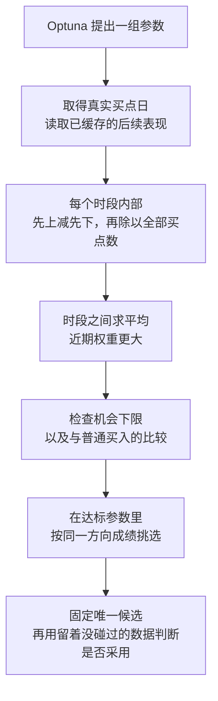
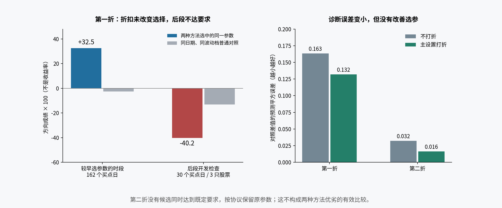

# v3 已更新：先用基础方向评分，暂不加入统计折扣

来源：2026-10-02 真实训练数据比较、正式代码实现与独立复审；底稿为同目录 [完整报告](final_report.md)。

**这次已经把你采纳的两层平均落实到 v3。真实实验没有显示“按证据打折”能选出更好的参数，所以先保留基础方向评分。bb 的正式参数没有改。**

我们用同一批股票、同一组参数，让基础评分和加入折扣的评分各自选一次，再查看它们选中的参数在后面的训练数据中怎样。一次两者选得一样，另一次没有任何候选同时达标；这不足以支持增加折扣，但也不能证明折扣以后都没有用。

| 文中用词 | 意思 | 项目出处 |
|---|---|---|
| 买点 | 用来评价买入后表现的股票日期，同股同日只算一次 | [path2/CONTEXT.md:155](../../../path2/CONTEXT.md:155) |
| 首次穿越 | 买入后先到上方目标线还是下方目标线；新版用收盘价判断 | [path2/CONTEXT.md:148](../../../path2/CONTEXT.md:148) |
| bo | 简单突破买入，用固定的一套参数作对照 | [path2/CONTEXT.md:11](../../../path2/CONTEXT.md:11) |

## 新版现在怎样工作

三个结果都进入每个时段的计算：先上加一，先下减一，未触线为零。未触线表示在规定时间里没有收盘价达到目标线，不表示实际收益为零。

每个时段先得到一个成绩，再在时段之间平均。某个时段有很多买点，不会因此在外层再获得更大权重；近期时段会获得更大权重。没有买点的时段保留“没有机会”的状态，另外检查供给，不虚构一个成绩。

所有合法的连续时段起点都计算，省去了随机抽200次造成的数值差异。它让计算更稳定，没有增加独立历史。

普通买入按候选相同日期、相同波动档配比；固定bo另算自己的表现。方向主分、普通对照和它们的差异都会报告，不能只给一个孤立高分。

搜索和入选已经统一：机会够用、方向及普通对照要求通过后，按同一个方向成绩选择。上涨空间和盘中回撤继续保留；只有事前明确设了要求时才影响去留。

## 真实实验发生了什么

第一组比较中，基础评分和折扣评分选中了同一套参数。它在较早时段看起来不错，但后面的训练数据里，先下比先上多，表现也低于匹配的普通买入，因此没有达到采用要求。

这里还有一个容易误读的地方：**它在后段与原参数选出的买点完全相同。**准确结论是前段看到的优势没有延续，不能说新参数比原参数变差，更不能说统计折扣帮我们避开了这批买点。

第二组比较中，没有候选同时通过事前要求，于是两种方法都保留原参数。没有候选可选，不能拿来证明两种评分一样好。

折扣并非毫无作用：它使候选与普通买入差异的预测，更接近后段观测值。但这个数字上的改善没有转化为更好的参数选择。因此这次决定先不把折扣加入正式默认。

图中的方向成绩不是收益率。负数表示按规定方式汇总后，先下占优势；不等于亏损了同样百分比。

## 计算优化也已经接入

每只股票的后续表现只算一次，多组参数复用。上涨空间和盘中回撤用滚动计算；收盘首次穿越批量比较，已经分出结果的起点不再反复检查。

普通买入提前按日期和波动档汇总，每组候选只查询自己所选买点对应的结果；固定bo也复用标签。参数完全重复时复用检测，浮点值不同则不会靠取整假装相同。

复审还修复了回看范围的问题：现在会明确允许从哪天开始计算历史特征，这段历史同样登记为已使用，不能为了预热无声读取更早的保留数据。本轮实验原本就把数据裁到了允许范围，结果没有因此改变。

另外，现在不仅看日期是否已经到了，还检查每只股票的实际数据有没有更新到预定尾部。数据没到齐就不能用残余的一小段结果给出采用结论。

## 现在还不能承诺什么

**新版能够搜索、比较和给出暂用结论，但统计确认规则还没有校准。**它不会自动把“看起来提高”说成“已经确认改善”，也不会把大量重叠时段当成大量独立证据。

满足要求而看起来改善时，可按你已选择的政策暂用；预定复核仍不足确认则恢复原参数。这个限制已写进skill。当前实验连采用要求都没通过，所以没有暂用任何新bb参数。

本轮只比较了一套pattern、一个股票子集和两次相关的时间拆分。它不是5000只股票的全面调参，也不是两种评分分别引导Optuna不断搜索的完整比赛。下一次实际调参会使用新版评分，但这次实验不能充当任何新参数已经值得实盘采用的证明。

## 数字与交付

| 项目 | 结果 |
|---|---|
| 固定股票池 | 256只，仅按预定顺序和数据完整性选取 |
| 参数预算 | 33组；每次实际28种不同买点集合 |
| 第一次合格候选 | 10组；两种评分选中同一组 |
| 第一次后段 | 30个买点，来自3只股票；方向和对照要求失败 |
| 第二次合格候选 | 0组，按规则保留原参数 |
| 已保存结果复核 | 全部132组评分一致至浮点舍入精度；四段标签和原参数买点逐值一致 |
| 合成行为测试 | 119项全部通过 |
| 正式参数 | bb未修改 |

最终测试数字和独立验收记录见完整报告与 `verification.json`。测试验证实现一致性，不证明市场效果。

使用记录中另有一处如实披露：8只股票的纯计时预跑在新登记入口写入之前计算过标签，虽未查看成绩也一律算作开发数据。正式比较前已登记完整范围，保留区间没有参与任何价格计算。当地pickle文件需整份载入再裁切，因此不声称物理上从未读到后段字节。

[新版 skill](../../../.agents/skills/tune-gates-v3/SKILL.md) · [完整报告与实验依据](final_report.md)
