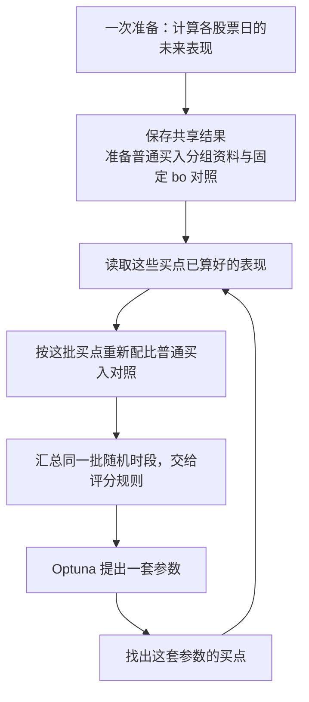
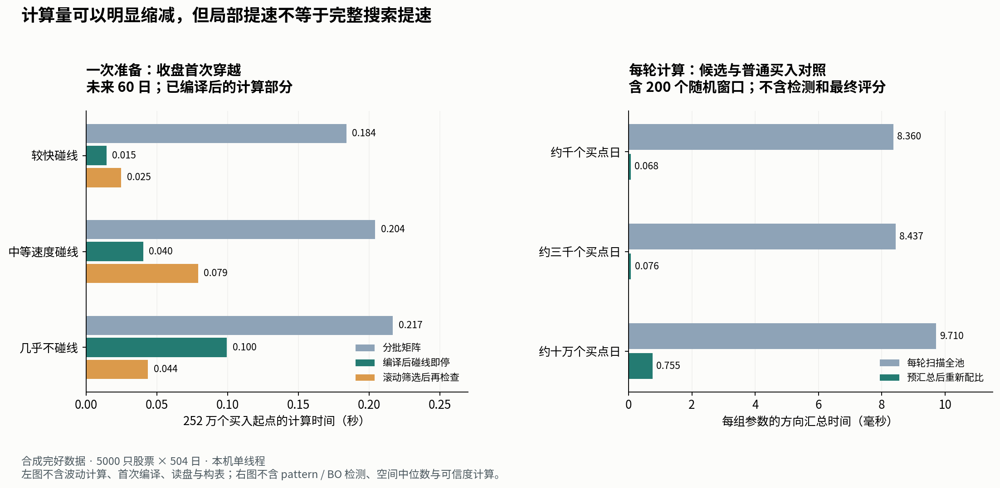

# v3 计算优化：哪些值得先做

来源：2026-10-02 三名 agent 的计算实验及交叉复审，技术底稿为同目录 [final_report.md](final_report.md)。本轮只研究计算，未修改正式 skill。

**值得优化，而且先用简单方法减少重复工作就能有明显收益；没有必要仅因股票池有 5000 只，就先减少对照股票。**

我们用合成的完整行情和买点，测试了约两年、5000 只股票的规模。发现价格比较本身很快，许多时间花在逐条取数据、整理表格，以及反复扫描已经固定的对照上。没有测试实际读盘和寻找 pattern 买点的完整过程，所以现在还不能说整次搜索能在几秒内完成。

本文反复使用的项目词：

| 词 | 本文的意思 | 项目出处 |
|---|---|---|
| 买点 | pattern 选中的买入日；同一股票同一天只计一次 | [path2/CONTEXT.md:155](../../../path2/CONTEXT.md:155) |
| 首次穿越 | 买入以后先碰到上线还是下线；本轮新方案按收盘价判断 | [path2/CONTEXT.md:148](../../../path2/CONTEXT.md:148) |
| bo | 项目已有的突破定义，用固定参数作为一个对照 | [path2/CONTEXT.md:11](../../../path2/CONTEXT.md:11) |

## 以后每轮实际要做什么

一只股票在某天买入，后面价格怎样，不会因为 Optuna 换了一套 pattern 参数而改变。会变的是这套参数是否把它选为买点。因此，未来表现应提前算好，每轮只找买点、读取表现、重新汇总。

**当前代码已经会复用未来表现。**本轮进一步研究的是：怎样把第一次准备做快，以及怎样避免每轮为了汇总又把整个股票池扫描一遍。

## 第一件事：把逐条处理改成批量处理

目前有些地方会对每个买点重新截一小段表，找最高价，整理日期，再拼成一条结果。邻近买点反复做相似的操作，整理数据的时间可能超过价格比较本身。

计算一段历史的波动，以及未来一段时间的最高价，都可以沿着日期连续计算，不必每个买点从头操作一次表格。结果也可以整列生成，日期只整理一次。

这部分最值得先做。实验中，即使继续输出与旧方法一样的完整表格，也已经能明显减少重复工作；暂时无需把所有计算都换成最复杂的算法。

## 第二件事：首次穿越先用“碰线即停”

判断方向，只需要知道最先碰到哪条线。从买入后的第一天往后检查，碰到一条线，就不必继续检查这个买点之后的日子。

把这段简单循环交给能直接执行数值运算的编译工具后，本次测试比展开整块未来价格矩阵更快。矩阵计算仍然可用，但不是越大块就越快。

如果观察期很长，而且绝大多数买点一直不碰线，可以先算整段最高、最低收盘价：整段都没越界的，直接记为未触线；其余再检查先后顺序。这个筛选也要花时间，碰线本来很快时，加入它反而更慢，所以不建议默认启用。

这些做法只改变计算方式。不能为了省时间，把“先碰哪条线”改成“后来有没有碰过上线”。

## 第三件事：普通买入先汇总，每轮再配比

普通买入对照需要跟当前候选的买点日期和波动水平相配。因此，不能提前算一个全历史平均值，让所有参数都用它。

但可以提前保存：**每一天、每个波动档里，有多少股票先碰上线、先碰下线、始终没碰线。**

一套新参数出来后，只需看它在哪些日期、哪些档位产生了多少买点，再按这个分布组合对照。组内所有普通股票原本权重相同，这样只是先把相同部分相加，不需要再次逐只访问全池股票，也不减少对照样本。

固定 bo 对照使用自己的买点。如果它的定义、参数和随机时段都不变，它在各时段的方向结果可以一次算好。如果以后要求 bo 也与每套参数的买点逐一匹配，那部分就要跟着重新配比。

## 第四件事：200 次随机时段只查询已有数量

每套参数找出买点以后，先统计每天上穿、下穿和未触线的数量，再沿日期累计。

某个随机时段的数量，等于“截至时段末尾的累计数量”减去“时段开始之前的累计数量”。这样即使两个时段交叉，或者同一个时段抽到两次，也不必重新扫全部买点。

每个时段仍单独得到结果，再按确定的评分规则汇总。我们没有把你的随机时段方案换成一个全历史总分，也没有因为查得快，就把重复时段当成新增的独立证据。

## 推荐顺序与边界

建议先做批量准备、共享结果和普通对照的提前分组，再接上快速的首次穿越计算。先让全池一次算完并复用；只有实际读盘、内存或使用范围说明有必要时，再考虑“用到哪里才算哪里”。单凭 250 万条记录，还不足以证明需要增加这种复杂度。

仍有三件事不能混淆：

- **寻找买点仍可能耗时。**结构参数改变后，哪些股票日符合 pattern 可能要重新判断；本轮没有测这部分。
- **数量能相加，中位数不能这样替换。**如果上涨空间的精确中位数仍影响评分，就仍要从对应买点的原始表现计算，不能拿各组中位数再取中位数冒充。
- **历史不够长，就少评价一些末尾买入日。**实验为了测足够大的规模，补齐了未来行情；实际使用时不能为了凑齐数量，提前读留着没碰过的数据。

## 实测数字

以下全是本机合成数据实验。股票数为 5000；“504 日”指目标买入日数量，另有计算所需的历史和未来价格。

| 做了什么 | 测到的时间 | 没有包含什么 |
|---|---:|---|
| 批量算买入日的历史波动 | 约 0.65 秒 | 读盘、找 pattern 买点 |
| 算未来 60 日最高价 | 约 0.22 秒 | 整理输出表格；更复杂的实现可到约 0.03 秒 |
| 算 252 万个起点的收盘首次穿越，未来 60 日 | 约 0.015–0.100 秒 | 波动计算、读盘、构表；编译工具首次准备另约 0.31 秒 |
| 优化后、保留旧口径与完整输出的整段准备 | 约 16.4 秒 | 读盘、找买点、Optuna；这里仍用旧 high/low 判断，不是已完成的新 close 流程 |
| 36 套候选的方向汇总，各查 200 个时段 | 0.337 秒降至 0.0109 秒 | 找买点、上涨空间中位数、最后完整评分 |

这些数字说明优化方向有依据，也说明单个数值计算很快不等于整套流程一样快。三名 agent 已互相核对计算结果和报告范围；本轮只交付研究文档，正式代码未改，临时实验代码已清理。
