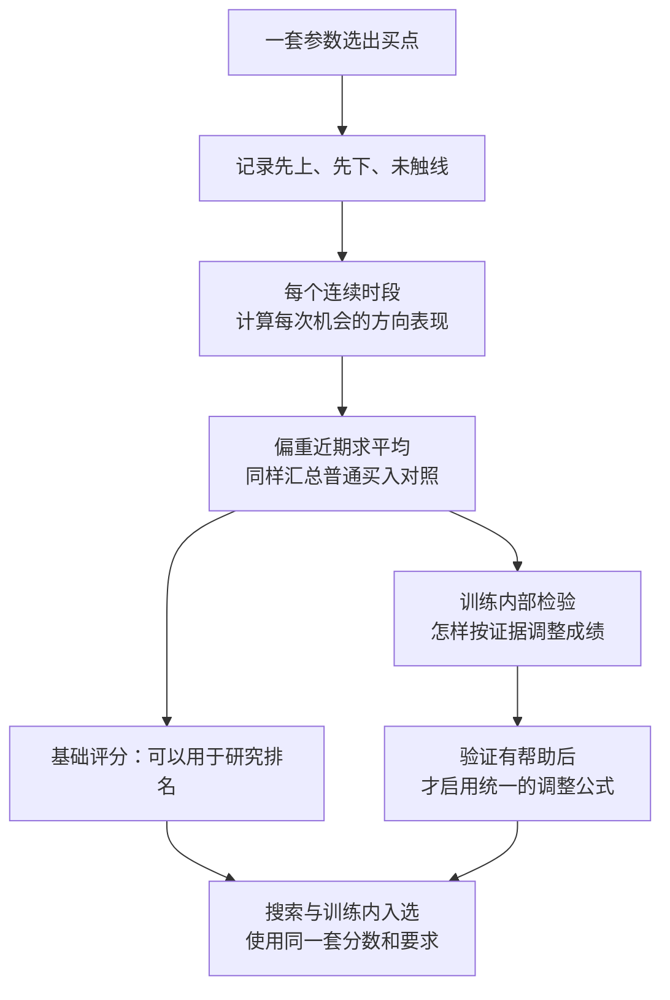
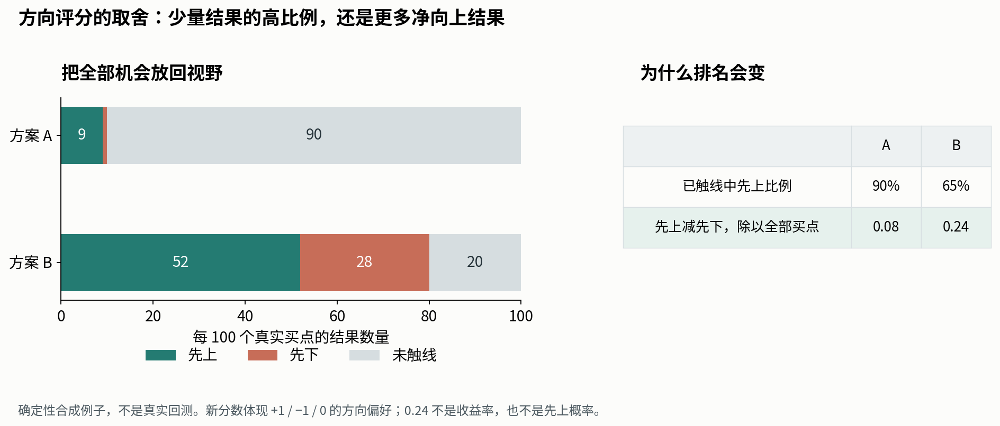

# v3 方向评分：团队建议怎么定公式

来源：2026-10-02 新一轮 agent team 的公式研究与交叉复审，底稿为同目录 [完整报告](final_report.md)。这是研究建议，尚未修改正式 skill，也没有用真实行情校准统计折扣。

**建议先把“每次机会的方向表现”定义清楚：先上加分、先下减分、未触线留在全部机会里；逐时段计算，再偏重近期汇总。怎样根据证据强弱调整这个成绩，还需要训练内部验证，不能现在随便填一个系数。**

团队比较了不同评分目标，写出反例，并用合成数据检查了窗口汇总和证据调整。得到的是一个明确的推荐结构，以及几种已被反例否决的捷径；不是已经证明能在真实行情里选出更好参数的成品。

本文用到的项目词：

| 词 | 一句话意思 | 出处 |
|---|---|---|
| 买点 | pattern 选中的买入日；同一股票同一天只计一次 | [path2/CONTEXT.md:159](../../../path2/CONTEXT.md:159) |
| 首次穿越 | 买入后先碰上线还是下线，本轮继续按收盘价讨论 | [path2/CONTEXT.md:148](../../../path2/CONTEXT.md:148) |
| bo | 已有的突破定义，固定其参数作为简单方法的对照 | [path2/CONTEXT.md:11](../../../path2/CONTEXT.md:11) |

## 整体结构

普通买入、bo、机会数量、上涨空间和盘中风险都会保留，但不把它们任意加权，凑成一个看不出含义的总分。

## 先解决：只看已经触线的买点，会漏掉什么

假设两组参数各有100个买点：

- A：9个先上、1个先下，另外90个到期都没触线。
- B：52个先上、28个先下，另外20个没触线。

只看已经触线的部分，A的先上比例是90%，B是65%，A看起来更好。但如果关心每次实际买入，在规定时间里提供多少净向上的结果，B更好。

因此建议每个时段先算：

> **时段分数 =（先上数量 − 先下数量）÷ 全部买点数量**

上述A得到0.08，B得到0.24。这是明确的取舍：我们愿意让更多净向上的结果，胜过极少结果中的高比例。

这项推荐有三个边界：

- 未触线记0，只表示没有得到向上或向下的方向分，**不表示真实收益为0**。
- 它没有彻底排除波动影响。方向本来偏上时，更常在期限内触线会提高分数；它只是不会把同样多的先上、先下当成方向改善。
- 它仍不区分第一天先上与最后一天先上，也不反映实际持仓、成本和退出收益。

所以原来的先上比例、未触线比例和全部买点数都要继续报告，不能只留新分数。

## 接着解决：时段之间怎样汇总

建议保留连续约一个月的时段，但主分改为这些时段成绩的平均值，并给近期更大权重。

原因是，中位数可能对一部分改善完全没有反应。例如多数时段成绩不变，原本很差的一批时段明显改善了，中位数仍可能原地不动。它没有算错，只是没有评价这次改善。对于希望持续改进的搜索，平均值能提供更连续的反馈。

**这不是证明平均值在所有场景下更好。**中位数较少受少数特殊时期影响，平均值则会把这些时期也算进去。团队推荐后者作为主分，同时继续报告中位数和坏时段，避免只看到平均成绩。

跨时段这样汇总，可以减轻买点密集的好行情对整个历史的支配。每个时段内部仍按真实股票日计数，不会偷偷改成每天等权。

近期多大权重，需要训练内部核对；不交给Optuna逐套参数选择最有利的时间范围，也不需要你决定具体系数。

## 200次随机抽时段，还要保留吗

团队提出一个新建议：**直接计算全部合法起点。**

以504个可评价买入日、每段21个交易日为例，全部只有484个起点。既然前一轮已经找到快速汇总的方法，就可以全部计算，不必抽200次来近似。

好处是同一份历史不会因为随机种子不同而多出一份评分误差。代价只是多查一些窗口。这没有增加独立历史，也没有让证据自动变强。

要分清两项变化：改用平均值是在改变希望追求的表现；枚举全部起点是在更准确地计算选定的窗口目标。两项都是本轮建议，尚未当作你已批准的最终设计写入skill。

全部完整窗口仍有一个边缘特点：历史最前、最后的日期进入窗口较少，内侧日期进入窗口较多。因此这评价的是完整时段里的表现，不是每个交易日完全等权。我们建议明确保留这个含义，另外报告最近完整时段的表现。

## 没有买点，与买了却没触线，要分开

没有买点的时段，不能计算每次机会表现；有买点但全部未触线，分数是0。

建议保留没有买点的状态，只对实际有机会的时段计算表现，同时单独检查机会数量和近期有没有机会。不能给没有交易的时段补上普通买入成绩，也不能把没有交易说成发生了一批差交易。

代价是：一个只在少数季节出现的pattern，仍可能有很高的条件成绩。报告必须同时说明它多久才有机会、近期是否还有机会、证据来自多广的历史，不能拿高分冒充全年都能使用。这样既保留供给下限，也不强迫每个月出手。

## 普通买入和bo各做什么

推荐主分仍然关心**实际买入后的方向表现**。普通买入按同日期、同波动档的配比进行比较，用来说明其中多少成绩也能由同期背景解释。

这意味着：一组参数整体方向更好，但比普通买入只好一点；另一组整体方向较弱，却比它所处环境的普通买入好很多。我们默认倾向前者，因为当前目标是让每次机会更好，而非优先证明复杂pattern独有的能力。

这容许策略利用有利行情。必须公开这个代价，不能同时声称已排除了市场背景。团队建议把“整体观察成绩不低于匹配普通买入”作为统一要求；它只是观察值比较，不是已证明不会退步，也不要求每个时段都显著胜出。

bo继续作为固定的简单方法对照。用它自己的买点比较时，差异也可能包含择时不同；不能随意把它与普通买入平均，也不自动变成每个时段都必须超过的门槛。

## 最难的部分：成绩究竟该打多少折

值得继续开发的思路是：**普通买入的背景成绩保留，pattern多出来的差异按证据强弱调整。**

用语言写就是：

> **调整后分数 = 普通买入分数 + 愿意相信的那部分差异**

“愿意相信多少”不能随意由买点数决定。同一天许多股票可能一起受市场影响，同一只股票连续几天也可能只是同一段走势；200个重叠时段更不是200份新历史。

但简单地只取股票数与时段数中较小的那个，也不对：一只股票多年积累的新证据可能永远不被承认；同一天多只股票各自有信息时，也可能被一律压成一份。团队用反例否决了这个捷径。

另一个实验还发现：即使考虑了相邻时段的联系，短历史中算出的不确定性仍可能明显偏低。**公式能算出一个数字，不代表这个数字已足够可信。**

因此目前的处理是：基础分可以用于研究；统计调整先保留为待验证扩展。不能在同一次排名里，有的候选用原分、有的候选用调整分；也不能为了显得稳健，把所有分数统一打五折——那根本不会改变选中谁。

这不取消你允许“证据不足时暂用、之后复核”的选择。它要求如实标暂用，不能用未验证的折扣把结果改称已经确认。

## 下一步需要做的实质工作

下一步应选定一个具体pattern，在它的训练数据内部校准：用较早部分评分与选参，检查后面一部分是否也表现好；确保早段评分没有借用后段的未来价格。用于改公式的检查数据只算开发数据，最后留着没碰过的数据仍单独保留。

在相同搜索预算下，比较基础分与统计调整版，观察最终选出的参数是否更好，而不只是调整后的数字是否更保守。若调整效果不稳定，就整次研究统一使用基础分、保留证据说明，不强行启用。

机会供给和上涨空间的下限，以及盘中风险的上限，也需在用途明确后固定。超过供给下限不再无限加分；这些要求一旦影响候选去留，就必须同时进入搜索与训练内最终入选，不能最后再换一套标准。

## 公式附注

读懂上文即可理解建议；下面用于精确对照技术稿。

| 层次 | 候选定义 | 当前状态 |
|---|---|---|
| 每时段 | `z = (先上 − 先下) / 全部买点` | 推荐的方向目标，待采纳 |
| 跨时段 | `Z = 各活跃时段 z 的近期加权平均` | 推荐的汇总方式，待采纳 |
| 普通对照 | `B = 同一批时段、同一权重下的匹配对照` | 与候选共同计算 |
| 差异 | `Δ = Z − B` | 原始差异必须报告 |
| 调整候选 | `S = B + λ × Δ` | λ的规则需训练内部校准 |

技术研究了 `λ = τ² / (τ² + V)`：V表示差异估计的不确定程度，τ²调节相信真实差异存在的程度。当前二者没有真实训练校准结果；λ也不是“结论为真的概率”。未经校准时使用Z研究排名，不冒充已经扣除了运气。

本轮全部实验为确定性反例或合成数据，没有真实行情回测，没有修改正式代码。各项结论已由三位agent交叉复审，临时实验代码交付前清理。
