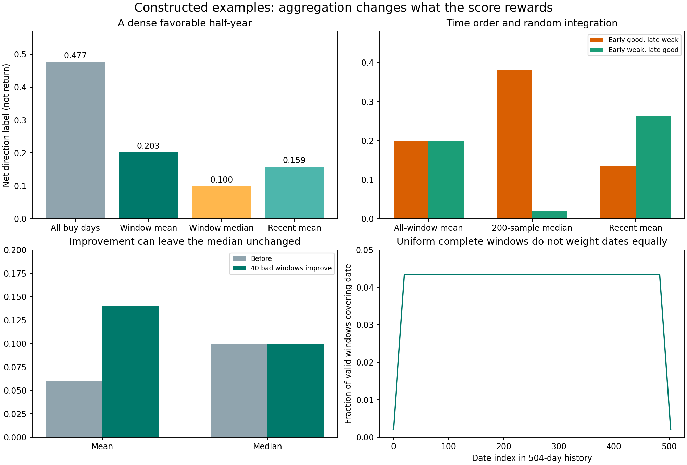

# 方向主分的窗口汇总：推荐与反例

日期：2026-10-02。研究范围：合成完整标签、公式推导；未读真实行情，未运行真实搜索，未碰最后验证数据，未修改正式代码。协议先写于 `adversarial_protocol.md`，原始结果见 `windows_results.json`。

## 结论先行

**建议窗口之间采用偏重近期的加权均值，中位数留作描述；先按业务权重汇总，再对汇总后的候选优势做可信程度调整。**每个有交易窗口的方向值用 `(先上−先下)/全部买点日`，因而有交易但全未触线时有定义，值为0；没有任何买点的窗口保持“未交易”，不补分。条件于有交易时段的成绩、机会供给、证据支持分别输出，不能用一个空窗罚分解决三个问题。

这不是找到了市场上唯一正确的公式。加权均值对各时段的改变作连续响应，适合搜索；近期权重落实“近期适用优先”。它们表达应用偏好，而不是宣称历史只有一套客观权重。窗口中位数有用，但会舍弃不少改善、在恰好各占一半的情形下明显跳变。

业务主分采用绝对方向还是配对优势，本组接受目标组的可审阅默认：**绝对方向为主，普通对照增量不劣作候选要求**，不要求每窗口显著胜过普通买入和bo。这里“不劣”暂指观察值 Delta≥0，不表示已证明统计不劣。这容许候选利用共同的牛市方向，不能把成绩都称作pattern独有能力。外层相同权重同时汇总绝对方向和对照差值；两者并列解释，不将对照差值暗中替换为唯一业务目标。

## 推荐接口与确切含义

训练的可评价买入日期数为 T，窗口长 L=21；有效起点 `s=0..T−L`，窗口 `[s,s+L−1]`。所谓可评价日期，是已按训练边界保证完整后续观察期的日期，不允许为了凑窗口越过保留数据边界。

每个窗口保存以下数量：

- `N_i`：唯一股票日买点数；`U_i / D_i / V_i`：先上、先下、未触线数，三者之和为 N_i。
- `active_i = N_i > 0`。全未触线不属于空窗口。
- `z_i=(U_i−D_i)/N_i`：有交易条件下，每次机会的净方向标签；范围−1到1，**不是盈利概率，更不是实际收益**。
- `b_i`：普通对照与该窗口候选的实际交易日、波动组配比匹配后的同口径方向值；无需排除候选自身。
- `bo_i`：固定bo在自身实际机会上的方向值，另存其供给与时间支持；没有bo买点时保持缺失，不补零，不能悄悄移除该窗口的候选成绩。

近期权重演示默认采用：

```text
a_i = 2 ** (-(T - 1 - window_end_i) / 252)
Z   = sum(active_i * a_i * z_i) / sum(active_i * a_i)
B   = sum(active_i * a_i * b_i) / sum(active_i * a_i)
Delta = Z - B
```

这里252个交易日半衰期仅是**待训练内部校准的初始默认**。所有候选使用相同权重规则，不能每候选挑最有利的期限。窗口终点或中心点作为年龄，在所有窗口等长、指数权重且最后归一化的条件下给出相同相对权重；无需把它们再变成两个可调参数。

不能把上述公式直接写成 `0 * NaN` 后依赖数值库巧合处理；实现应明确先取 active 窗口，再计算分母。若全部为空，返回“没有可评分的机会”，不返回0。与其给它伪造低分，Optuna接口应标记该候选不满足供给条件。

`Z` 表达的是“在候选有交易的月份中，偏重近期后的每次机会方向表现”。**它不表示所有月份都会有机会，也不表示这些月份里的资金一定充分使用。**先保留空窗状态，再对有交易窗口条件化，与“把空窗静默丢掉并声称全年有效”是两件事。

## 为什么不以中位数作为默认主分

实验使用 T=504、L=21，共484个合法窗口起点。200窗口的固定种子为20261002，所有候选共用；也计算全部484个起点，作为完全相同有限窗口分布的精确参照。



图中数字是方向标签差，不是收益率。图示用于展示公式的含义，不表示哪种策略在真实市场更好。

### 买点密集的好行情

前126天每天1000个买点、净方向0.50；之后378天每天20个买点、净方向0.10。直接合并所有买点日后得0.4774，接近密集阶段成绩。对全部合法窗口等权，均值降到0.2034，中位数是0.10；偏重近期均值为0.1590。200随机窗口相应均值0.2150，近期均值0.1663。

这验证了**窗口等权可大幅减弱跨月信号密度的支配**，但没有完全消除窗口内各日期的数量权重。跨越密集/稀疏阶段边界的窗口仍按窗口内部的买点计数；若真要每日等权，必须另定义每日先算分、再按日期汇总，那是不同目标，不应暗换。

同例中普通对照在好行情的净方向为0.30、其他时期为−0.10，候选在每个实际交易日都恰好多0.20。按候选构成匹配后，每种窗口汇总的对照优势都等于0.20。**同期背景有多好与筛选多了多少优势，是两项不同信息。**不能靠只报告绝对主分来宣称排除了牛市因素。

### 改善坏时段，主分却不动

200个窗口中，40个成绩−0.40、120个0.10、40个0.40。将前40个提高到0，均值由0.06升到0.14，中位数仍为0.10。这不是中位数算错，而是它有意不评价这次改善；对于要持续改进方向表现的搜索，这会产生大片无反馈区域。

方向分已经有界，不存在一个无穷大的极端数值拖动均值的情形。用中位数可以降低少数特殊时期的影响，但代价包括弱化少数坏时期；不能只将它解释成“防好运”，忽略它同样可能忽略坏结果。

### 时间顺序与随机窗口的跳变

候选A前252天净方向0.40、后252天0；候选C正好相反。交易数量相同。

| 全部484窗口 | A：近期变差 | C：近期改善 |
|---|---:|---:|
| 等权均值 | 0.2000 | 0.2000 |
| 等权中位数 | 0.2000 | 0.2000 |
| 近期加权均值 | 0.1358 | 0.2642 |

因此在应用确实偏向近期时，近期权重能作出明确区分。均值和中位数不加时间权重，都不会自己产生近期偏好。

固定200窗口碰巧抽到稍多前半段，A/C等权均值变成0.2069/0.1931，但中位数跃到0.3810/0.0190。**相同历史没有改变，只因抽起点带来的数值扰动，中位数就在这个边界反例里发生很大的变化。**换成近期均值后仍正确偏向C：0.1391/0.2609。

额外用种子1000..1199生成200份窗口安排，对相同静态历史的等权均值误差标准差为约0.01372，最大绝对误差约0.03686。这是随机积分误差，完全不是对未来市场的标准误或置信区间。数字只说明这个构造例子的敏感程度，不代表真实训练分数的普遍误差。

## 200次有放回抽样的角色应调整

本实验的200次只覆盖了158个不同起点。把它们原样复制成400次，所有均值、中位数、近期均值完全不变；历史仍是同一份历史，不能把不确定性自动缩小为原来的 `1/sqrt(2)`。

由于累计数已经可以很便宜地查询方向结果，**建议实际实现优先考虑直接枚举全部合法起点，计算同一窗口分布的汇总**；200个随机窗口保留作兼容方案或数值敏感性检查。对T=504只是484个窗口，相比200多2.42倍查询，免除了有限随机抽样的误差，不需要增加复杂模型。不声称这使市场证据变多，也不声称这已经证明真实实现时间足够快；它依赖前轮已研究的窗口累计查询能力。

这是一项新建议，不能声称用户早已确认放弃200次随机方案。如果最终保留200次，窗口计划在搜索开始前固定、所有候选共用，不对每个trial换一组种子，不靠加抽窗口创造统计可信度。

## 空窗口、季节性与未触线

合成季节性候选只在第60..80日和312..332日各交易21天，每天50个买点，净方向恒为0.40。共有2100个唯一股票日、42个活跃日期，全部484个完整窗口中82个包含机会，占16.94%；偏重近期后的窗口覆盖占14.35%。最近126天没有买点。

它的有交易条件分仍为0.40。补0会把“没有出手”变成“每次机会表现较差”，补对照则假装它在未出手期间持有对照，都缺乏已确认的业务根据。但不能只报告0.40：**近期没有机会，无法说明它现在能提供机会；仅两个短时段支持，不能据此说方向在广泛环境成立。**是否够用，要由机会供给要求和证据支持规则决定，不能临时强制每月交易。

全空候选：主分无定义。每天有10个买点但全部未触线的候选：净方向0，条件先上比例无定义。两者都可能出现在完好数据中，不能当作数据异常，更不能用同一缺失处理合并。净方向为0也不等于可用；方向为正的应用要求应单列，不能因其他候选更负就宣布全未触线策略有正向价值。

100次机会中9先上、1先下、90未触线，条件先上比例90%，净方向0.08。100次中52先上、28先下、20未触线，条件先上比例65%，净方向0.24。后者每次真实机会提供更多净向上标签；这种排序来自有限观察期下 +1/−1/0 的方向代理选择。没有规定资金持有多久、未触线如何退出之前，不能推出后者实际收益一定更好。

通过参数主动删掉不利月份，可能是真实择时能力，也可能是训练上挑掉坏样本。仅凭上述汇总公式无法分辨；随意对空窗惩罚同样不能解决。应控制搜索自由度与试验预算，并在训练内部以未用于该次搜索的日期检验整个选择流程，或者在最终冻结后的新证据上评估，不能用重复窗口冒充这一步。

## 边缘日期：窗口等权不等于逐日等权

所有484个合法起点等概率时，第一天和最后一天各只落入1个窗口，中间日通常落入21个窗口；对应概率1/484与21/484。最近一日即使有较大近期权重，也不能因此自动获得与内侧日期相同的覆盖。

本方案选择的是“随机完整月份里的表现”，这一边缘效应属于该估计对象，不是需要隐瞒的程序错误。可加报最后完整21日的独立描述，帮助看见最新一段；**不要临时把最新一窗重复多次来补权**。如果业务真要求每个交易日等权，应另行采用逐日评分；如果允许截短边缘窗口，应明说窗口长度改变，不能循环拼接历史尾首假装真实连续月份。现阶段建议接受并说明完整窗口的目标，不再引入一套边缘校正参数。

## 先汇总还是先校正

两个窗口的对照增量分别0.40和−0.10，业务等权均值0.15。仅为展示顺序差异，假设两窗计数2与200，每窗都乘 `n/(n+20)`，再平均结果为−0.02727。若先等权汇总，再统一乘0.5，结果为0.075。

这些常量没有拟合依据，计数也没有被宣称为独立样本。例子仅说明：**逐窗口按样本多少回拉，会让稀疏窗口的表现更多地退回参照，因而改动最终估计目标；与保持业务权重后整体判断候选可信程度不是同一个步骤。**逐窗层级估计并非数学错误，但需要解释不同窗口之间为何应共享怎样的先验，当前两年历史不值得默认为此引入复杂模型。

推荐先把 Z、B、Delta 以及原始股票日期支持一并交给证据模块，围绕同一个汇总目标估计或规则化可信程度，再统一调整。不能用窗口标准差除以根号200作为证据，也不能因重复窗口成绩完全一样就宣布完全确定。证据模块的相关性与校准方案由另一份研究负责。

## 空间、供给与盘中风险在接口上的位置

先返回主分与独立的约束向量，不把一切揉成任意加权和：

```text
score = 经证据规则调整后的绝对方向汇总
constraints = {
  普通对照增量是否满足预定不劣要求,
  机会供给是否达到预定下限,
  上涨空间是否足以满足用途,
  盘中风险是否满足预定底线,
  证据支持是否足以进行本轮排名/暂用
}
diagnostics = {
  原始Z与配对B、Delta，固定bo与其支持范围,
  U/D/V与条件先上比例，真实唯一买点数、活跃日数,
  窗口覆盖、近期覆盖，时间/股票集中程度,
  典型窗口成绩、坏时段成绩，以及不确定性来源
}
```

上述各项要求在搜索前固定，并在最终训练内入选时沿用。数值下限应在训练内部校准，资金分配/持仓规则未知时不能编造“机会数越多越好”或把上涨空间当作兑现利润。bo作用以目标组建议为准，不自动要求每一窗显著胜过它。中位数与坏时段统计是诊断；如果未来要把坏时段表现变成硬要求，应在搜索前定义，而非结果出来后另换一套入选标准。

## 重建与交付说明

原始JSON保存了全部200起点、种子、输入规则、计数、汇总、数值误差和断言结果。重建时按输入规则生成504长 N/U/D 数组，用带首项0的累计和查询21日窗口和，再按本文公式计算；不需要真实行情或独立股票路径。此实验中的“股票日数”是合成计数，没有据此估计股票间相关性。空间与盘中风险并未模拟。

纯推导与本地合成实验足以支持上述代数事实；本文没有凭外部经验宣称哪种市场模型最优。临时脚本结束删除，实验不产生符合登记条件的市场特征副产品。
