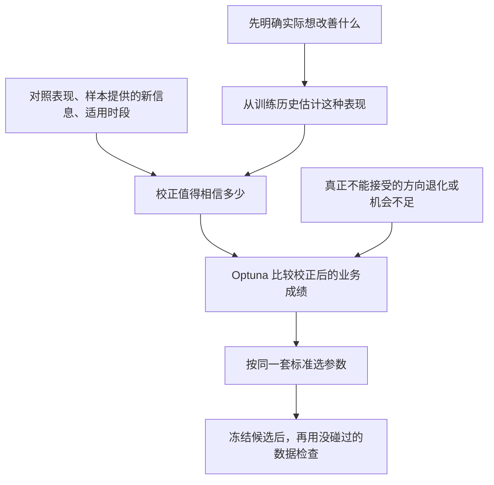

# v3 应该优化什么，统计证据又该放在哪里

来源：2026-10-02 团队研究 `final_report.md`，结合当前代码核对和人为构造的算例。本轮没有修改算法，没有用真实市场成绩检验新方案。

**建议让 Optuna 优化“有证据支持的业务表现”：业务决定什么值得提高，统计决定眼前的好成绩值得相信多少。不要把所有指标都变成越大越好的加分项。**

本文用到的项目词：

| 词 | 在这里是什么意思 | 出处 |
|---|---|---|
| 买点 | 真正拿来评价买入后表现的股票日期；同股同日只算一次 | [path2/CONTEXT.md:155](../../../path2/CONTEXT.md:155) |
| 前瞻收益 | 买入后固定期限内的最大上涨幅度，本文称“上涨空间”；不是已经赚到的钱 | [path2/CONTEXT.md:141](../../../path2/CONTEXT.md:141) |
| 首次穿越 | 先碰到上方目标线还是下方目标线，用来观察方向表现 | [path2/CONTEXT.md:148](../../../path2/CONTEXT.md:148) |

## 为什么不能把两种考量直接相加

你提出的区分很关键：机会多，可能让判断更可信，却不一定让有限资金赚得更多。同一天出现很多信号，而资金已经用完，多出来的信号可能没有实际用途；资金空出来时出现少量好信号，反而可能有用。

但“统计上所有指标都越多越好”需要稍作修正。真正有帮助的是更多适用、能提供新信息的观察。同一批股票在同一段行情中反复出现，不能按买点数量认作同样多份独立证据；把同一历史抽200次，也没有增加200段市场经历。更有把握地确认某个策略很差，并不会使它变好。

## 目前建议各管一件事

| 项目 | 怎么参与选参 |
|---|---|
| 上涨空间 | 当前可以作为主要想改善的表现，但要先处理少量样本带来的不可信高分 |
| 方向表现 | 保留为需要检查的独立信息；确实不能接受的退化作为底线，不凭空规定“方向提高一点等于空间提高多少” |
| 机会数量 | 看是否能满足使用需求；数量过线后不无限加分。总数也不能代替机会出现的时间分布 |
| 样本提供的新信息 | 决定观察成绩信多少，进入成绩的校正；不再额外加一份“数量奖励” |
| 普通买入、bo买入 | 每次比较都计算，但按各自用途参与判断，不能默认两项优势都要无限增大 |

这里的底线也不能凭惯例设。资金有限，不意味着必须每个月都买；没有好机会时空仓可能正确。此前最低买点数要求若暂留，也只能说是一个待检验的使用要求，不能声称已经算出了实际资金需要。

Optuna 可以同时接收主分和要求是否达标，因此“让它考虑一个要求”不等于“必须把这个要求加进同一个算式”。它仍可能试到不达标参数，最终入选时要使用同一套达标规则。[Optuna 官方说明](https://optuna.readthedocs.io/en/v4.7.0/reference/samplers/generated/optuna.samplers.TPESampler.html)

## 两种对照为什么不能全部变成加分

普通买入指相同日期、同一可交易股票池里，不要求符合 pattern 的买入；它也包含碰巧符合 pattern 的股票。这个比较帮助判断：上涨是否主要来自当时的市场背景。它不自动排除股票波动等其他差异。

bo买入是一套固定的简单突破规则。如果它是你可以实际改用的方案，比较它能帮助判断复杂 pattern 是否值得采用；如果它只是研究对照，就不能自动变成“打不过它就淘汰”。同样，没有额外选股优势，不代表挑中了好交易时机这件事没有价值。

**追求更大的上涨空间，与追求超过对照更多，可以得到不同答案。** 例如一个候选的上涨空间较小，但普通股票更差；另一个候选的空间更大，但普通股票也不错。只奖励“多赢了对照多少”，可能选择前一个。这样做可以有道理，但目标已经改变，不能说只是让原目标更客观了。

所以目前建议：主分仍以买入机会本身的上涨潜力为中心；对照帮助估计、解释，以及判断是否有更值得用的简单方案。不能把普通买入优势、bo优势各加一次，就认为更全面。

## shrinkage_score 值得借鉴的是哪部分

它的意思是：**证据少时，别完全相信观察到的成绩与普通水平有很大差别；证据充分时，才更多相信这个差别。**

可以用一句示意公式表示：

> 校正后的空间 = 合理参照的空间 + 可信程度 × 观察到的额外空间

这是业务目标与统计证据的一种结合方式。数量通过影响“可信程度”发挥作用，而不是每多一个买点就奖励几分。

不过，旧代码不能直接搬来用：它按记录数量决定信多少，未充分区分同一行情内的重复信息；其普通水平来自旧突破数据，也不是现在讨论的同日普通买入。团队还用合成数据确认，旧代码先按原始成绩选最好组合，再做校正，可能提前丢掉校正后更好的组合。

这类校正也不是只减分：观察成绩低于普通水平、证据又少时，它会把成绩向上拉。因此不能把它叫作最保守结果，也不能说已经排除了好运气。参照怎么选、到底信多少，还要研究；不能直接沿用旧代码的常量。

## 对你的双层中位数，应该保留什么判断

你的方法先让每个随机时段得到一个成绩，再对时段成绩取中位数，确实能避免买点多的月份仅靠数量支配外层分数。

但是两件事要分开看：

- **各时段各有一票**，是在控制时间上的权重。
- **最后取中位数**，是在偏重典型时段，淡化少数特别好或特别差的时段。

第二项不是第一项必然推出的，也不是“统计上最全面”的保证。它可以保留为明确的目标选择，但不能说它已经完整反映实际资金的得失；同理，也不能只凭反例就宣布改成平均值一定更好。

若采用前面的校正思路，可以先校正每个有足够资料的窗口，再取这些窗口成绩的中位数。这是一种值得继续研究的新评分，而不是已经证明正确的改良。没有买点的窗口要如实保留“没有买点”，不能填入普通买入的成绩，装成 pattern 在那里也取得了表现。

## 这次能够定下什么

能够定下的是分工：**一个业务主分，统计证据参与校正，少数真正不能妥协的要求作底线，两种对照分别解释。** 搜索与最后训练入选用同一套标准，不能搜索时看一种空间，入选又偷偷增加另一种空间标准。

当前推荐用“校正后的绝对上涨潜力”作为过渡主分，是因为它贴近你改善买入机会的目的；并非仅凭资金有限就能唯一推出这个答案。还没有规定怎样在同时出现的股票中选择、怎样卖出和计费用，任何现有空间公式都不能声称正在最大化真实资金回报。明确这些交易规则后，应再让主分直接反映实际能够执行的结果。[多期交易研究的作者说明](https://web.stanford.edu/~boyd/papers/cvx_portfolio.html)

本轮完成了三人交叉讨论、代码核对和合成反例，说明哪些推理成立、哪些结论不能自动推出；没有证明新公式在真实市场更赚钱，也没有替换现有 skill。具体校正办法由后续研究推导，不需要你来指定系数。

## 附表：两个最直观的算例

以下全是人为设定的数字，用于说明机制。

两候选观察空间都是10%，可信程度都设为一半：

| 普通买入的空间 | 校正后的绝对空间 | 校正后超过普通买入的部分 |
|---:|---:|---:|
| 8% | 9% | 1% |
| 2% | 6% | 4% |

优化中间一列会选第一行，优化最后一列会选第二行。公式没算错，想要改善的东西不同。

再假设每个月都有足够买点：

| 候选 | 各月的空间成绩 | 月成绩的中位数 | 各月等权的平均值 |
|---|---|---:|---:|
| A | 七个月10%，五个月0% | 10% | 约5.83% |
| B | 每个月6% | 6% | 6% |

两种汇总都给月份相同权重，却会选不同候选。这正是需要说明目标含义、不能只说“统计上更好”的原因。
