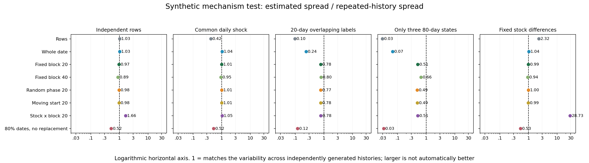

# v3 重抽样：可控反例与小型合成实验

日期：2026-10-02。读者：主研究者与后续复核会话。所有项目内路径均相对 repo root。

我们让同一套统计方法面对几种事先指定的数据关系，再检查它估计的波动与独立生成许多段历史所表现的波动是否接近。另外单独比较：用原始中位数排序，和用重抽结果里偏低的数排序，会选出什么候选。两类结果不能互相替代：估计波动较接近，并不自动证明那个排序目标最合适。

实验支持保留同一天的共同变化和邻近日期的相关性，也显示块重抽本身会失效。随机分块不能制造新历史；少数状态、固定股票差异、候选覆盖长度都会影响惩罚。这里没有使用市场数据，没有运行搜索，也不能据此选定真实市场最优块长或确认概率。

## 1. 预先要证实或推翻的事情

在查看最终结果前固定以下问题，不以某种重抽方法胜出作为停止条件：

1. 逐行独立、同日相关、连续日期相关三个机制是否需要不同抽样单位？
2. 股票与时间块分别抽再相乘，会不会在未来股票池固定时加入额外扰动？
3. 只有三个独立状态时，多重抽几百次能否弥补真实历史不足？
4. 保留 80% 日期、无放回的变化幅度，能否不经校正直接替代有放回抽样？
5. 原始中位数和重抽的 20% 分位，会怎样对待真实效果相同、但机会较稀或历史较短的候选？当后者真实效果更好时，代价是什么？

这里的“相同/更好”使用生成分布的已知中位数，不使用市场胜率及盈亏断言。没有定义或发现本轮主问题之外、通过市场特征及格线的副产品，因此没有往 `docs/feature_candidates.md` 追加条目。

## 2. 与现有实现的关系

只读 `.claude/skills/tune-gates-v3/scripts/scoring.py`。现有实现按买点日等权取中位数；日期按联合交易日序列切固定不重叠块；股票与日期块分别有放回，行权重等于二者抽中次数相乘；最后不足长的一块保留；空或方向不可评估的重抽进入最差分数；第 20% 分位使用经验分布左侧取值。

本实验的加权中位数，与现有 `_weighted_median` 在 100 组含重复标签、零权重及整数权重的随机小例上核对一致。此核对只验证统计实现，不评价现有生产策略。未修改现有代码、skill、参数、ADR，也未读取市场或最终验证数据。

## 3. 生成方法：已知关系，独立再造整段历史

每种机制独立生成 240 段历史；每段 240 个日期、8 只股票；每种抽样方法各产生 399 次重抽。正值标签为 `Y[s,t] = 10 exp(Z[s,t])`。下表中的正态随机变量都独立，除非公式显式共享。`e[s,t]` 为标准正态噪声。

|生成机制|Z 的定义|跨独立历史固定的东西|
|---|---|---|
|每行独立|`e[s,t]`|日期数、股票数|
|同日共同变化|`m[t] + 0.3 e[s,t]`|同一天共用 `m[t]`，各天独立|
|连续20日重叠|`sum(m[t:t+20])/sqrt(20) + 0.3 e[s,t]`|相邻标签共享19个市场扰动|
|仅3段独立状态|`g[floor(t/80)] + 0.3 e[s,t]`|每段80日共享一个状态，整段历史只有3个状态|
|固定股票持久差异|`a[s] + 0.3 e[s,t]`，`a` 为[-1.5,1.5]间8个等距数|股票集合和每股长期位置固定，不重新抽股票|

这些分布按对数对称，按固定股票组成汇总后的总体中位数均为10。最后一项特意选择很明显的股票差异，它是对抽样目标的压力测试，不代表真实市场差异的大小。

标签没有由实际价格路径生成，不能证明每张合成标签表都能由真实K线实现；它们用来检查统计汇总和扰动方式的逻辑。标签连续，未覆盖真实数据里大量相同值、零空间或异常长尾。虽然输入噪声连续，有限样本中位数和重抽分位仍然离散。

### 抽样方法

所有日期抽样均让同一天所有股票使用相同日期权重；逐行法是明确的对照。

- **逐行有放回**：从原来的 `N=T×S` 行中抽 `N` 行，行计数服从等概率多项式分布。
- **整日有放回**：从 `T` 个日期中抽 `T` 次，同一天的整组股票一起重复。
- **固定20/40日块**：连续、不重叠地切块，从 `K=T/L` 个块中抽 `K` 次，块内日期一起重复。
- **随机偏移20日块**：每次先抽 `r∈{0,…,19}`，日期 `t` 归入 `floor((t+r)/20)`；两端短块保留。当前共有 `K` 块则抽 `K` 次。每个日期期望权重为1，重抽总行数可能变化。
- **随机起点20日段**：从 `0,…,220` 均匀抽12个起点，各保留其后20个日期，不跨末端接回开头。最边缘日期只属于1种起点，中间日期属于20种，所以端点入样较少；它不是只改变切点、其他都不变的对照。
- **股票×固定20日块**：从8股抽8次，另从12个块抽12次，行权重为股票次数乘块次数，模拟当前方法的核心统计。
- **80%无放回日期子集**：从240日均匀选192个日期，每个只保留一次。未加入任何把它转换成完整历史波动的比例校正。

对整数权重，重抽中位数等同于展开重复行后求普通中位数；偶数总权重平均居中的两个值。空重抽先替换为 `-1e100` 再取第20%分位，与现有实现“不删除失败重抽”的意图一致。校准部分所有方法都非空；排名中较短候选可能为空。未模拟方向下限及基线配比，也未声称所有候选都通过完整 v3 入选条件。

### 用什么量作比较

对第 `m` 段独立历史，原始中位数为 `theta[m]`，第 `b` 次重抽中位数为 `theta_star[m,b]`。

- 独立历史实际波动：`D = sd_m(log(theta[m]))`。
- 第 `m` 段历史估计的波动：`d[m] = sd_b(log(theta_star[m,b]))`。
- 表和图的比值：`mean_m(d[m]) / D`。是**标准差比**，不是方差比，也不是每次预测误差。

比值1表示平均估计幅度接近这套生成机制下的实际幅度；大于1或小于1都不自动等于好的排序。使用对数只是避免不同正值幅度把同类相对变化混在一起；生产评分仍使用原始正值中位数的20%分位。

JSON额外保留每种方法比值的10%、50%、90%分位，以及第20%分位低于总体中位数10的频率。后者只作固定生成机制中的重复模拟诊断，**不是现实市场中已校准的80%下界**。尤其三个状态的例子，不能据此宣称任何80%或95%覆盖保证。

## 4. 波动结果

|生成机制|逐行有放回|整日有放回|固定20日块|固定40日块|随机偏移20日块|随机起点20日段|股票×固定20日块|80%无放回日期子集|
|---|---:|---:|---:|---:|---:|---:|---:|---:|
|每行独立|1.03|1.03|0.97|0.89|0.98|0.98|1.66|0.52|
|同日共同变化|0.42|1.04|1.01|0.95|1.01|1.01|1.05|0.52|
|连续20日重叠|0.10|0.24|0.78|0.80|0.77|0.78|0.78|0.12|
|仅3段独立状态|0.03|0.07|0.51|0.66|0.49|0.49|0.51|0.03|
|固定股票持久差异|2.32|1.04|0.99|0.94|1.00|0.99|28.73|0.53|

这里推翻了四个过强的说法：

- “只要允许逐日有放回就够了”：同一天一起抽能处理同日共同变化，但连续20日重叠时仍明显漏掉波动。
- “块长等于评价期限，或再加长一倍，就已足够”：20日和40日块在本例均仍偏窄。三个80日状态的例子更明显。
- “再抽股票只是多一层可靠性”：未来股票组成固定时，它加入的是换股票组成的扰动。固定股差异例中的巨大比值是这个目标错位的刻意反例，不能当作一般市场的膨胀倍数。
- “无放回子集可直接代替有放回”：保留80%日期时，许多信息仍被保留，变动天然更小；本实验没有替这种尺度差异作校正。

随机偏移与随机起点在这些机制中没有明显扭转结论。随机偏移是减少人为切点依赖的工程选择，并不能补足长期依赖。随机起点本例表现接近，也不证明端点降权无害；本轮没有专门模拟最新几日出现永久状态变化。

## 5. 排名实验：同一份逐日标签上选择机会

固定两个候选，不重新搜索。只比较评分本身，**未套当前方向过滤和“机会数至少为原参数一半”的下限**；若把A直接当原参数，B只有其四分之一机会，会被现有默认排除，不能把以下结果称为当前完整选参流程的失误。也可以把A/B理解为都超过第三组原参数机会底线的两个候选，本实验没有构造或检验这第三组原参数。每段历史有240日、4股；A选择全部960行，B选择240行。共独立生成400段历史，每种方法每段399次重抽，A/B共用同一抽样权重。

三种事先指定的差别：

1. **独立标签、日期较稀**：`Z=0.5e`，B选择每四日中的一天。
2. **重叠标签、日期较稀**：`Z=0.35×20日标准化重叠和 + 0.15e`，B选择每四日中的一天。
3. **重叠标签、只覆盖最近60日**：相同重叠生成机制，B选择最后60日。

每种情况都比较两档已知效果：没有额外效果；B所选日期的共享标签统一乘 `exp(0.08)`。第二档里，**先改变唯一的一份逐股逐日标签，再同时重算A和B**，不会让同一股日有两个结果。A包含这些日期，因此A的真实总体中位数也提高：它是75%原正态加25%平移正态的混合分布中位数，再取指数乘10；B则是 `10 exp(0.08)`。混合中位数用80次二分计算。

无额外效果时A/B真实中位数都是10；加效果后，A约10.20、B约10.83。下表是B得分严格超过A的历史比例；相等不计B胜，另在JSON保留相等比例。它反映预先指定的一对候选如何排名，不是Optuna自适应搜索下的选择偏差估计。

排名只比较评分本身，未套完整方向与机会下限。A、B应理解为两组候选；若直接将A当成原参数，B只有其四分之一的机会，会被当前默认的相对机会下限0.5排除，不能把本例称作现有v3全流程的实际误选。若参照另一组机会更少的原参数，两组候选可以同时达到机会下限，但本实验没有模拟这套完整流程。

|候选差别|候选真实中位数|原始中位数|逐行有放回|整日有放回|固定20日块|随机偏移20日块|随机起点20日段|股票×固定20日块|80%无放回日期子集|
|---|---:|---:|---:|---:|---:|---:|---:|---:|---:|
|独立标签，日期较稀|10.00|52.0%|29.2%|31.0%|29.5%|31.2%|32.2%|23.2%|38.5%|
|独立标签，日期较稀|10.83|94.8%|88.0%|87.2%|86.5%|87.0%|85.8%|82.5%|91.8%|
|重叠标签，日期较稀|10.00|51.0%|24.2%|12.5%|45.5%|45.5%|46.0%|42.0%|27.3%|
|重叠标签，日期较稀|10.83|100.0%|98.8%|95.5%|99.8%|100.0%|99.5%|100.0%|99.2%|
|重叠标签，只覆盖最近60日|10.00|49.2%|47.0%|44.5%|36.2%|39.2%|37.2%|35.8%|46.8%|
|重叠标签，只覆盖最近60日|10.83|62.3%|61.0%|58.8%|49.0%|52.0%|49.8%|49.2%|61.3%|

这些预设例子显示两种不同代价：真实效果相同时，较短历史受到更明显惩罚；真实效果稍好时，它也可能因此失去排名。最近60日候选B真实中位更高的例子，原始中位数选中B约62%，固定20日块偏低分数约49%。这个差别不能证明原始中位数普遍更好；这里没有放入大量较差但噪声很大的候选再反复搜索，因而也没有实证偏低分数减少“挑中碰巧表现最好者”的整体收益。

另一个有区分力的结果是：在标签重叠、B均匀覆盖整段但日期更稀时，整日有放回明显更少选B，而分块后的偏向小得多。它表明仅仅保持同日股票共权仍不够：忽略日期之间的相关性，会把密集候选的重复信息当成额外证据。这个解释依赖当前生成机制，不推广为所有稀疏候选均应同等对待。

## 6. 满足股票与日期覆盖的精确反例

固定股票池只有3股。每个20日块里，A选择奇数日三个股票，标签分别恒为 `[12,12,2]`；B选择偶数日三个股票，标签都恒为9。铺满12个块，每个候选360行、3股、12块，同股同日始终只有一个标签。若未来重复相同组成，A的汇总中位数12，B为9。

日期或整块重复不改变两个候选各自的中位数。若再从三股有放回抽三次，A的弱股至少出现两次的概率为 `3×(1/3)^2×(2/3)+(1/3)^3=7/27≈25.9%`，这时A的中位数是2。因此A重抽分布的20%分位为2，B为9，排序反转。

`experiments_exact_counterexample.json` 枚举了27个等概率抽股结果。这不证明股票重抽总不应该做；它证明“同一个固定股票池继续出现机会”和“换一种股票组成仍要有效”是不同目标。完整方向约束未建模；若买点前瞻结果必须来自真实价格路径，还需额外构造价格路径验证，本例没有做这件事。

## 7. 随机误差、踩坑与复查

- 固定种子20261002，NumPy `default_rng(SeedSequence([seed, scenario_index, history_index]))`。校准场景索引依本报告表序为0—4；排名场景为100—102。
- 每段校准历史先抽全部个股噪声，再抽共同或状态噪声；随后权重抽取次序：逐行、整日、20日块、40日块、股票、随机起点、随机偏移、无放回日期子集。排名先抽个股噪声再抽市场噪声，权重次序相同；两个效果档共用噪声与权重。
- 399次重抽的20%分位是排序后的第80个值，估计还有抽样噪声。240段历史估计标准差的相对随机误差粗略约5%，前提为近似正态；频率在最不确定的50%附近，240段时标准误约3.2个百分点，400段时约2.5个百分点。小数点后差异不作优劣结论。
- 早期预运行发现：只覆盖最近60日的候选可能在某次整块重抽后没有行，直接对含NaN数组取分位会制造错误结果。最终修正为先给最差分数，最终报告只使用修正版。
- 主研究者复核又发现：最初草案只把B分数平移，会使A/B同一股日不共享唯一标签。最终改成平移共享表再重算两者，并同步改A的已知总体中位数。草案结果未作为证据。
- 机制研究者提醒：随机起点法的末端入样不均、固定股票反例的目标限定、标准差比与方差比必须分开。报告已逐项体现。
- 核心临时脚本已经由主研究者查看关键函数；收尾删除临时实验和绘图脚本，结果与公式留存。可从历史CSV重新计算全部汇总；设计JSON保存参数，复现实验无需读取市场数据。

## 8. 能说明与没有测到

能说明：某些抽样单位会漏掉既有相关性；股票抽样会改变对未来股票组成的假设；低分位评分对机会数量与覆盖历史的惩罚不是免费午餐；多次重抽不能把三段历史变成很多段独立经历。

没有测：市场中实际依赖长度、未来非平稳变化、股票池变化、完整方向和机会门槛、候选新旧差值的区间、Optuna多轮自适应搜索、重抽种子被搜索利用的程度、最后数据的真实表现，也没有对块长/分位数/重抽次数定案。原始中位数排序与低分位排序均有代价；本轮不据小模拟宣布一个普遍赢家。

## 9. 交付文件

- `experiments_runtime.json`：运行版本与收尾删除脚本的内容哈希。
- `experiments_design.json`：固定设计、次数、随机种子、共享标签修正与方法说明。
- `experiments_calibration_histories.csv`：每段历史、每种方法的原始中位数、估计波动与第20%分位。
- `experiments_calibration_summary.json`：校准汇总，含均值比值及跨历史分位。
- `experiments_ranking_histories.csv` / `experiments_ranking_summary.json`：修正共享标签后的固定候选排名结果。
- `experiments_exact_counterexample.json`：3股反例的精确枚举摘要。
- `experiments_spread_ratio.png`：波动标准差比图。
- `experiments_tables.md`：本文两张结果表的独立副本。
