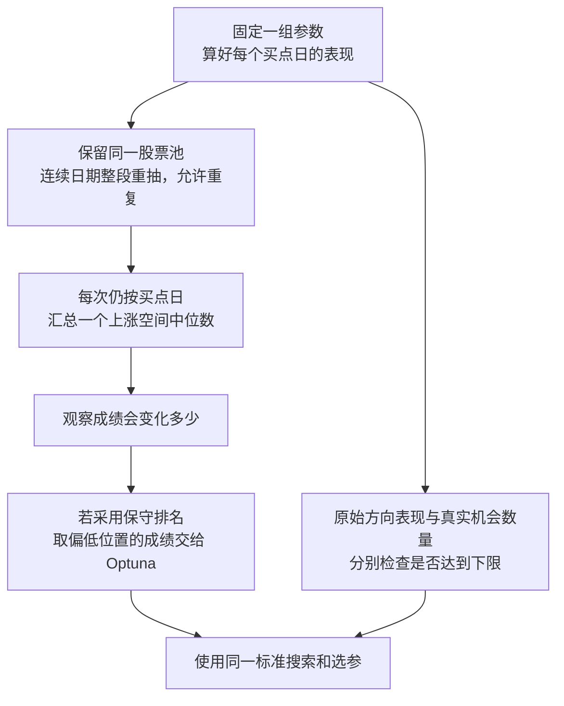

# v3 的重抽，到底该解决什么问题

来源：2026-10-02 的 [完整研究报告](final_report.md)、三位研究者的交叉讨论及合成实验。本文是方案建议，现有 skill 和代码尚未按此修改。

**建议允许有放回，但主要按连续日期一起重抽，并让同一天所有股票一起参与。它的用途是检查：同一股票池中，好成绩是否过于依赖某些历史时段。** 股票组成变化另外检查；不要把所有不同的担忧都混成一个越来越保守的分数。

## 本文沿用的词

| 词 | 在这里是什么意思 | 出处 |
|---|---|---|
| 买点 | 实际用于评价的买入日；同股票同日只计一次 | [path2/CONTEXT.md:159](../../../path2/CONTEXT.md) |
| 前瞻收益 | 买点之后规定期限内的最大上涨幅度，本文称“上涨空间” | [path2/CONTEXT.md:141](../../../path2/CONTEXT.md) |
| 首次穿越 | 价格先碰到上涨目标线，还是先碰到下跌目标线，用于方向表现 | [path2/CONTEXT.md:148](../../../path2/CONTEXT.md) |

## 先想清楚重抽的作用

一组参数在已有训练数据上的成绩，本来就算得出来。重抽时参数、买点和每个买点日的表现都不变，只改变哪些历史片段出现得多、哪些少一些。

如果稍微改变这些片段的占比，成绩就大变，说明当前高分很依赖所经历的历史。如果怎么组合都差不多，则说明它对这类变化不太敏感。

这个检查可以帮助选参，但不能单凭它说将来也会这样。比如两年碰巧都处于相似行情，再怎么重抽，仍然看不到从未出现过的新行情。重抽很多次，也无法把两年变成更多年。



图里的“偏低位置”是很多次重抽成绩中的偏低位置，不是某个参数附近的最差成绩，也不是单次买入最差会赚多少。

## 连续时间段，也完全可以有放回

假设把近期历史分成四段：

```text
原历史： [ A ][ B ][ C ][ D ]
重抽一： [ A ][ A ][ D ][ B ]
重抽二： [ C ][ B ][ C ][ D ]
```

第一轮 A 出现两次，C 没出现；第二轮 C 出现两次，A 没出现。这就是有放回。每次抽中的是整段，段内各个买点日跟着一起计数。

重复只是计算时改变占比，不表示实盘里真的新增了机会。检查买点日数量是否达到下限，仍然用原来的真实数量。

如果无放回地把四段全部拿一次，最后只是换顺序，汇总中位数不变。如果每轮只拿其中三段，成绩会变化，它回答的是“少看一段历史以后还怎么样”。这也有价值，但和有放回重新组合整份历史不是同一个问题，不能直接把两种变化幅度当成同一把尺子。

## 为什么不把每天完全打散

周一和周二都观察往后若干天，它们的上涨空间可能来自同一次上涨；同一天的多只股票，也可能一起受市场影响。

每天都允许买，所以这些日子都是实际机会。但判断成绩可靠不可靠时，它们不一定提供彼此独立的支持。全部打散后重抽，容易把同一轮行情产生的多次好成绩，看成很多次不同经历。

推荐安排保留两种联系：同一天的股票一起抽，相邻的一段日子也一起抽。最后仍然按每个买点日求中位数，不先把一天或一段压成一个等权机会。

连续段只用于重新汇总已经算好的表现，不会把股价剪碎后拼成新走势，也不会重新计算人工接缝之后的最高价。

## 为什么建议把抽股票另外放

“在这个股票池里继续交易”与“换一种股票组成以后仍然有效”，是两个不同的问题。

如果某个方法确实长期擅长池子里的几只股票，反复把这些股票抽走，再把变差的成绩压进主分，就会额外惩罚这种擅长。这个惩罚是否必要，取决于是否要求它换股票后也有效。

本次建议优先服务当前股票池：主分改变历史时段占比，另报删去某只股票以后会怎样，让依赖来源看得见。它不意味着股票优势永久不变；两种抽法都无法凭空知道未来个股优势会怎样变化。

## 两年确实很短，换一种抽法也补不回来

如果每段约一个月，两年大约只有二十多段；若评分只看近期一年，就只有十来段。买点集中时，真正包含机会的段更少。

把每段切短，可抽的段变多，却会拆开本来联系紧密的日子。把每段拉长，更能保留一轮行情，却只剩很少段。随机改变起点可以减少固定切口的影响，但不会创造新的历史。

随机起点还可能带来新问题：如果每段都不能跨出历史末端，最早和最近的日子可能比中间的日子更少被抽中。因此这次没有直接宣布“随机起点一定更好”，也没有确认现有段长已经够用。[软件作者对首尾抽样的说明](https://bashtage.github.io/arch/bootstrap/timeseries-bootstraps.html)。

建议从清楚、简单的固定连续段开始比较，再检查换切口、换合理长度后结论会不会明显变化。具体数值由开发检验确定，不需要你拍板，也不从最后验证结果里挑最好看的一种。

## 偏保守的成绩，可以用于优化，但有代价

原始成绩很高、稍换历史组成就明显下降的候选，会被偏保守的评分压低。这可能少追到一些偶然高分。

反过来，一个候选确实更好，只是出现较少或覆盖时间较短，也可能被压低。机会数量超过下限后不直接加分，与因证据更充分而得到较少折扣，可以同时成立；但必须承认后者仍会影响排名。

因此建议继续把这种保守取舍列为一个待验证的主方案，同时保留原始空间排名作为开发对照。不能仅因为叫“稳健”，就认定它一定能选出更好的参数。

如果采用保守成绩，搜索和训练入选就都按同一成绩比较，不再在最后另加“原始空间还必须提高”这套门槛。方向和真实机会数量仍分别守下限。某次重抽没有可以判断方向的触线日，也不应该自动把仍可计算的空间判成很差。

## 这次实际检查了什么

我们造了几种关系已知的假数据：彼此无关的机会、同一天共同变化的机会、相邻很多天共享变化的机会，以及只有少数长期状态的历史。先规定比较方式，再看哪些方法会漏掉或放大变化。

结果没有出现一个处处正确的赢家：逐日打散可能低估变化，连续段仍可能保留不够，额外抽股票也可能加入本任务不需要的变化。我们还比较了两个真实优劣已知的候选，确认偏保守排名确实可能错过较好的那个。

这都是合成检验。没有读取市场数据，没有重跑完整参数搜索，也没有证明哪个默认长度或评分位置最适合实盘。当前最有把握的是抽样的目的和分工，而不是某个数字已经最优。

## 建议保留的设计

1. 固定参数后，复用买点日结果，重抽时只重新汇总。
2. 以连续日期为单位，有放回；同日各股票、各候选共用抽中次数。
3. 原始空间与重抽后的保守成绩分别展示，选定一个作为统一训练排名。
4. 主方案采用保守成绩时，明确它可能错过真实但证据较少的优势；保留原始成绩方案作开发对照。
5. 股票依赖、时段依赖另外解释，不把多项最差结果叠成一个难以理解的分数。
6. 规则事先确定，最终留着没碰过的数据只用于检查冻结候选。

这些是下一版的研究建议，现有 skill、代码和正式参数未修改。

## 数字附表：只说明合成机制

下表给三个有代表性的结果。假数据中的“更好”已知，不来自对市场的事后判断。

| 检查 | 结果 | 只能说明什么 |
|---|---|---|
| 相邻20日共享变化，估计成绩会变化多少 | 逐股票买点日重抽约捕捉到实际变化幅度的10%；20日整段约78% | 保留相邻联系很重要，但20日段仍不一定够 |
| 历史只有三个长期状态 | 20日整段约捕捉到实际变化幅度的51% | 多次重抽不能补出更多状态 |
| 较好候选只在最后60日产生机会 | 原始成绩选对约62%，20日段的保守成绩约49% | 保守评分可能牺牲真实优势；不证明原始成绩普遍更好 |

前两行的“变化幅度”具体为中位空间取对数后的标准差，见完整报告；第三行比较400份独立生成的历史，只比较两个候选，未套完整方向和机会门槛，也没有模拟从大量参数里挑最高分。它们不能当成 v3 在实盘的准确率。
