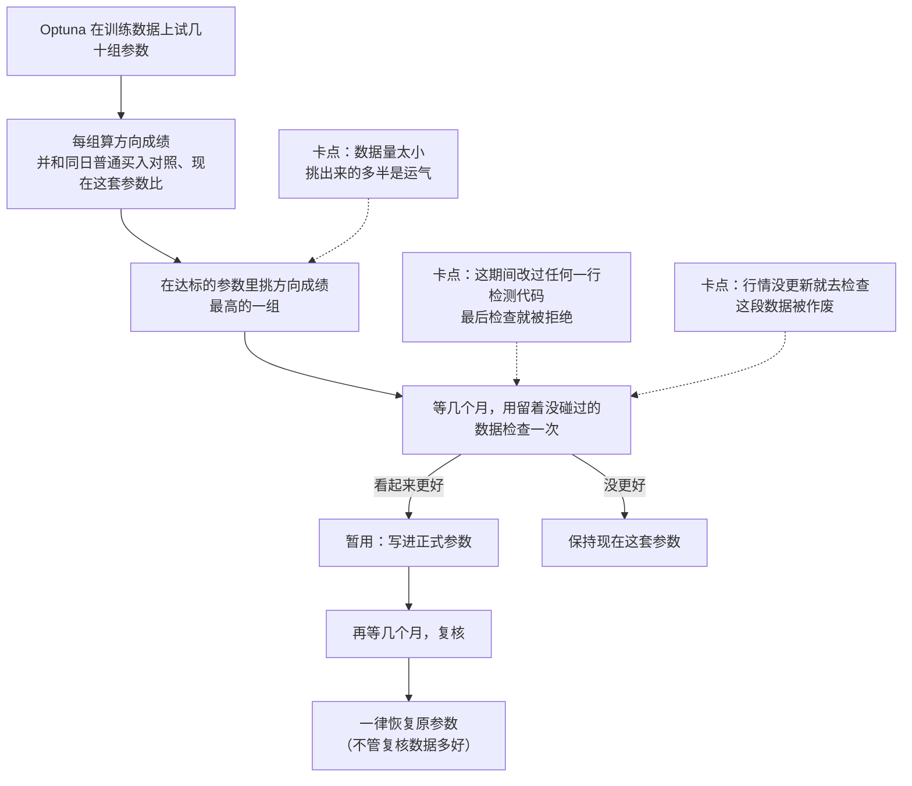

# tune-gates-v3 评审 · 白话版

> 来源：同目录 [final_report.md](final_report.md)（2026-10-05，三人评审小组 + 主会话核对）。本文自包含，读它就能做决定。
> 证据性质：代码问题是逐行读代码、跑复现确认的；效果数字来自 10 月初 bottom_burst 那次真实对照的数据（256 只股票），在此基础上做了重抽和模拟，没有跑新的调参。
> 2026-10-06 更正：初版把 v3 的「同一天、同波动档普通买入」对照叫成随机日基线，是错的；随机日基线是从全部日子里随机抽日，不限同一天。已全文改为「同日普通买入对照」。

**一句话：v3 的骨架是对的，删掉旧版那批复杂度也删对了；但它现在跑不完一轮有意义的调参——复核在代码里注定恢复原参数，有几处工程坑会白白作废数据，而且数据量不够分辨参数好坏这件事，它既没解决也不告诉你。修法以删除和改几行为主，不加新的统计机制；有三件事需要你拍板。**

## 用到的词

| 词 | 意思 | 出处 |
|---|---|---|
| 买点 | 真正用来计算后续表现的那一天；同一只股票同一天只算一次 | [path2/CONTEXT.md:159](../../../path2/CONTEXT.md) |
| 首次穿越 | 买入后先碰到上方目标线还是下方目标线；v3 用收盘价判断 | [path2/CONTEXT.md:148](../../../path2/CONTEXT.md) |
| 同日普通买入对照 | 在候选每个买点的同一天、同样波动水平的股票里随便买，用来对照；那几天大盘的涨跌因此被扣掉 | [path2/CONTEXT.md:155](../../../path2/CONTEXT.md)；不是 [随机日基线](../../../path2/CONTEXT.md)（`path2/CONTEXT.md:152`，从全部日子里随机抽日，不限同一天） |
| 方向成绩 | v3 按固定办法算的分：各时段里「先涨到上线的买点数 − 先跌到下线的买点数」除以买点总数，再按近期加权平均。0.1 不是收益 10% | v3 skill 用语 |
| 现在这套参数 | 本轮调参之前正在用的参数 | tune-gates 人话译法 |
| 留着没碰过的数据 | 没参与挑参数的数据；v3 用它做「最后检查」，之后再用新攒的数据做「复核」 | tune-gates 人话译法 |
| 暂用 | 最后检查看起来更好，就先写进正式参数，到预定日期复核 | v3 skill 用语 |

## 一、v3 现在怎么走，卡在哪



## 二、做对了什么（建议保留）

- **删掉旧版那批东西是对的。** 包括事后切档位的扫描结果和配套的一致性验证、逐个参数筛选、稳健区域、三处让你拍板的停点。它们大多是为旧架构服务的，或者针对的是次要因素：挑出来的参数在挑它的那份数据上总会显得偏好，而这个偏好程度和比较了多少组合几乎无关。代码从约一万行降到约一千六百行，你每轮要拍板的次数从三四次降到零到一次。
- **每组参数直接跑检测、直接评分**，后续表现每只股票只算一次反复用。全部股票跑 80 组大约 20 分钟（推算）。
- **和同日普通买入对照比**（同一天、同样波动水平的股票随便买），这一点必要也做得对：越是波动大的日子，随后越容易先跌，不按波动配对会冤枉或抬高候选。
- **方向成绩的算法本身没问题。** 和「把所有买点直接平均」相比，它的稳定程度差不多，对候选的排名也基本一致。
- **用收盘价判首次穿越**，和盘中判法比，方向反过来的只有 1.3%，副作用很小。
- **只挑一个候选、留着没碰过的数据只看一次**，并且看之前先登记。这是整条链里唯一真正决定结论的一步，值得保护。
- **最后检查真正可靠的本事是拦住明显变差的改动**：真实变差较多的改动，只有约 2% 能混过去。

## 三、卡在哪

### 1. 复核注定恢复原参数（最严重，已逐行核对代码）

v3 的结局本来设计成三种：确认采用、暂用、不采用。但「确认」需要一条经过校准的证据规则，代码里没有，相关结果被写死成「证据不足」；而「暂用」只允许出现在最后检查，不允许出现在复核。于是到了复核，所有分支都落到「恢复原参数」。我们拿一个复核数据完美改善、各项要求全过的例子去跑，结果照样是恢复原参数。

这意味着：复核要专门留出一段新数据、再等几个月，却对结论毫无影响；一个改动想长期留下，唯一的办法是永远不跑复核。这和你当初选的「先暂用、到期复核」不是一回事。现有的白话说明还把「确认采用」画成可能的结局，把这个问题遮住了。

### 2. 三个会白白作废数据或卡死流程的工程坑（已核对代码）

- **代码一改，最后检查就做不了。** v3 冻结候选时，会把整个框架和所有 app 的代码内容记下来，到检查时发现「上次调完之后，检测逻辑改过」就拒绝。bb 的最后检查最早要到 2027 年初，而过去四个月里这些代码最长 31 天就会改一次，所以几乎一定会被拦住。冻结时也没记 git 提交号，被拦住后找不到可以退回的版本。
- **行情没更新就去检查，等了几个月的数据会被作废。** v3 先登记「这段数据已经用过」，再去读行情；行情没到齐就报错，但登记已经生效，下次再跑会被拒绝。我们的行情是手动从 Yahoo 拉的，「日期到了」和「数据到了」是两件事，这个坑很容易踩。
- **漏写回看起点，最后检查段会整段没有买点。** bb 每个买点要往前看约三个月的历史。配置里没写回看起点时，检查段的前三个月全被当作预热，检查段又短，于是一个买点都没有，结论是「不采用」，数据照样算用过。

### 3. 数据量不够分辨好坏，v3 却不告诉你（已用真实对照数据验证）

在 256 只股票的规模下，「现在这套参数」的买点只来自 10 只左右的股票。结果是：

- 参数改动的真实效果，按旧研究换算大约只有 0.03（方向成绩单位）；而两套相近参数的成绩差，光是偶然因素就能晃动 0.08~0.12，是真实效果的三四倍。
- 所以训练里挑出来的第一名基本是靠运气：在所有改动都无效的假想情况下，挑出来的第一名照样会显得好 0.19。一个真有 0.03 改善的候选，被挑中的机会和在达标候选里随手挑一个差不多。
- 最后检查对「真改善 0.03」和「没改善」的区分很弱：前者约 30% 的时候能进入暂用，后者约 18%。

旧版在 bb_v1 上「没找到稳健区域」也是同一个原因。区别在于，旧版至少会报出「这份数据最多能分辨出几个点的差别」，v3 不报，所以「这次本来就分不出来」被藏起来了。

v3 对此唯一有用的杠杆是**扩大股票池**，但它没给股票池的默认值，配置示例里只有 6 只股票。

### 4. 有两道要求其实在看大盘涨跌，不在看参数好坏（已用真实对照数据验证）

v3 要求候选的方向成绩必须大于 0，而且不能比同日普通买入对照差。这两条是实现时的默认设置，不是你定的。问题在于调参是二选一：换不换成候选。如果「现在这套参数」本身也不满足这两条，用它们去拒绝候选，结果只是把更差的那套留下。

真实例子：在包含 2025 年初下跌的那段训练数据里，28 个候选有 27 个因为「方向成绩必须大于 0」被卡掉。而「现在这套参数」自己的方向成绩是 −0.20，也低于同日普通买入对照。有 10 个候选两项都比它好、机会也够，全被拒绝，最后留下的是 −0.20 的原参数。同样，最后检查如果正好落在下跌的几个月，任何候选都通过不了，结论在打开数据之前就已注定。

## 四、怎么修（以删为主）

**删掉的：**
- ~~统计折扣整块删掉~~（已撤回）：一次 bb 测试不能否定一个给所有 pattern 用的优化方法，而且删掉后搜索里只剩门槛、没有往好处推的力。改为保留，并修正一处走样：现在打折后的分会把同一天普通买入的成绩（大盘那一块）原样加回目标里，应改成只优化「打折后比同日普通买入多出的部分」。详见 `final_report.md` §11。
- 永远走不到的「确认」结局及相关说明。
- 「方向成绩必须大于 0」，以及「至少 30 个买点日」「最近半年至少 1 个」这两条数量要求。
  - 「至少 30」在 3 个月的检查段里会系统性卡掉买点稀少的 pattern；而且 30 个买点可能只来自 3 只股票，既不能说明机会够，也不能当证据。
  - 删掉后，「不少于现在这套参数的一半」这两条仍然保证机会有下限。
- 白话说明里过期的部分，以及 skill 文档里删了也不影响执行的段落。

**改几行的：**
- 复核规则（见第五节第 1 题）。
- 「不能比同日普通买入对照差」改成「相对同日普通买入对照的成绩，不能比现在这套参数差」（见第五节第 2 题）。
- 冻结时记下 git 提交号；代码改过时，就回到那个版本去做检查。
- 先检查行情是否到齐，再登记使用。
- 回看起点自动推算，不再靠人填。

**改默认值的：**
- 股票池默认用全部股票。这是唯一能真正增加信息的一条，零代码。
- 后续观察期从 20 个交易日改为 40。20 天时约七成买点两条线都没碰到，40 天时降到约四成，每个买点带来的方向信息大约翻倍。bb 那次真实对照本来就用 40。

**只新增一样、而且只报告的：** 开跑前给你一句「这批数据上，方向成绩光靠偶然就会晃动大约多少」，明显不够时提醒一次扩大股票池。它不卡流程，也不参与挑选和采用。另外开跑时就告诉你最早什么时候出结论，并说明训练里看到的改善是「挑出来之后的观察值，不是预期收益」。

**明确不做的：** 确认规则、开跑前的样本够不够闸门、限制一次调几个参数、股票数下限、恢复稳健区域、自动延长观察。理由是这些要么在现有数据量下几乎不会起作用，要么会把旧版的复杂度带回来。

## 五、需要你拍板的三件事

### 第 1 题：复核要不要真的起作用

现在的复核注定恢复原参数，必须改。两条路：

- **A（推荐）：复核用和最后检查一样的规则。** 复核数据上仍然更好、要求全过，就继续使用（标明「两次独立检查都更好，但不是统计确认」）；否则恢复原参数。改动三五行。
  - 代价：真实效果为零的改动，大约四分之一会被长期留下。扩大股票池也降不下这个比例，因为对真实效果为零的改动，每次检查本质上都是一半一半。
  - 不过零效应的改动按定义没有坏处。扩大股票池真正改善的是：变差的改动几乎留不下，真有改善的大多能留下。
- **B：干脆删掉复核。** 暂用就当正式参数，下一轮调参时自然会拿它和新候选比。最省时间和数据。
  - 代价：零效应改动被留下的比例约一半，比 A 多拦一道的机会也没了；而且它改掉了你当初选的「到期复核」。

### 第 2 题：下跌行情里比现在少亏，算不算改善

更准确的问法是：如果现在这套参数本身方向成绩为负、或者不如同日普通买入对照，一个比它好但仍然为负的候选，换不换？

- **算（推荐）：** 删掉「方向成绩必须大于 0」，把「不能比同日普通买入对照差」改成「不比现在这套参数差」。另外，「这个 pattern 这段时间整体为负」会作为醒目提示报告给你，由你决定这个 pattern 还要不要用。
  - 代价：在 256 只股票的规模下，零效应候选在最后检查里被暂用的比例从约 18% 升到约 35%。
  - 这个代价要看清楚：原来 18% 偏低，并不是因为检查更会分辨好坏，而是那两道线在大盘弱的时段把所有候选一起拦了，好的坏的都拦。区分好坏的能力只是略降。要压低误暂用，正路是扩大股票池。
- **不算：** 维持现状。代价是下跌时段里任何参数都调不动，最后检查的结论取决于那几个月大盘的涨跌。

### 第 3 题：平时说「调一下 XX 的参数」，默认进哪一版

现在这句话触发的是旧版，v3 只能点名进入。旧版的入口说明自称「唯一入口」，另一个 skill 也把调参转给旧版。v3 里还有一个触发词「结合新旧方法调参」，对应的能力并不存在。

- **推荐默认用 v3。** 旧版只保留给「这个 pattern 比随机买有没有底子」「这道闸该不该删」这类问题。
- 代价是改三处触发说明，零代码。旧版目录不能整删，因为 feature-study 还在用它的统计模块。

## 六、修完之后能期待什么

- **调参本身的期望收益就小。** 即使全部修完、换成全部股票，参数改动的真实效果大约只有 0.03 这个量级。修好后的 v3 是一个便宜、诚实的「改参数过滤器」：拦得住变差的改动，能让真改善大概率留下，但不能「确认」小改善。
- **一轮要等很久。** bb 这一系列过去的数据已经被 bb_v1 用到 2026 年 8 月，留着没碰过的数据只能来自未来：

```
2026-10  现在开跑（训练只能用已看过的历史数据）
   │
   ├── 2026-11 起  最后检查段开始攒买点
   │
2027-02 ~ 2027-04  最后检查出结论（取决于检查段留多长）
   │
2027-08 ~ 2027-10  复核出结论（按第 1 题选 A；选 B 则没有这一步）
```

## 七、局限

- 实测只用了一个 pattern（bottom_burst）、256 只股票和两次时间拆分。「换成全部股票后会好多少」是按股票数推算的，没有实测；要实测得先核对这些数据的使用登记。
- 上面的波动数字没有算上「同一天全市场一起涨跌」的影响，真实情况只会更差。
- 「真实效果约 0.03」是从旧版 bb_v1 的结果换算来的，不是 bottom_burst 的实测。
- 有一个小分歧没定：bb_v1 已经自己用过的那段预留数据，还要不要继续保护。它只影响一个暂时不做的可选改动（取消阶段之间约 3 个月的空档），可以以后再说。

## 附表：主要数字

| 项目 | 数值 | 说明 |
|---|---|---|
| 「现在这套参数」的买点来自几只股票 | 训练段 10~12 只；检查段 3~9 只 | 256 只股票的股票池 |
| 两套相近参数成绩差的偶然晃动 | 0.08~0.12 | 真实效果约 0.03 |
| 所有改动都无效时，训练第一名「显得好」多少 | 约 0.19 | 中位数 |
| 真改善 0.03 的候选被挑中的概率 | 3%~7% | 随手挑一个达标候选是 2%~5% |
| 最后检查进入暂用的比例：零效应 / 改善 0.03 / 变差 0.10 | 18% / 30% / 1.8% | 现行规则 |
| 同上，按第 2 题「算」 | 35% / 52% / 6.5% | 区分力约 1.65 倍 → 1.5 倍 |
| 最后检查 + 复核都过的比例（第 1 题选 A + 第 2 题「算」） | 零效应 16% / 改善 0.03 35% / 变差 0.10 0.7% | 256 只股票 |
| 换成全部股票后被长期留下的比例（推算） | 变差 0.03：0.2%~5%；零效应：约 25%；改善 0.03：60%~91% | 未实测 |
| 下跌时段被「方向成绩必须大于 0」卡掉的候选 | 28 个里 27 个 | 现在这套参数自己是 −0.20 |
| 「至少 30 个买点」在 4 个月检查段卡掉的候选 | 19 个里 12 个 | |
| 两条线都没碰到的买点比例 | 观察 20 天约 67%~70%；40 天约 40% | |
| 收盘判法与盘中判法方向相反的比例 | 1.3% | |
| 代码量（非测试） | 旧版约 10,800 行 → v3 约 1,600 行 | |
