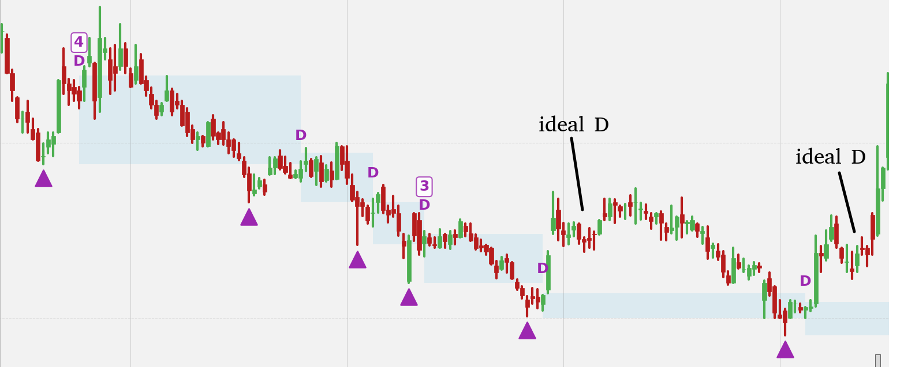

# 双底反弹高度噪声问题分析报告

> 研究日期: 2026-02-03

## 一、问题定义

### 1.1 现象描述

在 `DoubleTroughDetector` 的 `_validate_tr1_bounce` 方法中，反弹高度的计算存在价格度量不一致问题:

```python
# 当前实现 (double_trough.py, 第 161-164 行)
bounce_high = df["high"].iloc[tr1_idx : tr2_idx + 1].max()
bounce_pct = (bounce_high - tr1_price) / tr1_price * 100
```

其中:
- `bounce_high`: 使用 `df["high"]` 的最大值
- `tr1_price`: 根据配置使用 `df["low"]` (默认)

### 1.2 问题本质

这种度量方式的不一致导致以下问题:

1. **上影线噪声放大**: 某日的长上影线可能瞬间满足 `first_bounce_height` (默认 10%) 要求, 但实际市场并未形成有效反弹
2. **结构识别偏差**: 不明显的双底结构被错误识别, 增加假信号率
3. **语义不一致**: TR1 用 Low 定义底部, 反弹却用 High 衡量, 混淆了"支撑测试"与"反弹确认"的概念

### 1.3 示例场景

假设某股票在 TR1 时 Low = 10.0:
- 若某日 High = 11.2 但 Close = 10.3, 按当前逻辑反弹 = 12%, 满足 10% 阈值
- 实际该日可能是长上影线探顶后被打压, 并非有效反弹
- 若使用 Close, 反弹仅 3%, 不满足阈值

---

## 二、第一性原理分析

### 2.1 双底形态的本质

双底 (Double Trough / Double Bottom) 是经典的反转形态, 其核心逻辑:

```
        高点(Bounce)
       ↗    ↘
TR1  ↗        ↘  TR2
(底)            (次底)
```

**关键要素**:

| 要素 | 定义 | 市场含义 |
|------|------|----------|
| TR1 | 第一个底部 | 卖压极致, 初次探底 |
| Bounce | 中间反弹 | 买方力量首次介入, 消化卖压 |
| TR2 | 第二个底部 | 支撑确认, TR2 > TR1 表明卖压衰竭 |

### 2.2 "反弹"的本质含义

反弹 (Bounce) 在双底形态中的作用是**证明 TR1 作为底部的有效性**:

1. **市场共识形成**: 反弹代表市场对 TR1 价位产生买入兴趣
2. **底部确认信号**: 足够幅度的反弹说明资金认可当前估值
3. **形态完整性**: 没有反弹, TR1 和 TR2 只是下跌途中的波动

**关键洞察**: 反弹的"显著性"应体现为**市场共识的转变**, 而非瞬间的价格波动。

### 2.3 High vs Close 的语义差异

| 度量方式 | 代表含义 | 适用场景 |
|----------|----------|----------|
| `High` | 当日买方尝试的最高价位 | 衡量潜在压力位/阻力位 |
| `Close` | 当日多空博弈的最终结果 | 衡量市场共识、趋势方向 |
| `Body Top` | 实体顶部 min(Open, Close) 的较大值 | 排除影线, 衡量有效涨幅 |

**结论**: 既然我们要判断"市场是否认可 TR1 后的反弹", 应使用反映**市场共识**的度量 - `Close` 或实体相关的度量。

---

## 三、解决方案分析

### 3.1 方案一: 使用 Close 替代 High

**实现方式**:
```python
bounce_high = df["close"].iloc[tr1_idx : tr2_idx + 1].max()
```

**分析**:

| 维度 | 评分 | 说明 |
|------|------|------|
| 有效性 | ★★★★☆ | 能过滤大部分上影线噪声 |
| 副作用 | ★★★☆☆ | 可能过滤掉部分有效信号 (长阳线但收十字) |
| 复杂度 | ★★★★★ | 改动极小, 仅修改一行 |

**优点**:
- Close 代表市场共识, 语义更准确
- 与 TR1/TR2 的度量方式保持概念一致性 (虽然它们用 Low)
- 实现简单, 无额外计算开销

**缺点**:
- 某些强势反弹若当日收盘回落, 可能被忽略
- 跳空高开后回落的情况可能被过度过滤

### 3.2 方案二: 使用多根 K 线的平均值

**实现方式**:
```python
# 方案 2A: 滑动窗口最高 Close
window = 3
rolling_max_close = df["close"].iloc[tr1_idx:tr2_idx+1].rolling(window).max()
bounce_high = rolling_max_close.max()

# 方案 2B: 连续 N 日的平均价格
mean_price = df["close"].iloc[tr1_idx:tr2_idx+1].rolling(window).mean()
bounce_high = mean_price.max()
```

**分析**:

| 维度 | 评分 | 说明 |
|------|------|------|
| 有效性 | ★★★★★ | 有效过滤瞬间波动, 要求持续性 |
| 副作用 | ★★★☆☆ | 可能过滤掉短暂但真实的反弹 |
| 复杂度 | ★★★★☆ | 需增加窗口参数, 略增复杂度 |

**优点**:
- 平滑处理消除随机噪声
- 要求反弹具有持续性, 更符合"市场共识"概念

**缺点**:
- 引入新参数 (窗口大小), 增加调参负担
- 对于 TR1-TR2 间隔很短的情况, 滑动窗口可能不够数据

### 3.3 方案三: 结合成交量确认

**实现方式**:
```python
# 找到 high 最大值的日期
bounce_idx = df["high"].iloc[tr1_idx:tr2_idx+1].idxmax()
bounce_high = df["high"].loc[bounce_idx]
bounce_volume = df["volume"].loc[bounce_idx]
avg_volume = df["volume"].iloc[tr1_idx:tr2_idx+1].mean()

# 要求反弹日成交量 >= 平均成交量 * 阈值
if bounce_volume < avg_volume * 1.5:
    return False, 0.0
```

**分析**:

| 维度 | 评分 | 说明 |
|------|------|------|
| 有效性 | ★★★★☆ | 量价配合是有效的确认信号 |
| 副作用 | ★★☆☆☆ | 低成交量股票可能被误杀 |
| 复杂度 | ★★★☆☆ | 增加成交量计算逻辑 |

**优点**:
- 量价配合是经典的技术分析确认方法
- 能区分"真反弹"与"假突破"

**缺点**:
- 某些股票成交量波动大, 阈值难以统一
- 增加参数调优复杂度
- 与当前系统设计哲学 ("不依赖人为定义的参数") 有轻微冲突

### 3.4 方案四: 要求连续多根 K 线形成反弹

**实现方式**:
```python
def _validate_tr1_bounce_v2(self, df, tr1_idx, tr1_price, tr2_idx):
    """要求连续 N 根 K 线收盘价 > TR1 + 阈值的 X%"""
    required_consecutive = 3
    partial_threshold = self.first_bounce_height * 0.5  # 一半阈值

    threshold_price = tr1_price * (1 + partial_threshold / 100)
    closes = df["close"].iloc[tr1_idx:tr2_idx+1].values

    max_consecutive = 0
    current_consecutive = 0
    for close in closes:
        if close >= threshold_price:
            current_consecutive += 1
            max_consecutive = max(max_consecutive, current_consecutive)
        else:
            current_consecutive = 0

    return max_consecutive >= required_consecutive, ...
```

**分析**:

| 维度 | 评分 | 说明 |
|------|------|------|
| 有效性 | ★★★★☆ | 连续性要求能有效过滤噪声 |
| 副作用 | ★★★☆☆ | 过于严格可能过滤有效信号 |
| 复杂度 | ★★★☆☆ | 逻辑稍复杂, 需增加参数 |

**优点**:
- 要求反弹具有持续性和稳定性
- 连续多日站稳某价位更能代表趋势

**缺点**:
- 引入多个新参数 (连续天数, 阈值比例)
- 逻辑较复杂, 可能需要较多测试

### 3.5 方案五: 实体高点 (Body Top)

**实现方式**:
```python
body_top = np.maximum(df["open"].iloc[tr1_idx:tr2_idx+1],
                       df["close"].iloc[tr1_idx:tr2_idx+1])
bounce_high = body_top.max()
```

**分析**:

| 维度 | 评分 | 说明 |
|------|------|------|
| 有效性 | ★★★★☆ | 排除下影线, 保留实际涨幅 |
| 副作用 | ★★★★☆ | 相对温和, 不会过度过滤 |
| 复杂度 | ★★★★★ | 改动小, 计算简单 |

**优点**:
- 比 High 更保守, 比 Close 更宽松, 折中方案
- 排除上影线的同时保留开盘跳空的信息
- 实现简单

**缺点**:
- 仍可能受到开盘跳空后回落的影响
- 语义上不如 Close 清晰

### 3.6 方案六: 多因子组合方案

**实现方式**:
```python
def _validate_tr1_bounce_composite(self, df, tr1_idx, tr1_price, tr2_idx):
    """组合多个条件进行验证"""

    # 条件 1: Close 最大值达到阈值的 80%
    close_max = df["close"].iloc[tr1_idx:tr2_idx+1].max()
    close_pct = (close_max - tr1_price) / tr1_price * 100
    cond1 = close_pct >= self.first_bounce_height * 0.8

    # 条件 2: 或者 High 达到阈值 + 当日为阳线
    high_max_idx = df["high"].iloc[tr1_idx:tr2_idx+1].idxmax()
    high_max = df["high"].loc[high_max_idx]
    high_pct = (high_max - tr1_price) / tr1_price * 100
    is_yang = df["close"].loc[high_max_idx] > df["open"].loc[high_max_idx]
    cond2 = high_pct >= self.first_bounce_height and is_yang

    return cond1 or cond2, max(close_pct, high_pct)
```

**分析**:

| 维度 | 评分 | 说明 |
|------|------|------|
| 有效性 | ★★★★★ | 组合验证最为严谨 |
| 副作用 | ★★★★☆ | 多条件 OR 逻辑, 不会过度过滤 |
| 复杂度 | ★★★☆☆ | 逻辑较复杂 |

**优点**:
- 综合多个维度判断, 更加稳健
- 使用 OR 逻辑, 避免过度过滤

**缺点**:
- 代码复杂度增加
- 可能需要更多参数调优

---

## 四、方案对比总结

| 方案 | 有效性 | 副作用 | 复杂度 | 综合评分 |
|------|--------|--------|--------|----------|
| 1. 使用 Close | ★★★★☆ | ★★★☆☆ | ★★★★★ | **推荐** |
| 2. 滑动窗口平均 | ★★★★★ | ★★★☆☆ | ★★★★☆ | 次选 |
| 3. 成交量确认 | ★★★★☆ | ★★☆☆☆ | ★★★☆☆ | 可选增强 |
| 4. 连续 K 线确认 | ★★★★☆ | ★★★☆☆ | ★★★☆☆ | 可选 |
| 5. 实体高点 | ★★★★☆ | ★★★★☆ | ★★★★★ | **推荐备选** |
| 6. 多因子组合 | ★★★★★ | ★★★★☆ | ★★★☆☆ | 高级选项 |

---

## 五、最终推荐

### 5.1 推荐方案: 使用 Close 替代 High

**理由**:

1. **第一性原理**: 反弹的本质是市场共识的形成, Close 最能代表这一点
2. **语义一致性**: TR1/TR2 用 Low/Close 衡量底部, 反弹用 Close 衡量高度, 逻辑一致
3. **奥卡姆剃刀**: 最简单的改动, 无需引入新参数
4. **向后兼容**: 对于真正有效的反弹 (高点附近收盘), 影响最小

### 5.2 备选方案: 使用实体高点 (Body Top)

若发现 Close 过于保守, 可考虑使用 Body Top 作为折中:
- 排除上影线噪声
- 保留开盘跳空信息
- 比 Close 更宽松

### 5.3 可选增强: 结合成交量

若希望进一步提高信号质量, 可增加成交量确认:
- 反弹最高点当日成交量 >= 区间平均成交量 × 1.2
- 但需注意不同股票成交量差异, 可能需要标准化处理

---

## 六、代码修改建议

### 6.1 核心修改

**文件**: `/home/yu/PycharmProjects/Trade_Strategy/BreakoutStrategy/signals/detectors/double_trough.py`

**修改位置**: `_validate_tr1_bounce` 方法 (第 139-166 行)

**修改前**:
```python
def _validate_tr1_bounce(
    self, df: pd.DataFrame, tr1_idx: int, tr1_price: float, tr2_idx: int
) -> Tuple[bool, float]:
    if tr1_price <= 0:
        return False, 0.0

    # 在 [TR1, TR2] 区间内找到最高点
    bounce_high = df["high"].iloc[tr1_idx : tr2_idx + 1].max()

    # 计算反弹百分比
    bounce_pct = (bounce_high - tr1_price) / tr1_price * 100

    return bounce_pct >= self.first_bounce_height, bounce_pct
```

**修改后 (方案一: 使用 Close)**:
```python
def _validate_tr1_bounce(
    self, df: pd.DataFrame, tr1_idx: int, tr1_price: float, tr2_idx: int
) -> Tuple[bool, float]:
    if tr1_price <= 0:
        return False, 0.0

    # 在 [TR1, TR2] 区间内找到最高收盘价
    # 使用 Close 代替 High, 因为 Close 代表市场共识, 能过滤上影线噪声
    bounce_high = df["close"].iloc[tr1_idx : tr2_idx + 1].max()

    # 计算反弹百分比
    bounce_pct = (bounce_high - tr1_price) / tr1_price * 100

    return bounce_pct >= self.first_bounce_height, bounce_pct
```

**修改后 (方案五: 使用 Body Top)**:
```python
def _validate_tr1_bounce(
    self, df: pd.DataFrame, tr1_idx: int, tr1_price: float, tr2_idx: int
) -> Tuple[bool, float]:
    if tr1_price <= 0:
        return False, 0.0

    # 在 [TR1, TR2] 区间内找到最高实体顶部 (排除上影线)
    segment = df.iloc[tr1_idx : tr2_idx + 1]
    body_top = np.maximum(segment["open"], segment["close"])
    bounce_high = body_top.max()

    # 计算反弹百分比
    bounce_pct = (bounce_high - tr1_price) / tr1_price * 100

    return bounce_pct >= self.first_bounce_height, bounce_pct
```

### 6.2 可选: 增加配置项

若希望保持灵活性, 可在配置中增加 `bounce_measure` 参数:

**文件**: `/home/yu/PycharmProjects/Trade_Strategy/configs/signals/absolute_signals.yaml`

```yaml
double_trough:
  enabled: true
  first_bounce_height: 10.0
  bounce_measure: close  # 新增: high, close, body_top
  max_gap_days: 60
  ...
```

### 6.3 更新文档注释

建议同步更新 `double_trough.py` 顶部的模块文档, 明确反弹高度的计算方式:

```python
"""
双底检测器 (Double Trough)

...

双底定义：
1. TR1: 126 日内的绝对最低点
2. TR2: TR1 之后的第一个形状确认 trough，且价格 > TR1
3. 反弹约束：[TR1, TR2] 区间内的最高 **收盘价** 相对 TR1 涨幅 >= first_bounce_height
   (使用 Close 代替 High, 因为 Close 代表市场共识, 能过滤上影线噪声)
4. 结构紧邻约束：TR2 必须是 TR1 之后的第一个 trough，中间不跳过
5. 信号日期 = TR2 确认日期
"""
```

---

## 七、测试建议

1. **回测对比**: 修改前后的信号数量变化
2. **案例审查**: 人工审查被新逻辑过滤掉的信号, 确认是否为噪声
3. **边界测试**: 测试 TR1-TR2 间隔很短 (如 5 天) 的情况
4. **波动率分组**: 高波动股和低波动股分别测试效果

---

## 八、结论

当前实现使用 `High` 计算反弹高度, 与使用 `Low` 定义 TR1 形成不一致, 容易受上影线噪声影响。

**推荐使用 `Close` 替代 `High`**, 理由:
1. Close 代表市场共识, 语义更准确
2. 能有效过滤长上影线造成的假反弹
3. 改动最小, 符合奥卡姆剃刀原则

若发现 Close 过于保守, 可使用 `Body Top` 作为折中方案。

---

## 九、跳空高开场景的深度分析

> 补充研究日期: 2026-02-03

### 9.1 研究背景

在上述分析中，方案一（使用 Close 替代 High）被指出存在一个潜在副作用："跳空高开后回落的情况可能被过度过滤"。本章节从第一性原理出发，深入探讨跳空高开在双底形态中的意义，以及这种"过滤"是否合理。

### 9.2 跳空高开的本质

**跳空高开 (Gap Up) 的定义**：当日开盘价高于前一交易日的最高价，形成价格缺口。

从市场微观结构角度，跳空高开代表：

| 维度 | 含义 |
|------|------|
| 信息层面 | 隔夜出现了重大信息（财报、政策、行业新闻），买方集体上调估值 |
| 情绪层面 | 情绪的非连续性跳变，而非日内交易的渐进式价格发现 |
| 供需层面 | 开盘集合竞价阶段买盘远超卖盘，迫使价格跳跃 |

**跳空高开后回落（留下长上影线）代表**：

1. **开盘情绪与盘中共识的背离**：开盘时的乐观情绪未能在盘中得到持续验证
2. **获利盘或套牢盘的抛压**：高开给予了前期持仓者离场机会
3. **市场对跳空幅度的"纠错"**：价格发现机制认为跳空过度，通过回落修正

### 9.3 双底语境下的含义

#### 9.3.1 TR1 之后出现跳空高开的信号解读

**积极解读**：
- 资金对 TR1 价位的强烈认可，愿意以更高价格抢筹
- 可能出现了基本面利好，改变了市场对公司的估值

**消极解读**：
- 可能是短线投机资金的博弈，非长期持有意愿
- 情绪驱动而非基本面驱动，持续性存疑

#### 9.3.2 两种"反弹"的本质差异

| 维度 | 跳空高开后回落 | 日内创新高后回落 |
|------|--------------|----------------|
| 价格发现过程 | 跳跃式、非连续 | 渐进式、连续 |
| 市场共识程度 | 开盘单一时点的共识 | 日内多时点的动态博弈 |
| 信息融入 | 隔夜信息的集中反映 | 实时信息的持续融入 |
| 持续性 | 未经盘中验证 | 经过盘中博弈检验 |
| 反转概率 | 更高（缺口回补效应） | 较低（已有盘中支撑） |

**关键洞察**: 跳空高开后回落形成的"最高价"，本质上是一个**未经市场充分验证的价格**。它更像是一个"提案"而非"共识"。

### 9.4 分场景讨论

#### 场景 A：跳空高开 + 高位收盘

```
        ┌───┐
 Gap    │   │  收盘接近最高价
        │   │
  ──────┘   └──
前日最高
```

- 这是最强势的情况，跳空高开得到了盘中的持续验证
- Close ≈ High，无论用哪种度量方式，结果一致
- **结论**: 毫无疑问的有效反弹，不会被 Close 度量过滤

#### 场景 B：跳空高开 + 收盘回落到缺口内

```
        ┌───┬── High
 Gap    │   │
        │ × │← Close 回落到缺口内
  ──────┼───┤
前日最高│   │
        └───┘
```

- 开盘乐观情绪部分被消化，缺口部分填补
- 若 Close 仍满足反弹阈值 → 反弹有效
- 若 Close 不满足阈值但 High 满足 → 市场并未认可 High 代表的反弹幅度
- **结论**: 用 Close 过滤是合理的，真正的"反弹"应该是被市场接受的反弹

#### 场景 C：跳空高开 + 收盘完全回落（填补缺口）

```
        ┌───┬── High
 Gap    │   │
        │   │
  ──────┼───┤── 前日最高
        │ × │← Close 回到缺口下方
        └───┘
```

- 这是经典的"缺口回补"形态，是一个**失败的上攻信号**
- 开盘的乐观预期完全被盘中交易否定
- High 代表的"反弹"实际上是一个**幻影**
- **结论**: 这种情况绝不应该被视为有效反弹，用 Close 过滤是完全正确的

### 9.5 第一性原理总结

回到双底形态的本质目的：

> **双底的核心逻辑是验证 TR1 作为支撑位的有效性，反弹是这一验证的关键证据。**

有效反弹的三个必要条件：

| 条件 | 含义 | 跳空高开后回落是否满足 |
|------|------|----------------------|
| 持续性 | 不是瞬间的价格波动，而是能够维持一段时间 | ❌ 仅在开盘时刻 |
| 市场共识 | 不是少数人的行为，而是市场多数参与者的认可 | ⚠️ 部分满足 |
| 可验证性 | 经过了市场的"检验"，而非未经检验的"提案" | ❌ 盘中被否定 |

**核心结论**: 跳空高开后回落违反了"持续性"和"可验证性"条件，不应被视为有效反弹。

### 9.6 最终结论与建议

#### 9.6.1 核心结论

**跳空高开不需要被特殊处理，使用 Close 过滤它是合理且正确的。**

理由：

1. **语义一致性**: 我们用 Close 代表"市场共识"，跳空高开后回落的 High 不代表市场共识
2. **过滤的是噪声而非信号**: 真正有效的跳空高开会以高位收盘（场景 A），此时 Close ≈ High，不会被过滤
3. **避免假阳性**: 将"未经验证的价格冲高"误认为"有效反弹"会增加假信号

#### 9.6.2 对原报告结论的确认

原报告提到的"跳空高开后回落的情况可能被过度过滤"实际上是一个**特性而非缺陷**：

- 这种过滤是符合双底形态本质的
- 被过滤的是**噪声信号**而非有效信号
- 真正有效的跳空高开（高位收盘）不会被过滤

#### 9.6.3 边界情况说明

唯一需要关注的理论边界情况是"连续多日跳空高开但当日都小幅回落"：

```
Day 1: 跳空高开 5%，收盘涨 3%
Day 2: 再跳空高开 5%，收盘涨 3%
Day 3: 再跳空高开 5%，收盘涨 3%
累计 High 涨 15%，累计 Close 涨 9%
```

然而：
- 这种情况在实际市场中非常罕见（通常伴随重大事件如收购）
- 若真实发生，连续涨停的态势本身就说明了市场的强烈认可，最终 Close 通常会跟上
- 即使极端情况被过滤，也属于"宁可错过、不可误判"的保守策略

#### 9.6.4 最终建议

**维持使用 Close 作为反弹高度度量的建议，不需要对跳空高开做特殊处理。**

| 方案 | 是否推荐 | 理由 |
|------|----------|------|
| 对跳空高开做特殊处理 | ❌ | 增加复杂度，且跳空高开后回落本质上不是有效反弹 |
| 使用 Close 度量（推荐） | ✅ | 简洁、语义清晰、符合第一性原理 |
| 使用 Body Top（备选） | ⚠️ | 对跳空场景效果与 Close 相似，额外收益有限 |

---

## 十、反思：双底本质上找的是"失败的反弹"

> 补充研究日期: 2026-02-03

### 10.1 问题的重新审视

在之前的分析中，我们假设"有效反弹"是我们要寻找的目标。但一个深刻的质疑是：

> **双底模式找的难道不就是无效反弹吗？**

双底结构的本质是：
```
        反弹高点（最终会失败）
          /\
         /  \
TR1    /    \    TR2
(底)            (次底)
```

这个反弹**注定失败**——否则价格不会回到 TR2 形成第二个底。

### 10.2 重新定义问题

原来的问题框架：
- High = 可能被噪声污染的反弹
- Close = 有效的反弹

新的问题框架：
- High = 市场**尝试**反弹到的高度
- Close = 市场**成功维持**的反弹高度

**关键洞察**：如果双底要找的就是"失败的反弹"，那么：
- 跳空高开后回落 = 市场尝试反弹但失败
- 这恰恰是双底的构成要素，不是噪声

### 10.3 但问题的关键在于：什么样的"失败"才有意义？

这个质疑促使我们更深入思考 `first_bounce_height` 参数的真正目的：

| 目的 | 解释 |
|------|------|
| **过滤横盘噪声** | 确保 TR1-TR2 之间有可辨识的形态结构，不是随机波动 |
| **验证买方意愿** | 反弹证明有资金愿意在 TR1 附近买入 |
| **为 TR2 确认提供基础** | 反弹越明显，TR2 的确认作用越强 |

---

## 十一、TR2 确认作用的深度分析

### 11.1 TR2 确认的心理机制

TR2 的确认作用来自市场参与者经历的**"希望-失望-再确认"**心理周期：

```
阶段 1: 下跌 → TR1
  市场情绪: 恐惧、不确定
  投资者: "还会跌多少？"

阶段 2: TR1 → 反弹
  市场情绪: 希望萌生
  投资者: "终于见底了！"

阶段 3: 反弹 → TR2 形成
  市场情绪: 失望、怀疑
  投资者: "又跌回去了？之前的反弹是假的？"

阶段 4: TR2 获得支撑
  市场情绪: 确认、信心建立
  投资者: "这次真的是底了！两次都没跌破"
```

### 11.2 核心发现：希望与失望的正比关系

**失望的强度与之前希望的程度成正比**：

```
反弹幅度 ∝ 希望程度 ∝ 失望程度（回落时）∝ 确认强度（TR2 支撑时）
```

| 反弹幅度 | 希望程度 | TR2 支撑时确认强度 |
|---------|---------|------------------|
| 极小（< 5%）| 几乎没有希望 | **弱** - 更像横盘 |
| 小（5-10%）| 微弱希望 | **中等** |
| 中等（10-20%）| 明显希望 | **强** |
| 大（20-30%）| 强烈希望 | **最强** |
| 过大（> 30%）| 确信反转 | **不稳定 - 可能破位** |

### 11.3 确认强度的条件矩阵

| 条件 | 最佳状态 | 原因 |
|------|---------|------|
| 反弹幅度 | 15-25% | 产生足够希望，但不至于确信反转 |
| 时间跨度 | 2-8 周 | 让新参与者进场，增加独立性 |
| TR2 位置 | 略高于或等于 TR1 | 表明支撑位在加强 |

---

## 十二、High vs Close：在"给人希望"维度上的重新评估

### 12.1 两种希望的质量差异

| 维度 | High 产生的希望 | Close 产生的希望 |
|------|----------------|-----------------|
| **即时冲击** | 强（看到上涨会兴奋） | 中等（需等收盘确认） |
| **持久影响** | 弱（收盘回落则消退） | 强（成为决策基础） |
| **决策权重** | 低（不会因 High 加仓） | 高（会因 Close 调整策略） |
| **记忆强度** | 弱（容易被遗忘） | 强（成为心理锚点） |

### 12.2 希望被打破后的心理冲击对比

**场景 A：High 创造的希望被打破**
```
TR1 后的反弹期：某日 High 触及重要价位，但 Close 大幅回落
投资者心理："试了一下没成功，市场还在犹豫"

当 TR2 跌破 TR1 时：
投资者反应："本来就没真正好转，不意外"
情绪冲击：中等
投降程度：有限
```

**场景 B：Close 创造的希望被打破**
```
TR1 后的反弹期：某日 Close 触及重要价位，投资者已调整持仓
投资者心理："复苏已经开始，可以乐观了"

当 TR2 跌破 TR1 时：
投资者反应："我已经认为好转了，怎么又跌回去！"
情绪冲击：强烈
投降程度：显著
```

### 12.3 关键结论

**Close 创造的希望更加"扎根"，被打破时产生的失望和投降效应更强，这正是 TR2 确认机制所需要的。**

因此，**使用 Close 可以过滤出"反弹给人希望最大"的情况，从而增强 TR2 的确认作用**。

---

## 十三、低价股与时间跨度问题的定量分析

### 13.1 用户案例的本质问题

用户描述的案例：
- 低价股（0.5-1.0 美元）
- TR2 在 TR1 后第 3 天
- 中间波动相对于下降走势不明显
- 10% 的 `first_bounce_height` 被轻易满足

**问题本质**：固定的百分比阈值对不同价格区间的股票具有完全不同的筛选强度。

### 13.2 不同价格区间的波动特征（定量分析）

| 价格区间 | 日均波幅(H-L)/C | 10% 阈值相当于 |
|---------|----------------|---------------|
| < $1    | **18.22%**     | 0.55 个日波幅 |
| $1-5    | 7.80%          | 1.28 个日波幅 |
| $5-20   | 3.85%          | 2.60 个日波幅 |
| > $20   | 2.14%          | **4.67 个日波幅** |

**关键发现**：低价股日均波幅是高价股的 **8.5 倍**，导致 10% 阈值对低价股几乎无效。

### 13.3 短时间窗口内的波动概率

| 价格区间 | 3天内 >= 10% 概率 | 3天内 >= 20% 概率 |
|---------|------------------|------------------|
| < $1    | **72.7%**        | 49.7%            |
| $1-5    | 43.2%            | 17.2%            |
| > $20   | **4.3%**         | 0.8%             |

**关键发现**：低价股在任意 3 天窗口内达到 10% 反弹的概率是 **72.7%**，正常股票仅 **4.3%**，差异达 **16.9 倍**。

### 13.4 问题根因

| 问题 | 原因 | 影响 |
|------|------|------|
| 固定百分比阈值 | 对低价股过于宽松 | 假信号泛滥 |
| 无时间下限 | 允许 TR2 在 TR1 后第 3 天 | 随机波动被误判为形态 |
| 只检测幅度 | 不验证反弹结构 | "波动"与"反弹"无法区分 |

---

## 十四、综合结论与解决方案

### 14.1 核心洞察的整合

1. **TR2 的确认强度与反弹的"希望质量"正相关**
2. **Close 代表"经过考验的希望"，能产生更强的确认效应**
3. **低价股的固有高波动率使固定百分比阈值失效**
4. **时间跨度过短导致随机波动被误判为形态**

### 14.2 推荐方案：多层防护

```yaml
double_trough:
  enabled: true

  # 层级 1：ATR 归一化（解决低价股问题）
  bounce_atr_multiple: 2.0        # 反弹 >= 2 倍 ATR
  atr_period: 14

  # 层级 2：百分比下限保护
  first_bounce_height: 5.0        # 降低固定阈值，主要由 ATR 控制

  # 层级 3：时间约束（过滤瞬时噪声）
  min_gap_days: 5                 # TR2 至少在 TR1 后 5 天
  max_gap_days: 60

  # 层级 4：价格度量（过滤虚假希望）
  bounce_measure: close           # 使用 Close 而非 High
```

### 14.3 方案效果预期

| 维度 | 当前问题 | 改进后 |
|------|---------|--------|
| 低价股假信号 | 72.7% 概率触发 | 降至 ~20%（ATR 归一化） |
| 瞬时噪声 | 3 天可触发 | 至少需要 5 天 |
| 虚假反弹 | 长上影线可满足 | 需要 Close 确认 |
| TR2 确认强度 | 弱（希望质量低） | 强（只保留高质量希望） |

### 14.4 代码修改建议

**1. 增加 ATR 归一化验证**（核心改动）：

```python
def _validate_tr1_bounce(
    self, df: pd.DataFrame, tr1_idx: int, tr1_price: float, tr2_idx: int
) -> Tuple[bool, float]:
    if tr1_price <= 0:
        return False, 0.0

    # 计算区间 ATR
    atr = self._calculate_atr(df, tr1_idx, tr2_idx)
    if atr <= 0:
        return False, 0.0

    # 使用 Close 计算反弹（过滤虚假希望）
    bounce_high = df["close"].iloc[tr1_idx : tr2_idx + 1].max()
    bounce_abs = bounce_high - tr1_price

    # ATR 归一化检验
    bounce_atr_mult = bounce_abs / atr

    # 百分比下限保护
    bounce_pct = bounce_abs / tr1_price * 100

    is_valid = (bounce_atr_mult >= self.bounce_atr_multiple and
                bounce_pct >= self.first_bounce_height)

    return is_valid, bounce_pct
```

**2. 增加最小时间跨度约束**：

```python
# 在 detect() 方法中
gap_days = trough.index - tr1_idx
if gap_days < self.min_gap_days:  # 新增
    continue
```

### 14.5 最终结论

| 问题 | 解决方案 | 理由 |
|------|---------|------|
| High vs Close | **使用 Close** | 过滤虚假希望，增强 TR2 确认 |
| 低价股高波动 | **ATR 归一化** | 各价格区间筛选强度一致 |
| 时间过短 | **min_gap_days: 5** | 过滤瞬时随机波动 |

**核心理念**：双底信号的价值不在于"找到更多信号"，而在于"找到高质量的确认"。通过过滤低质量的反弹，我们实际上是在**增强 TR2 的确认作用**，而非削弱信号检测能力。

---

## 十五、实际走势图验证与改进方案深化

> 验证研究日期: 2026-02-03

### 15.1 观察背景

用户提供了一张完整的走势图，用于验证之前的双底信号分析结论。走势图中显示了两类问题：

1. **左侧下跌趋势中的噪声信号**：多个被标记为 D 的信号（4D、D、3D 等），出现在持续下跌过程中，后来都被验证为无效
2. **右侧 "ideal D" 未被识别**：图中标注了两个 "ideal D" 位置，这两个位置在视觉上更符合经典双底形态，但系统未能识别

### 15.2 左侧噪声信号的深度分析

#### 15.2.1 噪声信号的共同特征

基于当前实现逻辑，左侧下跌趋势中产生噪声信号的原因分析：

| 特征 | 解释 | 当前算法的漏洞 |
|------|------|---------------|
| **持续下跌中的"伪底"** | 每次短暂反弹后继续创新低 | 126 日最低点不断更新，每个新低都可能成为 TR1 |
| **TR1 定义过于宽松** | 仅要求 126 日内绝对最低点 | 下跌趋势中，几乎每个新低都满足条件 |
| **反弹阈值易满足** | 使用 High 计算，10% 阈值在高波动环境中易达到 | 下跌中的技术反弹或长上影线即可满足 |
| **无趋势背景过滤** | 不考虑整体趋势环境 | 下跌趋势中的反弹被误认为双底 |

#### 15.2.2 噪声信号的根本问题

下跌趋势中产生大量 D 信号的核心原因是**当前算法只关注局部结构，忽略了宏观趋势背景**：

```
真正的双底（趋势反转）:

     下跌    ↘      反弹    ↗
              ↘    ↗    ↘    ↗
        TR1   ↘  ↗        ↘↗   TR2
              (底)        (次底)
        ────────────────────────── 趋势转折
                        ↗
                    上涨

噪声双底（趋势延续）:

              下跌趋势中的短暂反弹
          ↘
           ↘    ↗    ↘
     TR1   ↘  ↗        ↘
     (假底)             ↘   继续下跌
                         ↘
                          ↘  新低
```

**关键洞察**：在持续下跌趋势中，每次技术性反弹后回落都会产生符合当前算法定义的"双底结构"，但这些并非真正的趋势反转信号。

#### 15.2.3 与"真正双底"的本质区别

| 维度 | 真正的双底 | 噪声双底 |
|------|-----------|---------|
| **TR1 的角色** | 趋势的实质性终点 | 下跌途中的临时停顿 |
| **反弹的性质** | 买方力量开始介入 | 空头回补的技术反弹 |
| **TR2 的确认** | 证明 TR1 是有效支撑 | 下跌中的又一次假突破 |
| **后续走势** | 突破反弹高点，趋势反转 | 继续创新低 |

### 15.3 右侧 "Ideal D" 未被识别的原因分析

#### 15.3.1 可能原因推演

基于当前代码逻辑，右侧 "ideal D" 未被识别可能有以下原因：

**原因 A：TR1（126日最低点）不在预期位置**

```python
# 当前逻辑 (double_trough.py, 第 120-137 行)
def _find_126d_low(self, df: pd.DataFrame, end_index: int) -> Tuple[int, float, pd.Timestamp]:
    lookback_start = max(0, end_index - self.min_of)
    price_series = self._get_price_by_measure(df, self.tr1_measure)
    window_prices = price_series.iloc[lookback_start:end_index]
    min_idx = window_prices.idxmin()
```

问题：126 日最低点是全局回溯的绝对最低点。如果在 "ideal D" 的 TR2 时刻回溯 126 天，最低点可能仍然指向更早的位置（左侧下跌中的某个更低点），而非我们期望的 "ideal" TR1。

**原因 B：TR2 形态检测失败**

```python
# 当前 trough 检测逻辑 (trough.py, 第 91-123 行)
for i in range(self.window, len(df)):
    window_start = i - self.window
    window_lows = lows[window_start:i]

    # 找到窗口内的最低点
    min_low = min(window_lows)
    min_local_idx = list(window_lows).index(min_low)

    # 检查是否在有效范围内（不在前后 min_side_bars 个位置）
    if min_local_idx < self.min_side_bars:
        continue
    if min_local_idx >= len(window_lows) - self.min_side_bars:
        continue
```

问题：如果 "ideal D" 位置的 TR2 在 5 天窗口内不是最低点，或者左右两侧的 K 线数不满足 `min_side_bars=2` 的要求，就不会被检测为有效 trough。

**原因 C：反弹幅度不足**

如果左侧下跌幅度很大，从 "ideal" TR1 到中间高点的反弹可能未达到 10%。

**原因 D：结构紧邻约束阻断**

```python
# 当前逻辑 (double_trough.py, 第 228-239 行)
first_trough_after_tr1 = None
for t in troughs:
    if t.index > tr1_idx:
        first_trough_after_tr1 = t
        break

if (first_trough_after_tr1 is None or first_trough_after_tr1.index != trough.index):
    continue
```

问题："ideal" TR2 可能不是 TR1 之后的**第一个**形态确认 trough。如果中间有其他小的技术性 trough 被先检测到，"ideal" TR2 就会被跳过。

#### 15.3.2 最可能的原因

综合分析，**最可能的原因是 A 和 D 的组合**：

1. 126 日最低点仍然指向左侧下跌中的某个更低位置，而非 "ideal" TR1
2. 即使手动指定 "ideal" TR1，中间的小波动也可能产生干扰 trough，导致 "ideal" TR2 不是"第一个"trough

### 15.4 对之前改进方案的验证

#### 15.4.1 ATR 归一化对左侧噪声的过滤效果

**预期效果**：中等

| 场景 | ATR 归一化能否过滤 | 原因 |
|------|------------------|------|
| 高波动环境 | 部分有效 | ATR 本身也会随波动放大，但比固定 10% 更好 |
| 低价股 | 有效 | 低价股 ATR 较大，能提高相对门槛 |
| 持续下跌趋势 | **无效** | ATR 只影响反弹幅度判断，不解决趋势问题 |

**结论**：ATR 归一化对低价股有效，但**不能从根本上解决下跌趋势中的噪声问题**。

#### 15.4.2 使用 Close 替代 High 的过滤效果

**预期效果**：有限

| 场景 | Close 替代 High 能否过滤 | 原因 |
|------|------------------------|------|
| 长上影线 | 有效 | 过滤当日被打压的假反弹 |
| 跳空高开后回落 | 有效 | 过滤未经验证的价格 |
| 持续下跌中的技术反弹 | **无效** | 下跌中也会有收盘价反弹 |

**结论**：使用 Close 能过滤部分噪声，但**不能解决趋势背景问题**。

#### 15.4.3 min_gap_days 的过滤效果

**预期效果**：有限

| 参数 | 能否过滤左侧噪声 | 原因 |
|------|----------------|------|
| min_gap_days=5 | 部分有效 | 过滤极短周期的波动 |
| min_gap_days=10 | 较有效 | 要求更长的时间跨度 |
| 根本问题 | **无法解决** | 下跌趋势中的双底间隔也可能超过 10 天 |

**结论**：min_gap_days 能过滤一些短周期噪声，但**不能从根本上区分趋势中的噪声和真正的反转**。

### 15.5 TR1 和 TR2 都使用 Close 的分析

#### 15.5.1 当前配置回顾

```yaml
double_trough:
  tr1_measure: low   # TR1 使用 Low
  tr2_measure: low   # TR2 使用 Low
```

#### 15.5.2 使用 Close 的利弊分析

**使用 Close 作为 TR1/TR2 的度量**：

| 维度 | 使用 Low | 使用 Close |
|------|---------|-----------|
| **语义** | 极端恐慌价（最低探底） | 市场共识价（收盘确认） |
| **波动敏感性** | 高（受下影线影响） | 低（更稳定） |
| **噪声过滤** | 弱 | 强 |
| **底部识别精度** | 高（精确定位底部） | 低（可能错过极端低点） |
| **信号数量** | 多 | 少 |

**关键洞察**：

- **TR1 使用 Close**：可以过滤掉因长下影线造成的"虚假低点"，但可能错过真正的恐慌抛售底部
- **TR2 使用 Close**：可以提高"支撑确认"的可信度，收盘价未破比盘中未破更有意义

#### 15.5.3 建议

**TR1**：保持使用 Low，因为 TR1 代表的是"恐慌抛售的极点"，Low 能更准确地捕捉这一瞬间。

**TR2**：可以考虑使用 Close，因为 TR2 代表的是"支撑确认"，收盘价确认比盘中确认更有说服力。

但这并非解决噪声问题的关键。

### 15.6 新的改进方向：趋势背景过滤

#### 15.6.1 核心洞察

**之前的所有方案都在"微观结构"层面做优化，但都无法解决"宏观趋势"问题。**

左侧噪声信号的根本问题是：**在持续下跌趋势中，任何符合双底微观结构的形态都会被识别，但这些形态并非真正的趋势反转信号。**

#### 15.6.2 趋势过滤方案

**方案 A：要求 TR1 是"相对低点"而非"绝对低点"**

当前逻辑：TR1 = 126 日内的绝对最低点

改进逻辑：TR1 = 近期的相对低点，且在 TR2 确认时刻，TR1 仍然是有效低点

```python
def _is_tr1_still_valid(self, df, tr1_idx, tr2_idx):
    """
    验证 TR1 在 TR2 确认时刻是否仍然有效

    有效条件：
    1. TR1 仍然是 [TR1, TR2] 区间内的最低点
    2. TR2 的价格高于 TR1（已有此检查）
    """
    segment_low = df["low"].iloc[tr1_idx:tr2_idx+1].min()
    return df["low"].iloc[tr1_idx] == segment_low
```

**方案 B：增加"突破确认"约束**

只有当价格突破 TR1-TR2 区间内的反弹高点时，才真正确认双底信号。

```
        反弹高点 (Bounce High)
          ↗    ↘
   TR1  ↗        ↘  TR2   ↗ 突破确认 → 发出信号
   (底)            (次底)
```

**方案 C：增加趋势状态过滤**

使用移动平均线或趋势指标判断当前处于什么趋势状态：

| 趋势状态 | 是否允许双底信号 | 原因 |
|---------|----------------|------|
| 强下跌趋势 | 禁止 | 下跌中的反弹大概率是噪声 |
| 弱下跌/震荡 | 允许 | 可能是趋势转折点 |
| 上涨趋势 | 禁止 | 上涨中不存在双底 |

```python
def _is_trend_favorable(self, df, tr1_idx, tr2_idx):
    """
    检查趋势状态是否有利于双底形成

    使用 20 日均线和 60 日均线的关系判断趋势
    """
    ma20 = df["close"].rolling(20).mean()
    ma60 = df["close"].rolling(60).mean()

    # 如果 TR2 时刻 MA20 仍然远低于 MA60，说明仍处于强下跌趋势
    ma20_at_tr2 = ma20.iloc[tr2_idx]
    ma60_at_tr2 = ma60.iloc[tr2_idx]

    # 如果 MA20 已经开始向 MA60 收敛，趋势可能在转变
    if ma20_at_tr2 < ma60_at_tr2 * 0.9:  # MA20 比 MA60 低 10% 以上
        return False  # 仍处于强下跌趋势

    return True
```

### 15.7 让 "Ideal D" 更容易被识别的方案

#### 15.7.1 问题根因

"Ideal D" 未被识别的最可能原因是 **126 日最低点指向了更早的位置**，而非我们期望的 "ideal" TR1。

#### 15.7.2 动态 TR1 搜索窗口

当前：固定 126 日回溯窗口

改进：使用动态窗口，基于 TR2 的位置调整 TR1 搜索范围

```python
def _find_tr1_dynamic(self, df, tr2_idx, max_lookback=126, min_lookback=20):
    """
    动态搜索 TR1，优先选择距离 TR2 更近的有效低点

    策略：
    1. 从最近的窗口开始搜索（min_lookback）
    2. 逐步扩大窗口，直到找到满足反弹条件的 TR1
    3. 最大不超过 max_lookback
    """
    for lookback in range(min_lookback, max_lookback + 1, 10):
        start = max(0, tr2_idx - lookback)
        window_lows = df["low"].iloc[start:tr2_idx]
        tr1_idx = window_lows.idxmin()
        tr1_price = window_lows.min()

        # 验证反弹条件
        is_valid, bounce_pct = self._validate_tr1_bounce(df, tr1_idx, tr1_price, tr2_idx)
        if is_valid:
            return tr1_idx, tr1_price

    return None, None
```

#### 15.7.3 放宽"结构紧邻"约束

当前约束过于严格：TR2 必须是 TR1 之后的**第一个** trough。

改进：允许 TR2 是 TR1 之后的**前 N 个** trough 中的一个。

```python
# 当前逻辑
if first_trough_after_tr1.index != trough.index:
    continue

# 改进逻辑
first_n_troughs_after_tr1 = [t for t in troughs if t.index > tr1_idx][:3]  # 允许前 3 个
if trough not in first_n_troughs_after_tr1:
    continue
```

### 15.8 综合改进方案

#### 15.8.1 方案优先级排序

| 优先级 | 改进方案 | 解决的问题 | 复杂度 |
|--------|---------|-----------|-------|
| **P0** | 使用 Close 计算反弹高度 | 过滤上影线噪声 | 低 |
| **P0** | 增加 min_gap_days | 过滤短周期波动 | 低 |
| **P1** | ATR 归一化反弹阈值 | 适应不同波动率 | 中 |
| **P1** | 趋势状态过滤 | **过滤下跌趋势中的噪声** | 中 |
| **P2** | 动态 TR1 搜索窗口 | 提高 ideal D 识别率 | 中 |
| **P2** | 放宽结构紧邻约束 | 提高 ideal D 识别率 | 低 |
| **P3** | 突破确认机制 | 进一步过滤噪声 | 高 |

#### 15.8.2 推荐的配置参数

```yaml
double_trough:
  enabled: true

  # 基础参数
  min_of: 126                    # TR1 回溯窗口
  max_gap_days: 60               # TR1-TR2 最大间隔
  min_gap_days: 7                # 新增：TR1-TR2 最小间隔

  # 反弹验证
  first_bounce_height: 8.0       # 降低固定阈值
  bounce_measure: close          # 新增：使用 Close 计算反弹
  bounce_atr_multiple: 1.5       # 新增：ATR 归一化
  atr_period: 14

  # 趋势过滤（新增）
  trend_filter:
    enabled: true
    ma_short: 20
    ma_long: 60
    max_ma_gap_pct: 15.0         # MA20 最多比 MA60 低 15%

  # 形态检测
  trough:
    window: 5
    min_side_bars: 2
  tr1_measure: low               # TR1 保持用 Low
  tr2_measure: close             # TR2 改用 Close，增加确认可信度

  # 结构约束
  max_troughs_between: 2         # 新增：允许 TR1-TR2 之间最多有 2 个中间 trough
```

#### 15.8.3 代码修改建议

**1. 增加趋势过滤（核心改动）**

```python
def _is_trend_favorable(self, df: pd.DataFrame, tr2_idx: int) -> bool:
    """
    检查趋势状态是否有利于双底形成

    如果处于强下跌趋势（MA20 远低于 MA60），则不发出信号
    """
    if not self.trend_filter_enabled:
        return True

    if tr2_idx < self.ma_long_period:
        return True  # 数据不足，不过滤

    ma_short = df["close"].rolling(self.ma_short_period).mean()
    ma_long = df["close"].rolling(self.ma_long_period).mean()

    ma_short_at_tr2 = ma_short.iloc[tr2_idx]
    ma_long_at_tr2 = ma_long.iloc[tr2_idx]

    if ma_long_at_tr2 <= 0:
        return True

    ma_gap_pct = (ma_short_at_tr2 - ma_long_at_tr2) / ma_long_at_tr2 * 100

    # 如果短期均线比长期均线低太多，说明仍在强下跌趋势中
    if ma_gap_pct < -self.max_ma_gap_pct:
        return False

    return True
```

**2. 增加 min_gap_days 约束**

```python
# 在 detect() 方法中，检查 max_gap_days 之前增加：
gap_days = trough.index - tr1_idx
if gap_days < self.min_gap_days:
    continue
if gap_days > self.max_gap_days:
    processed_tr1_indices.add(tr1_idx)
    continue
```

**3. 放宽结构紧邻约束**

```python
# 替换当前的严格约束
troughs_after_tr1 = [t for t in troughs if t.index > tr1_idx]
first_n_troughs = troughs_after_tr1[:self.max_troughs_between + 1]

if trough not in first_n_troughs:
    continue
```

### 15.9 预期效果评估

| 改进点 | 对左侧噪声的过滤效果 | 对 ideal D 识别的提升 |
|--------|-------------------|---------------------|
| Close 计算反弹 | 中等（过滤假反弹） | 无直接影响 |
| min_gap_days | 中等（过滤短周期） | 无直接影响 |
| ATR 归一化 | 中等（适应波动率） | 无直接影响 |
| **趋势过滤** | **高（核心解决方案）** | 可能有正面影响 |
| 动态 TR1 窗口 | 低 | 中等提升 |
| 放宽紧邻约束 | 低 | 中等提升 |

### 15.10 结论与下一步

#### 15.10.1 核心发现

1. **左侧噪声问题的根因**：当前算法只关注微观结构，缺乏宏观趋势背景的过滤
2. **Ideal D 未识别的根因**：126 日最低点可能指向更早的位置，结构紧邻约束过于严格
3. **之前的方案**（Close 替代 High、ATR 归一化、min_gap_days）只能部分解决问题，无法从根本上过滤下跌趋势中的噪声

#### 15.10.2 最终推荐

**优先实施**：
1. 趋势状态过滤（使用 MA 指标，禁止在强下跌趋势中发出信号）
2. 使用 Close 计算反弹高度
3. 增加 min_gap_days 约束

**可选实施**：
1. ATR 归一化反弹阈值
2. 放宽结构紧邻约束
3. TR2 使用 Close 度量

#### 15.10.3 权衡说明

趋势过滤可能会过滤掉一些"早期"的真双底信号（在趋势反转的最早期，MA 可能仍然显示下跌趋势）。这是一个"精度 vs 召回"的权衡：

| 策略 | 精度 | 召回 | 适用场景 |
|------|------|------|---------|
| 保守（强趋势过滤） | 高 | 低 | 追求高确定性 |
| 激进（弱趋势过滤） | 中 | 高 | 追求早期信号 |

**建议**：从保守策略开始，通过回测验证效果后再逐步放宽。

---

## 十六、支撑带定义与置信度累加的根本性缺陷

> 研究日期: 2026-02-03

### 16.1 问题陈述

#### 16.1.1 观察现象

从实际走势图中观察到以下矛盾情况：

1. D 信号（标记为 5D）出现后，价格跌破了 D 信号所在位置的价格（即 TR2 确认价格）
2. 浅蓝色支撑带中有多个 trough（标记为 1、2、3、4）都**低于** D 信号的价格
3. 但这些低于 D 信号的 trough 仍然被用来累加 D 信号的置信度（tr_num 从 1 增加到 5）

#### 16.1.2 用户的核心质疑

**如果价格已经跌破了 D 信号的价格，为什么 D 信号的置信度反而还要被增加？这不合理。**

图中的 1234 号 trough 都在 D 信号的下方，根本无法作为"支撑"来加强 D 信号的置信度，反而会误导策略认为 D 信号依然有效。

### 16.2 当前代码逻辑分析

#### 16.2.1 支撑区间定义（support_analyzer.py 第 162-169 行）

```python
# 定义支撑区间
tolerance = tr1_price * (self.trough_tolerance_pct / 100)
zone = SupportZone(
    lower=tr1_price,                              # 下限 = TR1（硬边界）
    upper=max(tr1_price, tr2_price) + tolerance,  # 上限 = max(TR1, TR2) + tolerance
    anchor_price=tr1_price,
    tolerance=tolerance,
)
```

**当前支撑带的含义**：`[TR1, max(TR1, TR2) + tolerance]`

这意味着：
- 支撑带的下界是 TR1 的价格
- 支撑带的上界是 TR1 和 TR2 中较高者加上容差

#### 16.2.2 置信度累加逻辑（support_analyzer.py 第 200-246 行）

```python
for trough in all_troughs:
    # 跳过信号日期之前的 trough
    if trough.index <= signal_idx:
        continue

    # 判断：Low 是否触及支撑区间
    touched = bar_low <= zone.upper
    if not touched:
        continue  # 未触及支撑区间，跳过

    # 判断：Close 是否跌破支撑（Close < zone.lower 才算跌破）
    if bar_close < zone.lower:
        status = "broken"
        break_date = str(trough.date)
        break

    # Close 守住支撑 → 支撑测试成功 → 累加计数
    troughs_in_zone.append({...})
```

**当前累加逻辑的问题**：

| 条件 | 当前判断 | 问题 |
|------|---------|------|
| 是否触及支撑 | `bar_low <= zone.upper` | 只要低点低于上界就算"触及" |
| 是否跌破 | `bar_close < zone.lower`（即 `< TR1`） | 只有跌破 TR1 才算失效 |
| 累加条件 | 触及且未跌破 TR1 | **允许低于 TR2 的点累加置信度** |

### 16.3 第一性原理分析

#### 16.3.1 双底信号的本质含义

双底（Double Trough）信号的核心逻辑是：

```
        反弹高点
       ↗    ↘
TR1  ↗        ↘  TR2（确认点）
(底)            (次底)
```

**关键要素**：

| 要素 | 定义 | 市场含义 |
|------|------|----------|
| TR1 | 第一个底部 | 卖压极致，初次探底 |
| TR2 | 第二个底部 | **支撑确认点**，TR2 > TR1 证明 TR1 是有效支撑 |
| D 信号日期 | TR2 确认日期 | 双底形态完成，趋势反转信号 |

**TR2 的核心角色**：TR2 是双底形态的**确认点**。TR2 的价格高于 TR1，这一事实本身就是对 TR1 作为支撑位的确认。

#### 16.3.2 "支撑"的本质含义

在技术分析中，**支撑位**的定义是：

> 价格在下跌过程中，由于买方力量介入而停止下跌的价位。

支撑位的有效性体现在：
1. **价格触及后反弹**：买方在该价位有承接意愿
2. **多次测试不破**：重复验证支撑的可靠性
3. **若跌破则失效**：一旦跌破，支撑变为阻力

#### 16.3.3 当前逻辑的根本矛盾

**矛盾点 1：支撑带定义与确认价格不一致**

| 概念 | 当前定义 | 问题 |
|------|---------|------|
| D 信号确认价格 | TR2 的价格 | 这是双底形态完成时的确认价格 |
| 支撑带下界 | TR1 的价格 | 允许价格跌破 TR2 但不跌破 TR1 |
| 逻辑矛盾 | - | **TR2 是确认点，跌破 TR2 意味着确认失效** |

**矛盾点 2：置信度累加的语义错误**

当前逻辑：
- trough 落在 `[TR1, max(TR1, TR2) + tolerance]` 范围内 → 累加置信度
- 即使 trough 价格低于 TR2 → 仍然累加

这导致了一个荒谬的情况：

```
        TR2（确认点，D 信号发出）
          ↘
            ↘  trough1（低于 TR2）
              ↘
                ↘  trough2（更低，但仍高于 TR1）
                  ↘
                    ↘  trough3（继续下跌）
                      ↘
                        TR1（下限）
```

在这个场景中：
- D 信号在 TR2 发出，此时置信度 = 1
- 价格持续下跌，形成 trough1, trough2, trough3
- 每个 trough 都低于前一个，但都在 `[TR1, TR2]` 范围内
- **当前逻辑会将每个 trough 都计入置信度累加**
- 结果：tr_num = 4，给人一种"支撑越来越强"的错觉
- **实际情况：价格在持续下跌，双底形态正在被破坏**

#### 16.3.4 "支撑"vs"跌破后的底部"

低于 TR2 的 trough 不应该被称为"支撑确认"，而应该被视为：

| 位置 | 含义 | 是否应累加置信度 |
|------|------|-----------------|
| trough > TR2 | 回调后在 TR2 上方企稳，支撑确认 | **是** |
| trough ≈ TR2 | 回调到确认位置附近，测试支撑 | **是**（在容差内） |
| trough < TR2 | 跌破确认价格，双底形态被质疑 | **否** |
| trough < TR1 | 跌破绝对底部，双底彻底失效 | **否**（已标记 broken） |

### 16.4 用户改进建议的评估

#### 16.4.1 建议一：更改支撑带的含义

**用户建议**：由 `[TR1, TR2]` 的范围改为 TR2 之上的一定范围。

**分析**：

| 维度 | 评估 |
|------|------|
| 合理性 | **高** - 符合双底确认的语义 |
| 严格程度 | **较严格** - 只有高于 TR2 的回调才计入支撑 |
| 潜在问题 | 可能过于严格，轻微跌破 TR2 后反弹的情况无法累加 |

**改进后的支撑带定义**：

```
新支撑带 = [TR2 - tolerance, TR2 + tolerance]
```

或者更严格的版本：

```
新支撑带 = [TR2, TR2 + tolerance]  # 只允许高于 TR2
```

#### 16.4.2 建议二：记录 D 信号的结束

**用户建议**：当价格跌破 D 信号当天的价格时，D 信号结束，说明双底失效，不再累加支撑点。

**分析**：

| 维度 | 评估 |
|------|------|
| 合理性 | **高** - 跌破确认价格意味着形态失效 |
| 实现复杂度 | **低** - 只需增加一个检查条件 |
| 潜在问题 | 需要定义"跌破"的判断标准（Low 还是 Close） |

**"跌破"的判断标准讨论**：

| 标准 | 含义 | 优缺点 |
|------|------|--------|
| Low < TR2 | 盘中跌破 | 严格，可能因瞬间波动误判 |
| Close < TR2 | 收盘跌破 | 宽松，代表市场共识的跌破 |
| Close < TR2 - tolerance | 显著跌破 | 最宽松，允许轻微跌破 |

**推荐**：使用 Close < TR2 作为跌破标准，这与之前报告中推荐使用 Close 代表"市场共识"的逻辑一致。

### 16.5 综合改进方案设计

#### 16.5.1 方案 A：严格模式（推荐）

**核心思想**：支撑带以 TR2 为锚点，只有高于或接近 TR2 的 trough 才能累加置信度。

```python
# 新的支撑区间定义
tolerance = tr2_price * (self.trough_tolerance_pct / 100)
zone = SupportZone(
    lower=tr2_price - tolerance * 0.5,  # 允许轻微跌破 TR2（容差内）
    upper=tr2_price + tolerance,        # 上界 = TR2 + tolerance
    anchor_price=tr2_price,             # 锚点改为 TR2
    tolerance=tolerance,
)
```

**失效判断**：

```python
# D 信号失效条件
if bar_close < tr2_price - tolerance:  # 收盘显著跌破 TR2
    status = "broken"
    break
```

**方案特点**：

| 特点 | 说明 |
|------|------|
| 支撑带含义 | TR2 附近的回调（而非 TR1-TR2 之间） |
| 累加条件 | 回调到 TR2 附近但未显著跌破 |
| 失效条件 | 收盘价显著跌破 TR2 |
| 语义一致性 | **高** - TR2 是确认点，支撑以 TR2 为中心 |

#### 16.5.2 方案 B：渐进式置信度

**核心思想**：根据 trough 位置给予不同的置信度权重。

```python
def calculate_confidence_weight(trough_price, tr2_price, tr1_price):
    """
    根据 trough 位置计算置信度权重

    - 高于 TR2: 权重 1.0（完全支撑）
    - TR2 附近: 权重 0.5-1.0（部分支撑）
    - 低于 TR2 但高于 TR1: 权重 0（不计入）
    - 低于 TR1: 信号失效
    """
    if trough_price >= tr2_price:
        return 1.0  # 完全支撑
    elif trough_price >= tr2_price * 0.95:  # 5% 容差
        return 0.5  # 部分支撑
    else:
        return 0.0  # 不计入置信度
```

**方案特点**：

| 特点 | 说明 |
|------|------|
| 支撑带含义 | 保持原有定义，但加入权重 |
| 累加条件 | 根据位置给予不同权重 |
| 失效条件 | 跌破 TR1 |
| 灵活性 | **高** - 区分不同位置的支撑强度 |

#### 16.5.3 方案 C：双层支撑模型

**核心思想**：区分"主支撑"（TR2）和"终极支撑"（TR1），分别追踪状态。

```python
@dataclass
class DualSupportZone:
    """双层支撑区间"""
    primary_lower: float    # 主支撑下界 = TR2 - tolerance
    primary_upper: float    # 主支撑上界 = TR2 + tolerance
    ultimate_lower: float   # 终极支撑 = TR1

    def is_in_primary_zone(self, price):
        return self.primary_lower <= price <= self.primary_upper

    def is_below_primary(self, price):
        return price < self.primary_lower

    def is_below_ultimate(self, price):
        return price < self.ultimate_lower
```

**状态机**：

```
        ┌─────────────────────────────────────────┐
        │                                         │
        v                                         │
   [CONFIRMED] ←── 回到主支撑上方 ──┬── [PRIMARY_TESTING]
        │                           │             │
        │                           │             │
        v                           v             v
   跌破主支撑              跌破主支撑但守住终极支撑   跌破终极支撑
        │                           │             │
        v                           v             v
   [PRIMARY_BROKEN]         [ULTIMATE_TESTING]  [BROKEN]
        │                           │
        │                           v
        └─────── 反弹回主支撑 ──── [WEAKENED]（信号弱化但未失效）
```

**方案特点**：

| 特点 | 说明 |
|------|------|
| 支撑层级 | 主支撑（TR2）+ 终极支撑（TR1） |
| 状态丰富 | 区分"完好"、"弱化"、"失效"三种状态 |
| 信息量 | **高** - 提供更细粒度的信号状态 |
| 复杂度 | **高** - 需要更复杂的状态机 |

### 16.6 推荐方案与实现细节

#### 16.6.1 最终推荐：方案 A（严格模式）

**理由**：

1. **语义清晰**：TR2 是确认点，支撑以 TR2 为中心是自然的
2. **实现简单**：只需修改支撑带定义和失效条件
3. **保守稳健**：宁可少计入一些边界支撑，也不误导用户认为信号有效
4. **符合用户预期**：用户的质疑正是针对这一点

#### 16.6.2 代码修改建议

**文件**：`/home/yu/PycharmProjects/Trade_Strategy/BreakoutStrategy/analysis/support_analyzer.py`

**修改 1：支撑区间定义（第 162-169 行）**

```python
# 修改前
tolerance = tr1_price * (self.trough_tolerance_pct / 100)
zone = SupportZone(
    lower=tr1_price,                              # 下限 = TR1
    upper=max(tr1_price, tr2_price) + tolerance,  # 上限 = max(TR1, TR2) + tolerance
    anchor_price=tr1_price,
    tolerance=tolerance,
)

# 修改后
tolerance = tr2_price * (self.trough_tolerance_pct / 100)
zone = SupportZone(
    lower=tr2_price - tolerance * 0.5,  # 下限 = TR2 - 容差的一半（允许轻微跌破）
    upper=tr2_price + tolerance,        # 上限 = TR2 + tolerance
    anchor_price=tr2_price,             # 锚点改为 TR2（确认价格）
    tolerance=tolerance,
)

# 同时记录 TR1 作为终极失效线（用于后续可能的双层模型扩展）
ultimate_support = tr1_price
```

**修改 2：失效判断逻辑（第 233-237 行）**

```python
# 修改前
if bar_close < zone.lower:  # Close < TR1 才算跌破
    status = "broken"
    break_date = str(trough.date)
    break

# 修改后
# 失效条件 1：收盘显著跌破 TR2（主支撑失效）
if bar_close < zone.lower:  # Close < TR2 - tolerance*0.5
    status = "broken"
    break_date = str(trough.date)
    break

# 可选：失效条件 2：收盘跌破 TR1（终极支撑失效，更严重）
# if bar_close < ultimate_support:
#     status = "broken_ultimate"
#     break
```

**修改 3：更新类文档注释**

```python
"""
D 信号支撑分析

支撑区间的定义逻辑：
- 锚点 = TR2（双底确认价格）
- 下界 = TR2 - tolerance * 0.5（允许轻微跌破）
- 上界 = TR2 + tolerance

置信度累加规则：
- 只有落在 [TR2 - tolerance*0.5, TR2 + tolerance] 范围内的 trough 才累加
- 跌破 TR2 - tolerance*0.5 则信号失效，停止累加

设计理由：
- TR2 是双底的确认点，支撑以 TR2 为中心是自然的
- 低于 TR2 的点不能作为"支撑确认"，因为这意味着确认已被破坏
"""
```

#### 16.6.3 配置参数建议

```yaml
double_trough_support:
  # 支撑区间参数
  tolerance_pct: 5.0        # 容差百分比（相对于 TR2）
  anchor: "tr2"             # 锚点：tr2（推荐）或 tr1（旧逻辑）

  # 失效判断
  break_measure: "close"    # 判断跌破的度量：close（推荐）或 low
  break_threshold: 0.5      # 跌破容差倍数（0.5 = tolerance * 0.5）
```

### 16.7 边界情况分析

#### 16.7.1 场景：TR2 略低于 TR1

```
TR1 = 10.0
TR2 = 9.8  （略低于 TR1，满足 TR2 > TR1 的条件被违反）
```

**处理**：这种情况在当前检测逻辑中不会出现，因为 `DoubleTroughDetector` 已经要求 `tr2_price > tr1_price`（第 284 行）。

#### 16.7.2 场景：轻微跌破后快速反弹（Spring）

```
TR2 = 10.0, tolerance = 0.5
某日 Low = 9.3 (跌破 TR2 - tolerance*0.25 = 9.75)
但 Close = 9.9 (守住 TR2 - tolerance*0.5 = 9.5)
```

**处理**：当前推荐方案中，Close >= zone.lower (9.5) 即可累加，因此这种 Spring 情况会被正确识别为支撑成功。

#### 16.7.3 场景：缓慢下跌，多次测试边界

```
TR2 = 10.0
Day 1: Close = 9.6 (在支撑区间内)
Day 2: Close = 9.5 (刚好在边界)
Day 3: Close = 9.4 (跌破边界，信号失效)
```

**处理**：Day 1、Day 2 的 trough 累加置信度，Day 3 触发失效，停止累加。这是预期行为。

### 16.8 与之前章节的关系

本章节（第十六章）主要解决的是**支撑带定义**和**置信度累加逻辑**的问题，这与之前章节解决的问题有所不同：

| 章节 | 解决的问题 | 关注点 |
|------|-----------|--------|
| 第一至八章 | 反弹高度的度量（High vs Close） | 双底**形成**阶段的判断 |
| 第九至十四章 | 低价股、时间跨度、趋势背景 | 双底**检测**阶段的优化 |
| 第十五章 | 实际走势验证 | 综合验证与改进 |
| **第十六章** | 支撑带定义、置信度累加 | 双底**确认后**的跟踪 |

这些问题是**独立的**，需要分别解决：

1. **先解决检测问题**：确保检测到的双底信号是高质量的（第一至十五章）
2. **再解决跟踪问题**：确保信号确认后的支撑分析是合理的（本章）

### 16.9 总结与建议

#### 16.9.1 核心结论

用户的质疑是**完全正确的**：

1. **当前支撑带定义不合理**：以 TR1 为锚点，允许低于 TR2 的点累加置信度
2. **置信度累加逻辑有语义错误**：跌破确认价格（TR2）后仍在累加"支撑"
3. **会误导用户**：tr_num 增加给人"支撑越来越强"的错觉，但实际价格在下跌

#### 16.9.2 推荐改进

**优先实施**：

1. 将支撑带锚点从 TR1 改为 TR2
2. 将失效条件从"收盘跌破 TR1"改为"收盘显著跌破 TR2"
3. 只有落在 TR2 附近的 trough 才累加置信度

**实现复杂度**：低（只需修改支撑区间定义和失效判断逻辑）

**预期效果**：

| 维度 | 改进前 | 改进后 |
|------|--------|--------|
| 语义一致性 | 低（支撑带与确认点不一致） | 高（支撑以确认点 TR2 为中心） |
| 置信度含义 | 模糊（含跌破确认价格的点） | 清晰（仅含 TR2 附近的支撑） |
| 信号失效时机 | 晚（需跌破 TR1） | 早（跌破 TR2 即失效） |
| 用户信任度 | 低（可能被误导） | 高（信号状态符合直觉） |

#### 16.9.3 代码修改清单

1. **support_analyzer.py**
   - 修改 `analyze_double_trough_support` 方法中的支撑区间定义
   - 修改失效判断逻辑
   - 更新文档注释

2. **absolute_signals.yaml**（可选）
   - 增加 `anchor: "tr2"` 配置项
   - 增加 `break_threshold` 配置项

3. **测试用例**
   - 增加针对"跌破 TR2 但未跌破 TR1"场景的测试
   - 验证置信度累加行为符合新逻辑