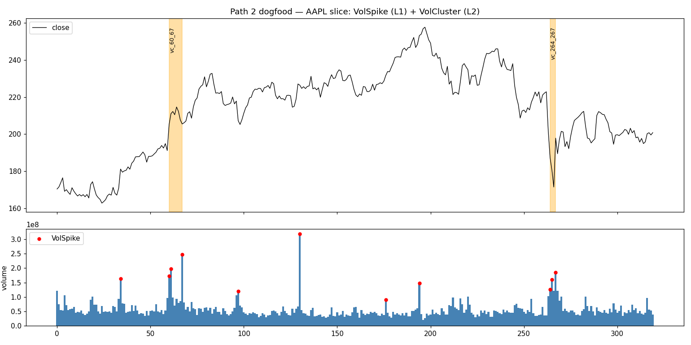

# Path 2 协议层 Dogfood 验证报告

> 日期:2026-05-16 · 上游:roadmap #1(经验闸门)· spec:`docs/superpowers/specs/2026-05-16-path2-dogfood-validation-design.md`

## 1. 结论

Path 2 协议层在一个完全自包含的真实形态上端到端跑通:
`df → run(VolSpikeDetector) → run(VolClusterDetector) → Pattern/算子过滤`。
协议层无需任何改动即可表达"放量 → 放量成簇"的两级形态;附带闭环了 bool-as-idx(spec §9.3,显式拒绝)。

## 2. 形态与数据

- 形态:L1 `VolSpike`(volume/20日均量 > 2.0)→ L2 `VolCluster`(W=10 内 ≥3 spike,非重叠贪心)。零领域逻辑,只吃 `volume`。
- 数据:AAPL 真实切片(`AAPL.pkl.iloc[759:1079]`),320 行,`2024-03-15`→`2025-06-25`,提交为 `tests/path2/fixtures/aapl_vol_slice.csv`(CSV 替代 pkl,见 spec 偏离说明)。`volume` 无 NaN。

## 3. 跑通结果

- L1:11 个 VolSpike,idx `[34,60,61,67,97,130,176,194,264,265,267]`。
- L2:2 个 VolCluster — `vc_60_67`(count 3,span 7)、`vc_264_267`(count 3,span 3)。
- 见图:`path2_dogfood_chart.png`(橙色带=簇,红点=spike)。

## 4. 协议层不变式行使情况(验证信号)

| 不变式 | 行使方式 | 结果 |
|---|---|---|
| `Event` frozen + 单事件不变式(int/区间/NaN) | 真实 320 行数据构造 11+2 个事件 | 真实通过;`volume` 无 NaN,NaN 卫语未触发(如实记录:本切片未制造 NaN 场景) |
| `run()` 跨事件:end_idx 升序 | 链式两级 run() | 真实流天然单调,未触发(非人为构造) |
| `run()` 跨事件:event_id 单 run 唯一 | 同上 | 非重叠贪心保证唯一,未触发 |
| `Detector.detect(stream)` 形态 | L2 消费 L1 流而非 df | 正常 |
| `Pattern.all` + `Any` 算子 | 在簇上过滤 / 簇内 spike 存在性 | 正常;Pattern.all 经强化为真实排除一个簇(非恒真) |

> NaN 卫语未被触发是因为该切片真实无缺失,不代表卫语无效——其单元覆盖在 `tests/path2/test_event.py`。

## 5. 框架贴合度发现(喂给 #3 / #4 的核心交付)

记录写 dogfood 时的真实痛感(供后续 stdlib 决策):

- **L2 检测器必须自己物化下层流再做前瞻**(`list(spikes)` + 贪心扫描)。"窗口内 ≥N 个"是高频形态,该样板代码应由 stdlib 沉淀(对应 roadmap #3 的 `Kof`/`Chain` 一类)。
- **"窗口锚定首成员 vs 滑动窗口"语义需使用方自决**,协议层不预设;stdlib 应给出明确命名的默认实现,避免每个使用方重写易错的贪心。
- **`event_id` 命名编码区间(`vc_{s}_{e}`)是使用方惯例**,协议层不强制——dogfood 验证了该惯例足以满足 run() 唯一性,但 stdlib 模板应给默认 id 生成器减少样板。
- **独立脚本复用 dogfood 检测器需手动 `sys.path` 注入**(pytest 有 rootdir,裸脚本没有)。说明:跨"测试脚手架 ↔ 复现脚本"复用代码有摩擦;stdlib 若落在正式包内则无此问题,反证脚手架定位正确。
- 协议层"瘦"的判断成立:算子 + Pattern.all 足以表达过滤,无需为本形态新增协议原语。

## 6. bool-as-idx 决议

spec §9.3 已闭环:`Event.__post_init__` 用 `type(idx) is bool` 显式拒绝 `bool`(`bool ⊂ int`,语义错误),回归测试见 `tests/path2/test_event.py`。该项已不属 roadmap #2 待并入项。

## 7. 测试

`uv run pytest tests/path2/ -q` → 63 passed(协议层 50 + bool 2 + 检测器单测 5 + 集成 6)。集成断言在真实数据上 pin 死,fixture 随仓库提交,确定可复现。
