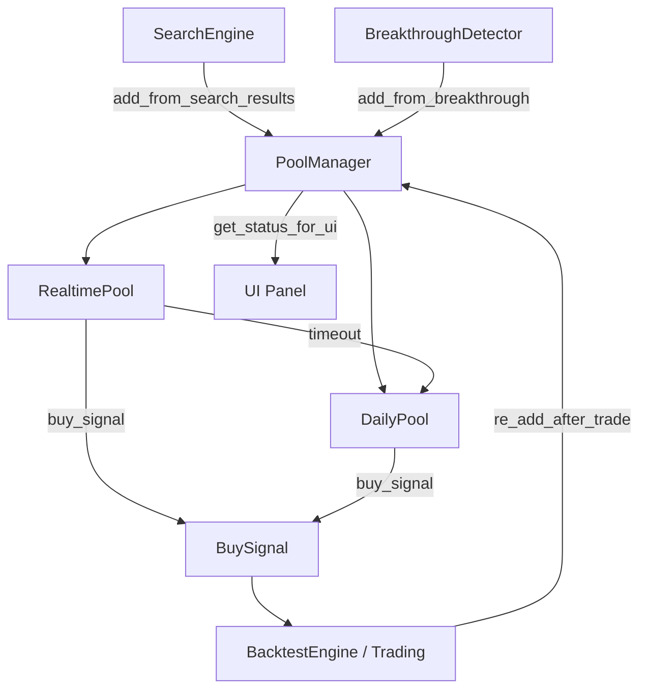

# 观察池模块设计方案

**创建日期**：2025-12-22
**状态**：设计完成，待评审
**模块路径**：`BreakthroughStrategy/observation/`

---

## 一、需求分析

### 1.1 核心需求

| 需求 | 优先级 | 说明 |
|------|--------|------|
| 回测场景支持 | **高** | 模拟观察-入场决策流程，验证策略逻辑 |
| 实盘场景支持 | **中** | 先设计接口和框架，等有实时数据后再实现 |
| 代码复用 | **高** | 回测与实盘尽量共用代码，避免维护负担 |
| 适应现有架构 | **高** | 与技术分析模块、UI模块保持风格一致 |

### 1.2 回测与实盘的差异分析

| 维度 | 回测场景 | 实盘场景 |
|------|---------|---------|
| **数据源** | 历史数据文件（PKL/CSV）| 实时行情订阅（Tiger API） |
| **时间流** | 虚拟时间推进（模拟器控制） | 真实时间流逝（系统时钟） |
| **并发模型** | 单线程顺序处理 | 异步/多线程（行情回调） |
| **持久化需求** | 可选（状态可重算） | 必须（系统重启恢复） |
| **超时检查** | 模拟日期驱动 | 真实日期定时任务 |

### 1.3 可共用的逻辑

以下逻辑在回测和实盘中完全相同：

1. **池条目数据结构** (PoolEntry) - 字段定义、序列化/反序列化
2. **观察池核心操作** - add, get, update_status, remove, get_all
3. **池间转换规则** - 实时池超时→日K池，日K池触发买入→持仓
4. **超时/过期判断** - check_timeout, check_expiry
5. **统计信息计算** - get_statistics

---

## 二、核心设计决策

### 2.1 架构模式选择

**推荐方案：组合 + 策略注入**（对应研讨方案B）

| 组件 | 模式 | 说明 |
|------|------|------|
| 时间管理 | 策略模式 | `ITimeProvider` 抽象，回测/实盘不同实现 |
| 持久化 | 策略模式 | `IPoolStorage` 抽象，内存/数据库不同实现 |
| 池操作 | 模板方法 | `ObservationPoolBase` 定义骨架流程 |
| 依赖组装 | 依赖注入 | 通过构造函数注入策略实现 |

**选择理由**：
1. 符合已有架构风格（`BreakthroughDetector` 的 `use_cache` 模式）
2. 代码复用最大化（核心池操作 100% 共用）
3. 测试友好（可注入 Mock 策略）
4. 扩展性好（未来可添加 RedisStorage 等）

### 2.2 双池结构保留

保留原设计的双观察池结构：

```
┌─────────────────────────────────────────────────────────────────┐
│                        状态流转图                                 │
├─────────────────────────────────────────────────────────────────┤
│                                                                 │
│  [搜索系统] ──当日突破──> [RealtimePool]                         │
│       │                      │                                  │
│       │                      ├──买入信号──> [持仓] ──止盈/止损──┐ │
│       │                      │                                │ │
│  过去N天突破                  └──超时(1天)──> [DailyPool]        │ │
│       │                                        │              │ │
│       └────────────────────────────────────────┤              │ │
│                                                │              │ │
│                                    ├──买入信号──> [持仓]       │ │
│                                    │                          │ │
│                                    └──过期(30天)──> [移除]     │ │
│                                                               │ │
│  ┌────────────────────────────────────────────────────────────┘ │
│  └──循环跟踪──> [DailyPool] (retry_count + 1)                    │
│                                                                 │
└─────────────────────────────────────────────────────────────────┘
```

### 2.3 实盘接口预留

由于目前没有实时数据，设计以下抽象接口：

- `IQuoteSubscriber` - 行情订阅接口
- `ISignalEmitter` - 信号发射接口
- `IPoolObserver` - 观察者接口

具体实现待实时数据接入后完成。

---

## 三、模块架构

### 3.1 目录结构

```
BreakthroughStrategy/observation/
├── __init__.py
├── pool_entry.py           # PoolEntry 数据结构
├── interfaces.py           # 抽象接口定义
├── pool_base.py            # ObservationPoolBase 基类
├── pool_manager.py         # PoolManager 管理器（统一入口）
├── strategies/
│   ├── __init__.py
│   ├── time_providers.py   # BacktestTimeProvider, LiveTimeProvider
│   └── storages.py         # MemoryStorage, DatabaseStorage
├── signals.py              # BuySignal, PoolEvent 定义
└── backtest_adapter.py     # 回测专用适配器（可选）
```

### 3.2 数据流转图



---

## 四、核心数据结构

### 4.1 PoolEntry（改进版）

```python
from dataclasses import dataclass, field
from datetime import date, datetime
from typing import Dict, Optional, List
from BreakthroughStrategy.analysis import Peak, Breakthrough

@dataclass
class PoolEntry:
    """
    观察池条目

    设计决策：
    - 内存态：直接引用 Peak/Breakthrough 对象（类型安全）
    - 持久化：提取关键字段 + 序列化完整对象（查询效率）
    """
    # 基本信息
    symbol: str
    add_date: date
    breakthrough_date: date

    # 直接引用（内存态，可选）
    breakthrough: Optional[Breakthrough] = None
    broken_peaks: List[Peak] = field(default_factory=list)

    # 冗余关键字段（查询优化，必填）
    quality_score: float = 0.0
    breakthrough_price: float = 0.0
    highest_peak_price: float = 0.0
    num_peaks_broken: int = 0

    # 状态
    pool_type: str = 'realtime'  # 'realtime' | 'daily'
    status: str = 'active'       # 'active' | 'bought' | 'timeout' | 'expired'
    retry_count: int = 0

    # 监控状态（实盘用）
    last_price: Optional[float] = None
    last_update: Optional[datetime] = None

    # 元数据
    created_at: datetime = field(default_factory=datetime.now)
    updated_at: datetime = field(default_factory=datetime.now)
    id: Optional[int] = None

    @classmethod
    def from_breakthrough(cls, bt: Breakthrough, pool_type: str = 'realtime') -> 'PoolEntry':
        """从Breakthrough对象创建PoolEntry"""
        return cls(
            symbol=bt.symbol,
            add_date=date.today(),
            breakthrough_date=bt.date,
            breakthrough=bt,
            broken_peaks=bt.broken_peaks,
            quality_score=bt.quality_score or 0.0,
            breakthrough_price=bt.price,
            highest_peak_price=max(p.price for p in bt.broken_peaks) if bt.broken_peaks else bt.price,
            num_peaks_broken=bt.num_peaks_broken,
            pool_type=pool_type
        )

    def to_db_dict(self) -> Dict:
        """转换为数据库存储格式"""
        return {
            'symbol': self.symbol,
            'add_date': self.add_date.isoformat(),
            'breakthrough_date': self.breakthrough_date.isoformat(),
            'quality_score': self.quality_score,
            'breakthrough_price': self.breakthrough_price,
            'highest_peak_price': self.highest_peak_price,
            'num_peaks_broken': self.num_peaks_broken,
            'pool_type': self.pool_type,
            'status': self.status,
            'retry_count': self.retry_count,
            'created_at': self.created_at.isoformat(),
            'updated_at': self.updated_at.isoformat()
        }

    @classmethod
    def from_db_dict(cls, data: Dict) -> 'PoolEntry':
        """从数据库记录创建PoolEntry"""
        return cls(
            id=data.get('id'),
            symbol=data['symbol'],
            add_date=date.fromisoformat(data['add_date']),
            breakthrough_date=date.fromisoformat(data['breakthrough_date']),
            quality_score=data['quality_score'],
            breakthrough_price=data['breakthrough_price'],
            highest_peak_price=data['highest_peak_price'],
            num_peaks_broken=data['num_peaks_broken'],
            pool_type=data['pool_type'],
            status=data['status'],
            retry_count=data['retry_count'],
            created_at=datetime.fromisoformat(data['created_at']),
            updated_at=datetime.fromisoformat(data['updated_at'])
        )
```

### 4.2 BuySignal（买入信号）

```python
@dataclass
class BuySignal:
    """买入信号"""
    symbol: str
    signal_date: date
    signal_price: float
    signal_strength: float  # 0-1，由质量评分等因素决定
    entry: PoolEntry
    reason: str  # 'realtime_confirmation' | 'daily_breakout' | 'pullback_entry'

    # 交易建议
    suggested_entry_price: float
    suggested_stop_loss: float
    suggested_position_size_pct: float = 0.10
```

### 4.3 PoolEvent（事件载体）

```python
from enum import Enum

class PoolEventType(Enum):
    ENTRY_ADDED = 'entry_added'
    ENTRY_TIMEOUT = 'entry_timeout'
    ENTRY_EXPIRED = 'entry_expired'
    BUY_SIGNAL = 'buy_signal'
    POOL_TRANSFER = 'pool_transfer'

@dataclass
class PoolEvent:
    event_type: PoolEventType
    entry: PoolEntry
    timestamp: datetime
    metadata: Dict = field(default_factory=dict)
```

---

## 五、抽象接口定义

### 5.1 时间提供者接口

```python
from abc import ABC, abstractmethod

class ITimeProvider(ABC):
    """时间提供者接口"""

    @abstractmethod
    def get_current_date(self) -> date:
        """获取当前日期"""
        pass

    @abstractmethod
    def advance(self, days: int = 1):
        """推进时间（仅回测使用）"""
        pass

    @abstractmethod
    def is_backtest_mode(self) -> bool:
        """是否为回测模式"""
        pass
```

### 5.2 存储接口

```python
class IPoolStorage(ABC):
    """池存储接口"""

    @abstractmethod
    def save(self, pool_type: str, entries: List[PoolEntry]):
        """保存池状态"""
        pass

    @abstractmethod
    def load(self, pool_type: str, status: str = 'active') -> List[PoolEntry]:
        """加载池状态"""
        pass

    @abstractmethod
    def update_entry(self, pool_type: str, entry: PoolEntry) -> bool:
        """更新单个条目"""
        pass

    @abstractmethod
    def is_persistent(self) -> bool:
        """是否持久化存储"""
        pass
```

### 5.3 行情订阅接口（实盘预留）

```python
@dataclass
class QuoteData:
    """行情数据标准结构"""
    symbol: str
    price: float
    high: float
    low: float
    open: float
    volume: int
    timestamp: datetime

class IQuoteSubscriber(ABC):
    """行情订阅接口（实盘预留）"""

    @abstractmethod
    def subscribe(self, symbols: List[str], callback: Callable[[QuoteData], None]):
        """订阅行情"""
        pass

    @abstractmethod
    def unsubscribe(self, symbols: List[str]):
        """取消订阅"""
        pass

    @abstractmethod
    def is_connected(self) -> bool:
        """检查连接状态"""
        pass
```

---

## 六、策略实现

### 6.1 回测时间提供者

```python
class BacktestTimeProvider(ITimeProvider):
    """回测时间提供者"""

    def __init__(self, start_date: date):
        self._current_date = start_date

    def get_current_date(self) -> date:
        return self._current_date

    def advance(self, days: int = 1):
        self._current_date += timedelta(days=days)

    def is_backtest_mode(self) -> bool:
        return True
```

### 6.2 实盘时间提供者

```python
class LiveTimeProvider(ITimeProvider):
    """实盘时间提供者"""

    def get_current_date(self) -> date:
        return datetime.now().date()

    def advance(self, days: int = 1):
        raise NotImplementedError("Live mode does not support time advancement")

    def is_backtest_mode(self) -> bool:
        return False
```

### 6.3 内存存储（回测用）

```python
class MemoryStorage(IPoolStorage):
    """内存存储（回测用）"""

    def __init__(self):
        self._data: Dict[str, Dict[str, PoolEntry]] = {
            'realtime': {},
            'daily': {}
        }

    def save(self, pool_type: str, entries: List[PoolEntry]):
        self._data[pool_type] = {e.symbol: e for e in entries}

    def load(self, pool_type: str, status: str = 'active') -> List[PoolEntry]:
        entries = list(self._data.get(pool_type, {}).values())
        if status:
            entries = [e for e in entries if e.status == status]
        return entries

    def update_entry(self, pool_type: str, entry: PoolEntry) -> bool:
        if entry.symbol in self._data.get(pool_type, {}):
            self._data[pool_type][entry.symbol] = entry
            return True
        return False

    def is_persistent(self) -> bool:
        return False
```

### 6.4 数据库存储（实盘用）

```python
class DatabaseStorage(IPoolStorage):
    """数据库存储（实盘用）"""

    def __init__(self, db_manager=None):
        if db_manager is None:
            from BreakthroughStrategy.utils.database import DatabaseManager
            self.db = DatabaseManager.get_instance()
        else:
            self.db = db_manager

    def save(self, pool_type: str, entries: List[PoolEntry]):
        table = f'observation_pool_{pool_type}'
        for entry in entries:
            self.db.upsert(table, entry.to_db_dict(), ['symbol'])

    def load(self, pool_type: str, status: str = 'active') -> List[PoolEntry]:
        table = f'observation_pool_{pool_type}'
        if status:
            rows = self.db.query(f"SELECT * FROM {table} WHERE status = ?", (status,))
        else:
            rows = self.db.query(f"SELECT * FROM {table}")
        return [PoolEntry.from_db_dict(row) for row in rows]

    def update_entry(self, pool_type: str, entry: PoolEntry) -> bool:
        table = f'observation_pool_{pool_type}'
        entry.updated_at = datetime.now()
        count = self.db.update(table, entry.to_db_dict(), {'symbol': entry.symbol})
        return count > 0

    def is_persistent(self) -> bool:
        return True
```

---

## 七、核心类实现

### 7.1 ObservationPoolBase（池基类）

```python
class ObservationPoolBase:
    """
    观察池基类

    采用模板方法模式，定义池操作的骨架流程
    """

    def __init__(self,
                 pool_type: str,
                 time_provider: ITimeProvider,
                 storage: IPoolStorage,
                 observation_days: int,
                 logger=None):
        self.pool_type = pool_type
        self.time_provider = time_provider
        self.storage = storage
        self.observation_days = observation_days

        if logger is None:
            from BreakthroughStrategy.utils.logger import Logger
            self.logger = Logger.get_logger(f'observation.{pool_type}')
        else:
            self.logger = logger

        # 内存缓存
        self._entries: Dict[str, PoolEntry] = {}
        self._load_state()

    # ===== 模板方法 =====

    def add(self, entry: PoolEntry) -> bool:
        """添加条目"""
        if not self._pre_add_check(entry):
            return False

        entry.pool_type = self.pool_type
        entry.add_date = self.time_provider.get_current_date()
        self._entries[entry.symbol] = entry

        self._persist_if_needed()
        self.logger.info(f"Added {entry.symbol} to {self.pool_type} pool")
        return True

    def get(self, symbol: str) -> Optional[PoolEntry]:
        """获取条目"""
        return self._entries.get(symbol)

    def get_all(self, status: str = 'active') -> List[PoolEntry]:
        """获取所有条目"""
        entries = list(self._entries.values())
        if status:
            entries = [e for e in entries if e.status == status]
        return entries

    def update_status(self, symbol: str, new_status: str) -> bool:
        """更新状态"""
        if symbol not in self._entries:
            return False

        entry = self._entries[symbol]
        old_status = entry.status
        entry.status = new_status
        entry.updated_at = datetime.now()

        self._persist_if_needed()
        self.logger.info(f"Updated {symbol} status: {old_status} -> {new_status}")
        return True

    def remove(self, symbol: str) -> Optional[PoolEntry]:
        """移除条目"""
        if symbol not in self._entries:
            return None

        entry = self._entries.pop(symbol)
        self._persist_if_needed()
        self.logger.info(f"Removed {symbol} from {self.pool_type} pool")
        return entry

    def check_timeout(self) -> List[PoolEntry]:
        """检查超时/过期的条目"""
        current_date = self.time_provider.get_current_date()
        timeout_entries = []

        for entry in list(self._entries.values()):
            if entry.status != 'active':
                continue

            days_since_add = (current_date - entry.add_date).days
            if days_since_add >= self.observation_days:
                timeout_status = 'timeout' if self.pool_type == 'realtime' else 'expired'
                entry.status = timeout_status
                entry.updated_at = datetime.now()
                timeout_entries.append(entry)

        if timeout_entries:
            self._persist_if_needed()
            self.logger.info(f"Found {len(timeout_entries)} {self.pool_type} entries timeout/expired")

        return timeout_entries

    # ===== 钩子方法 =====

    def _pre_add_check(self, entry: PoolEntry) -> bool:
        """添加前检查（可覆写）"""
        if entry.symbol in self._entries:
            self.logger.warning(f"{entry.symbol} already in {self.pool_type} pool")
            return False
        return True

    def _persist_if_needed(self):
        """按需持久化"""
        self.storage.save(self.pool_type, list(self._entries.values()))

    def _load_state(self):
        """加载状态"""
        entries = self.storage.load(self.pool_type, status='active')
        self._entries = {e.symbol: e for e in entries}
        self.logger.info(f"Loaded {len(self._entries)} entries from storage")
```

### 7.2 PoolManager（统一管理器）

```python
class PoolManager:
    """
    观察池管理器（统一入口）

    职责：
    - 管理双池（实时池 + 日K池）
    - 处理池间转换
    - 提供统一的对外接口
    """

    def __init__(self,
                 time_provider: ITimeProvider,
                 storage: IPoolStorage,
                 config: dict = None):
        config = config or {}
        self.time_provider = time_provider
        self.storage = storage

        # 初始化双池
        self.realtime_pool = ObservationPoolBase(
            pool_type='realtime',
            time_provider=time_provider,
            storage=storage,
            observation_days=config.get('realtime_observation_days', 1)
        )
        self.daily_pool = ObservationPoolBase(
            pool_type='daily',
            time_provider=time_provider,
            storage=storage,
            observation_days=config.get('daily_observation_days', 30)
        )

        self.min_quality_threshold = config.get('min_quality_score', 0)
        self._event_listeners: List[Callable[[PoolEvent], None]] = []

    # ===== 输入接口 =====

    def add_from_breakthrough(self, breakthrough: 'Breakthrough') -> bool:
        """从技术分析模块接收突破结果"""
        if breakthrough.quality_score < self.min_quality_threshold:
            return False

        entry = PoolEntry.from_breakthrough(breakthrough)
        today = self.time_provider.get_current_date()

        if breakthrough.date == today:
            return self.realtime_pool.add(entry)
        else:
            entry.pool_type = 'daily'
            return self.daily_pool.add(entry)

    def add_from_search_results(self,
                                 results_df: 'pd.DataFrame',
                                 breakthroughs: Dict[str, 'Breakthrough'] = None) -> int:
        """从搜索结果批量添加"""
        added_count = 0
        today = self.time_provider.get_current_date()

        for _, row in results_df.iterrows():
            symbol = row['symbol']

            if breakthroughs and symbol in breakthroughs:
                bt = breakthroughs[symbol]
                entry = PoolEntry.from_breakthrough(bt)
            else:
                entry = self._create_entry_from_row(row)

            bt_date = row['breakthrough_date']
            if isinstance(bt_date, str):
                bt_date = date.fromisoformat(bt_date)

            if bt_date == today:
                success = self.realtime_pool.add(entry)
            else:
                entry.pool_type = 'daily'
                success = self.daily_pool.add(entry)

            if success:
                added_count += 1

        return added_count

    def re_add_after_trade(self, symbol: str, entry_info: Dict) -> bool:
        """循环跟踪：交易后重新加入日K池"""
        entry = PoolEntry(
            symbol=symbol,
            add_date=self.time_provider.get_current_date(),
            breakthrough_date=entry_info['breakthrough_date'],
            quality_score=entry_info.get('quality_score', 0),
            breakthrough_price=entry_info.get('breakthrough_price', 0),
            highest_peak_price=entry_info.get('highest_peak_price', 0),
            num_peaks_broken=entry_info.get('num_peaks_broken', 1),
            pool_type='daily',
            retry_count=entry_info.get('retry_count', 0) + 1
        )
        return self.daily_pool.add(entry)

    # ===== 时间推进（回测用）=====

    def advance_day(self):
        """
        推进一天（回测专用）

        执行：
        1. 实时池超时检查 → 转入日K池
        2. 日K池过期检查
        3. 时间推进
        """
        # 1. 实时池超时检查
        timeout_entries = self.realtime_pool.check_timeout()
        for entry in timeout_entries:
            # 转入日K池
            self.realtime_pool.remove(entry.symbol)
            entry.status = 'active'
            entry.pool_type = 'daily'
            entry.add_date = self.time_provider.get_current_date()
            self.daily_pool.add(entry)

            self._emit_event(PoolEvent(
                event_type=PoolEventType.POOL_TRANSFER,
                entry=entry,
                timestamp=datetime.now(),
                metadata={'from': 'realtime', 'to': 'daily'}
            ))

        # 2. 日K池过期检查
        expired_entries = self.daily_pool.check_timeout()
        for entry in expired_entries:
            self._emit_event(PoolEvent(
                event_type=PoolEventType.ENTRY_EXPIRED,
                entry=entry,
                timestamp=datetime.now()
            ))

        # 3. 时间推进
        self.time_provider.advance(1)

    # ===== 买入信号检测（回测用）=====

    def check_buy_signals(self,
                          price_data: Dict[str, 'pd.Series']) -> List[BuySignal]:
        """检查买入信号"""
        signals = []
        current_date = self.time_provider.get_current_date()

        for entry in self.get_all_active():
            if entry.symbol not in price_data:
                continue

            bar = price_data[entry.symbol]
            signal = self._evaluate_buy_condition(entry, bar, current_date)

            if signal:
                signals.append(signal)
                self._emit_event(PoolEvent(
                    event_type=PoolEventType.BUY_SIGNAL,
                    entry=entry,
                    timestamp=datetime.now(),
                    metadata={'signal': signal}
                ))

        return signals

    def _evaluate_buy_condition(self,
                                 entry: PoolEntry,
                                 bar: 'pd.Series',
                                 current_date: date) -> Optional[BuySignal]:
        """评估买入条件（简化版，可扩展）"""
        current_price = bar['close']
        reference_price = entry.highest_peak_price

        # 简化的买入逻辑：价格站稳在峰值上方
        if current_price > reference_price * 1.02:  # 超过峰值2%
            return BuySignal(
                symbol=entry.symbol,
                signal_date=current_date,
                signal_price=current_price,
                signal_strength=entry.quality_score / 100,
                entry=entry,
                reason='breakout_confirmation',
                suggested_entry_price=current_price,
                suggested_stop_loss=reference_price * 0.97,
                suggested_position_size_pct=0.10
            )

        return None

    # ===== 查询接口 =====

    def get_all_active(self) -> List[PoolEntry]:
        """获取所有活跃条目"""
        return self.realtime_pool.get_all('active') + self.daily_pool.get_all('active')

    def get_all_active_symbols(self) -> List[str]:
        """获取所有活跃股票代码"""
        return [e.symbol for e in self.get_all_active()]

    def is_in_pool(self, symbol: str) -> bool:
        """检查股票是否在观察池中"""
        return (self.realtime_pool.get(symbol) is not None or
                self.daily_pool.get(symbol) is not None)

    def get_pool_type(self, symbol: str) -> Optional[str]:
        """获取股票所在的池类型"""
        if self.realtime_pool.get(symbol):
            return 'realtime'
        if self.daily_pool.get(symbol):
            return 'daily'
        return None

    def get_statistics(self) -> Dict:
        """获取统计信息"""
        realtime_active = self.realtime_pool.get_all('active')
        daily_active = self.daily_pool.get_all('active')

        all_active = realtime_active + daily_active
        avg_quality = sum(e.quality_score for e in all_active) / len(all_active) if all_active else 0

        return {
            'realtime_pool': {
                'active': len(realtime_active),
                'total': len(self.realtime_pool.get_all(status=None))
            },
            'daily_pool': {
                'active': len(daily_active),
                'total': len(self.daily_pool.get_all(status=None))
            },
            'total_active': len(all_active),
            'avg_quality_score': avg_quality
        }

    # ===== 事件系统 =====

    def add_event_listener(self, listener: Callable[[PoolEvent], None]):
        """注册事件监听器"""
        self._event_listeners.append(listener)

    def _emit_event(self, event: PoolEvent):
        """触发事件"""
        for listener in self._event_listeners:
            listener(event)

    # ===== 辅助方法 =====

    def _create_entry_from_row(self, row: 'pd.Series') -> PoolEntry:
        """从DataFrame行创建PoolEntry"""
        bt_date = row['breakthrough_date']
        if isinstance(bt_date, str):
            bt_date = date.fromisoformat(bt_date)

        return PoolEntry(
            symbol=row['symbol'],
            add_date=self.time_provider.get_current_date(),
            breakthrough_date=bt_date,
            quality_score=row.get('breakthrough_quality_score', 0),
            breakthrough_price=row.get('breakthrough_price', 0),
            highest_peak_price=row.get('peak_price', 0),
            num_peaks_broken=row.get('num_peaks_broken', 1)
        )
```

---

## 八、工厂函数

```python
# observation/__init__.py

def create_backtest_pool_manager(start_date: date, config: dict = None) -> PoolManager:
    """创建回测用的观察池管理器"""
    time_provider = BacktestTimeProvider(start_date)
    storage = MemoryStorage()
    return PoolManager(time_provider, storage, config)


def create_live_pool_manager(db_manager=None, config: dict = None) -> PoolManager:
    """创建实盘用的观察池管理器"""
    time_provider = LiveTimeProvider()
    storage = DatabaseStorage(db_manager)
    return PoolManager(time_provider, storage, config)
```

---

## 九、与其他模块的集成

### 9.1 与回测系统集成

```python
# backtest/backtest_engine.py 中的使用示例

class BacktestEngine:
    def __init__(self, config):
        # 创建观察池
        self.pool = create_backtest_pool_manager(
            start_date=config['start_date'],
            config=config.get('pool_config', {})
        )

        # 注册事件监听
        self.pool.add_event_listener(self._on_pool_event)

    def _on_pool_event(self, event: PoolEvent):
        if event.event_type == PoolEventType.BUY_SIGNAL:
            signal = event.metadata['signal']
            self._execute_buy(signal)

    def _process_day(self, current_date: date):
        # 1. 搜索新突破并添加到观察池
        if self._should_search_today(current_date):
            results = self.search_engine.search(end_date=current_date.isoformat())
            self.pool.add_from_search_results(results)

        # 2. 检查买入信号
        price_data = self._get_today_prices(current_date)
        signals = self.pool.check_buy_signals(price_data)

        # 3. 执行买入
        for signal in signals:
            self._execute_buy(signal)

        # 4. 推进观察池时间（处理超时转换）
        self.pool.advance_day()
```

### 9.2 与UI模块集成（可选）

建议新增 `ObservationPoolPanel`，在 UI 中展示观察池状态。

---

## 十、实施路径

### 阶段1：基础框架（当前优先）

1. 创建目录结构
2. 实现 `PoolEntry` 数据结构
3. 实现抽象接口 (`interfaces.py`)
4. 实现 `MemoryStorage` 和 `BacktestTimeProvider`
5. 实现 `ObservationPoolBase` 和 `PoolManager`
6. 编写单元测试

### 阶段2：回测集成

1. 与 `BacktestEngine` 集成
2. 实现买入信号检测逻辑
3. 验证池间转换
4. 性能测试

### 阶段3：实盘预留（未来）

1. 实现 `DatabaseStorage` 和 `LiveTimeProvider`
2. 实现 `IQuoteSubscriber` 具体类（对接 Tiger API）
3. 添加线程安全支持
4. 与监测系统集成

---

## 十一、方案对比总结

| 方案 | 复杂度 | 代码复用 | 扩展性 | 推荐程度 |
|------|--------|---------|--------|---------|
| 无观察池（硬编码延迟）| 低 | 无 | 差 | 不推荐 |
| 回测/实盘独立实现 | 中 | 低 | 中 | 不推荐 |
| **组合+策略注入** | 中 | **高** | **高** | **推荐** |
| 完整Actor模型 | 高 | 高 | 极高 | 过度设计 |

---

**文档状态**：设计完成
**下一步**：开始阶段1实现
