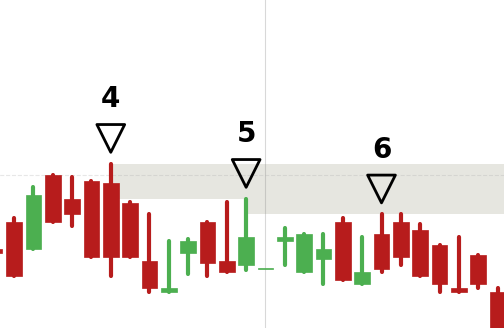

调参
最后一个突破的敏感度

在技术分析模块中增加峰值的定义范围，将图中这种单日大幅下跌的K线的最高价也纳入凸点的范围内，作为一种特殊意义点进行突破检测。
我观察到的特征：
1. 单日K线大幅下跌
2. 实体长度比过去数日和未来数日中的所有K线的实体都长
3. 位于一个下跌趋势的开始位置

将这个峰值的定义独立的模块化，作为突破检测中的一种特殊意义点进行处理。
启用两个子代理头脑风暴，先不要实现代码，给出方案。

