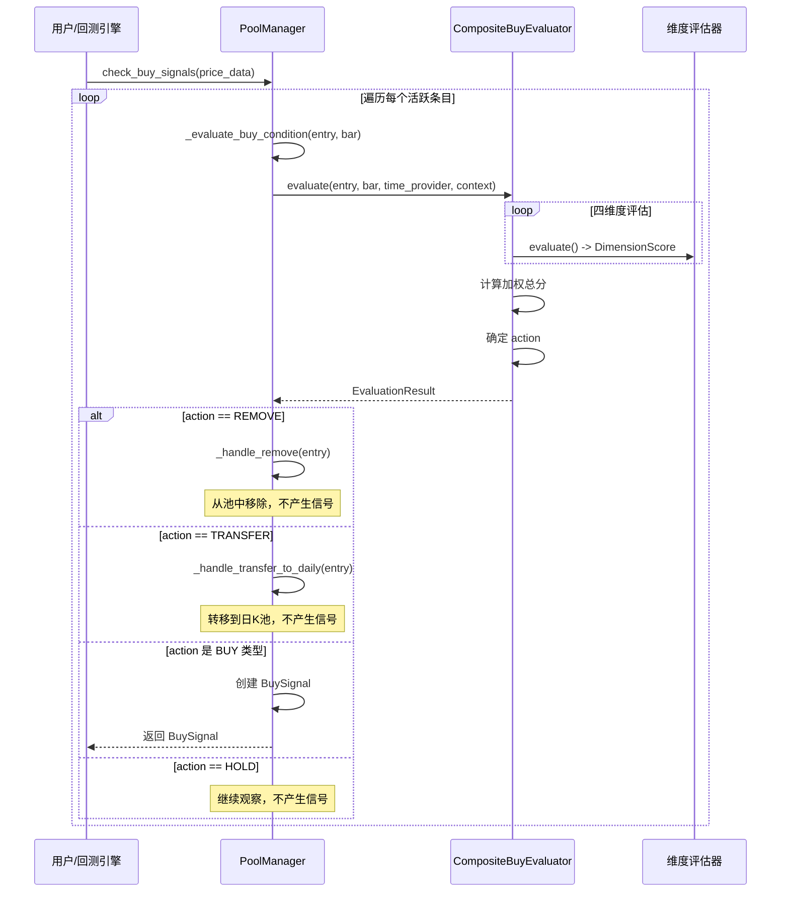

# 买入评估系统核心概念文档

## 概述

本文档旨在梳理买入评估系统中的核心概念及其相互关系，帮助理解 `action`、`signal`、`evaluate()` 和 `check_buy_signals()` 的设计意图与调用链。

---

## 零、术语澄清（重要）

### 0.1 entry vs bar

这两个概念容易混淆，必须区分清楚：

| 术语 | 类型 | 含义 | 包含内容 |
|------|------|------|----------|
| `entry` (PoolEntry) | 观察池条目 | 突破后创建的**跟踪记录** | 历史信息：突破价、峰值价、质量评分 |
| `bar` (current_bar) | K线数据 | 评估时刻的**价格快照** | 当前数据：open, high, low, close, volume |

**类比**：
- `entry` = 病人的病历档案（历史记录）
- `bar` = 今天的检查报告（当前数据）
- `evaluate()` = 医生根据病历 + 今天检查结果做出诊断

### 0.2 entry 与数据库记录的类比

`PoolEntry` 就是数据库表中的一条记录（row）：

```
数据库/表格术语        观察池系统
───────────────────────────────────
table (表)         →   Pool (池)
entry/row (行)     →   PoolEntry (条目)
column (列)        →   字段 (symbol, breakout_price, ...)
```

**观察池可视化为一张表**：

| symbol | breakout_price | highest_peak_price | status | quality_score |
|--------|----------------|-------------------|--------|---------------|
| AAPL   | 100.0          | 102.0             | active | 75            |
| TSLA   | 250.0          | 255.0             | bought | 80            |
| NVDA   | 500.0          | 510.0             | failed | 65            |

每个 `PoolEntry` 就是上表中的一行记录。

### 0.3 entries 的含义

`evaluate_entries()` 中的 `entries` 是 **多个 PoolEntry**（多条记录），不是多根 K线：

```python
# 正确理解
evaluate_entries(price_data)  # 评估观察池表中的所有活跃记录

# 错误理解
evaluate_entries(price_data)  # ❌ 不是评估多根 K线
```

---

## 一、核心概念定义

### 1.1 EvaluationAction (评估动作)

**定义位置**: `BreakoutStrategy/observation/evaluators/result.py`

**本质**: 评估器对单个观察池条目进行多维度评估后输出的**底层决策指令**。

```python
class EvaluationAction(Enum):
    STRONG_BUY = 'strong_buy'   # 强买入信号 (评分 >= 70)
    NORMAL_BUY = 'normal_buy'   # 普通买入信号 (评分 50-70)
    HOLD = 'hold'               # 继续观察，不操作
    REMOVE = 'remove'           # 移出观察池 (突破失败/风险过高)
    TRANSFER = 'transfer'       # 转移到日K池
```

**关键理解**:
- `action` 是评估器的**原始输出**，代表对某只股票"应该怎么处理"的底层建议
- `REMOVE` 不是"从某个池中移除"，而是"该股票应被放弃跟踪"的决策
- `action` 本身不依赖于池的存在；它只是评估逻辑的结论

---

### 1.2 EvaluationResult (评估结果)

**定义位置**: `BreakoutStrategy/observation/evaluators/result.py`

**本质**: 包装 `action` 的完整评估结果对象，包含评分细节、交易建议等。

**核心属性**:

| 属性 | 类型 | 说明 |
|------|------|------|
| `action` | EvaluationAction | 评估动作 |
| `total_score` | float | 综合评分 (0-100) |
| `dimension_scores` | List[DimensionScore] | 各维度评分明细 |
| `is_buy_signal` | bool | 是否为买入信号 (STRONG_BUY 或 NORMAL_BUY) |
| `suggested_entry_price` | float | 建议入场价 |
| `suggested_stop_loss` | float | 建议止损价 |
| `reason` | str | 决策原因 |

**重要派生属性**:
```python
@property
def is_buy_signal(self) -> bool:
    """action 是否表示买入"""
    return self.action in (EvaluationAction.STRONG_BUY, EvaluationAction.NORMAL_BUY)
```

---

### 1.3 BuySignal (买入信号)

**定义位置**: `BreakoutStrategy/observation/signals.py`

**本质**: 面向外部消费者（如回测引擎、交易执行模块）的**高层业务对象**。

**核心属性**:

| 属性 | 类型 | 说明 |
|------|------|------|
| `symbol` | str | 股票代码 |
| `signal_date` | date | 信号日期 |
| `signal_price` | float | 触发价格 |
| `signal_strength` | float | 信号强度 (0-1) |
| `entry` | PoolEntry | 来源的池条目 |
| `reason` | str | 信号原因 |
| `suggested_entry_price` | float | 建议入场价 |
| `suggested_stop_loss` | float | 建议止损价 |
| `suggested_position_size_pct` | float | 建议仓位比例 |

**与 EvaluationResult 的关系**:
- `BuySignal` 是 `EvaluationResult` 的"业务投影"
- 只有当 `result.is_buy_signal == True` 时才会生成 `BuySignal`

---

### 1.4 evaluate() 方法

**定义位置**: `BreakoutStrategy/observation/evaluators/composite.py` (CompositeBuyEvaluator)

**签名**:
```python
def evaluate(
    self,
    entry: PoolEntry,
    current_bar: pd.Series,
    time_provider: ITimeProvider,
    context: Optional[Dict[str, Any]] = None
) -> EvaluationResult
```

**本质**: 执行多维度评估的**核心引擎方法**。

**输入**:
- `entry`: 观察池条目（包含突破信息）
- `current_bar`: 当前K线数据 (open, high, low, close, volume)
- `time_provider`: 时间提供者
- `context`: 额外上下文（volume_ma20, prev_close 等）

**输出**: `EvaluationResult` 对象

**内部流程**:
1. 执行四维度评估（时间窗口、价格确认、成交量验证、风险过滤）
2. 检查门槛条件（风险过滤失败 -> REMOVE）
3. 计算加权总分
4. 应用质量评分调整
5. 确定最终动作

---

### 1.5 evaluate_entries() 方法 (新增)

**定义位置**: `BreakoutStrategy/observation/pool_manager.py` (PoolManager)

**签名**:
```python
def evaluate_entries(
    self,
    price_data: Dict[str, pd.Series],
    context: Optional[Dict] = None
) -> List[Tuple[PoolEntry, EvaluationResult]]
```

**本质**: **纯评估方法，无副作用**。遍历所有活跃条目进行评估，返回评估结果。

**特点**:
- 不执行任何池状态变更操作
- 不移除条目、不转移条目
- 适合需要先检查评估结果再决定是否执行的场景

---

### 1.6 apply_evaluation_results() 方法 (新增)

**定义位置**: `BreakoutStrategy/observation/pool_manager.py` (PoolManager)

**签名**:
```python
def apply_evaluation_results(
    self,
    results: List[Tuple[PoolEntry, EvaluationResult]]
) -> List[BuySignal]
```

**本质**: **执行动作方法**。根据评估结果执行相应操作。

**处理逻辑**:
- `REMOVE`: 调用 `_handle_remove()`，从池中移除
- `TRANSFER`: 调用 `_handle_transfer_to_daily()`，转移到日K池
- `STRONG_BUY/NORMAL_BUY`: 生成 `BuySignal` 返回
- `HOLD`: 不执行任何操作

---

### 1.7 check_buy_signals() 方法

**定义位置**: `BreakoutStrategy/observation/pool_manager.py` (PoolManager)

**签名**:
```python
def check_buy_signals(
    self,
    price_data: Dict[str, pd.Series]
) -> List[BuySignal]
```

**本质**: **便捷方法**，组合调用 `evaluate_entries()` 和 `apply_evaluation_results()`。

**实现**:
```python
def check_buy_signals(self, price_data):
    results = self.evaluate_entries(price_data)
    return self.apply_evaluation_results(results)
```

**注意**: 此方法有副作用（可能移除条目、转移条目）。

---

## 二、概念关系图

### 2.1 层次结构

```
+---------------------------------------+
|          用户/回测引擎                 |
+---------------------------------------+
            |
            | 两种调用方式:
            |
    +-------+-------+
    |               |
    v               v
+----------+   +------------------+
| 便捷方式 |   |    分步方式       |
+----------+   +------------------+
| check_   |   | 1. evaluate_     |
| buy_     |   |    entries()     |
| signals()|   |    (纯评估)      |
|          |   | 2. apply_        |
| (有副作用)|   |    evaluation_   |
|          |   |    results()     |
|          |   |    (执行动作)    |
+----------+   +------------------+
            \     /
             \   /
              \ /
               v
+---------------------------+
|  CompositeBuyEvaluator    |  <- 组合评估器
|      - evaluate()         |
+---------------------------+
            |
            v
+---------------------------+
|    维度评估器 (4个)        |  <- 底层评估组件
| - TimeWindowEvaluator     |
| - PriceConfirmEvaluator   |
| - VolumeVerifyEvaluator   |
| - RiskFilterEvaluator     |
+---------------------------+
            |
            v
+---------------------------+
|   EvaluationResult        |  <- 评估结果
|   (包含 action)           |
+---------------------------+
            |
            | (action 为 STRONG_BUY/NORMAL_BUY 时转换)
            v
+---------------------------+
|       BuySignal           |  <- 业务信号
+---------------------------+
```

### 2.2 调用链流程图 (Mermaid)



---

## 三、困惑点解答

### 3.1 demo_risk_filter 中的 REMOVE

**问题**: `demo_risk_filter` 没有使用 `pool`，但返回的 `action` 是 `REMOVE`，那 `REMOVE` 的概念是什么？

**解答**:

`REMOVE` 是**评估逻辑的结论**，而不是"执行移除操作"的动作。

在 `demo_risk_filter` 中：

```python
# 直接调用评估器，不经过池管理器
result = pool_mgr.buy_evaluator.evaluate(
    entry, bar, pool_mgr.time_provider,
    {'prev_close': 100.0, 'volume_ma20': 1000000}
)
```

这里直接调用 `evaluate()` 方法进行评估：
- **输入**: 一个 `PoolEntry` 和当前K线数据
- **输出**: `EvaluationResult`，其中 `action = REMOVE`

**关键理解**:
- `action = REMOVE` 的含义是："根据评估逻辑，这只股票**应该被放弃跟踪**"
- 这只是评估器给出的**建议**
- **真正的移除操作**由 `PoolManager._handle_remove()` 执行（如果通过 `check_buy_signals` 调用）

类比：医生诊断后说"建议住院"(`action=REMOVE`)，但患者是否真的住院取决于医院流程（`PoolManager`）。

---

### 3.2 demo_pool_integration 中的 signal

**问题**: `demo_pool_integration` 中的 `check_buy_signals` 没有使用 `action`，而是使用 `signal`。

**解答**:

`check_buy_signals()` 是**高层业务接口**，它在内部：
1. 调用 `evaluate()` 获取 `EvaluationResult`（包含 `action`）
2. 根据 `action` 决定后续操作
3. 只有当 `action` 是买入类型时，才转换为 `BuySignal` 返回

**内部转换逻辑**（位于 `PoolManager._evaluate_buy_condition`）:

```python
# 1. 调用评估器
result = self.buy_evaluator.evaluate(entry, bar, time_provider, context)

# 2. 处理不同的 action
if result.action == EvaluationAction.REMOVE:
    self._handle_remove(entry, result.reason)  # 执行移除
    return None  # 不返回信号

if result.action == EvaluationAction.TRANSFER:
    self._handle_transfer_to_daily(entry, result.reason)
    return None

# 3. 只有买入类型才转换为 BuySignal
if result.is_buy_signal:
    return BuySignal(
        symbol=entry.symbol,
        signal_date=current_date,
        signal_price=result.suggested_entry_price,
        signal_strength=result.signal_strength,
        entry=entry,
        reason=result.reason,
        # ... 其他属性
    )

return None  # HOLD 也不返回信号
```

**核心区别**:

| 概念 | 层次 | 包含什么 | 用途 |
|------|------|----------|------|
| `action` | 底层 | 单一枚举值 (REMOVE/HOLD/BUY等) | 评估器的决策输出 |
| `EvaluationResult` | 底层 | action + 评分细节 + 交易建议 | 完整评估结果 |
| `BuySignal` | 高层 | 买入相关信息 | 供外部模块消费的业务对象 |

---

## 四、完整数据流示例

以 `demo_pool_integration` 为例，完整追踪数据流：

### 场景：检测到买入条件

```
1. 用户调用
   signals = pool_mgr.check_buy_signals(price_data)

2. PoolManager.check_buy_signals()
   - 遍历 get_all_active() 获取所有活跃条目
   - 对每个 entry 调用 _evaluate_buy_condition()

3. PoolManager._evaluate_buy_condition()
   - 准备评估上下文
   - 调用 buy_evaluator.evaluate()

4. CompositeBuyEvaluator.evaluate()
   - 时间窗口评估 -> DimensionScore(time_window, score=80)
   - 价格确认评估 -> DimensionScore(price_confirm, score=90)
   - 成交量验证 -> DimensionScore(volume_verify, score=85)
   - 风险过滤评估 -> DimensionScore(risk_filter, score=100, passed=True)
   - 加权计算: (80*0.2 + 90*0.3 + 85*0.3) * 质量因子 = 75.2
   - 确定 action = STRONG_BUY (75.2 >= 70)
   - 返回 EvaluationResult(action=STRONG_BUY, total_score=75.2, ...)

5. 回到 _evaluate_buy_condition()
   - result.is_buy_signal == True
   - 创建 BuySignal 对象
   - 返回 BuySignal

6. 回到 check_buy_signals()
   - 将 BuySignal 添加到 signals 列表
   - 发射 PoolEvent(BUY_SIGNAL)

7. 返回给用户
   - signals = [BuySignal(AAPL, ...)]
```

### 场景：触发移除条件

```
1-4. 同上，但评估结果不同

4. CompositeBuyEvaluator.evaluate()
   - 风险过滤评估 -> DimensionScore(risk_filter, score=0, passed=False)
   - 检测到门槛条件失败
   - 确定 action = REMOVE
   - 返回 EvaluationResult(action=REMOVE, reason="Price dropped 5% below reference")

5. 回到 _evaluate_buy_condition()
   - result.action == REMOVE
   - 调用 _handle_remove(entry, reason)
     - entry.mark_failed(reason)
     - remove_entry(symbol)
     - 发射 PoolEvent(ENTRY_REMOVED)
   - 返回 None (不产生信号)

6. 回到 check_buy_signals()
   - 不添加任何信号

7. 返回给用户
   - signals = []
```

---

## 五、设计意图总结

1. **分层设计**:
   - 底层（evaluate）：纯评估逻辑，不关心池操作
   - 高层（check_buy_signals）：业务流程编排，处理池状态变更

2. **关注点分离**:
   - `EvaluationResult` + `action`：技术评估结果
   - `BuySignal`：业务消费对象

3. **可测试性**:
   - 可以独立测试评估器（如 `demo_risk_filter`）
   - 可以测试完整流程（如 `demo_pool_integration`）

4. **灵活性**:
   - 评估器可独立复用
   - 池管理器可自定义处理不同 action 的逻辑
